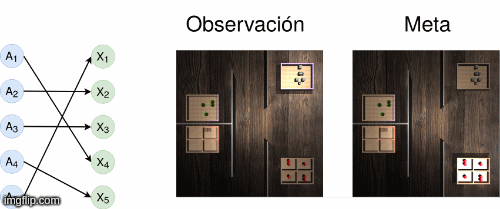

# Q-learning auxiliado por un modelo causal 

El método consiste en extender la política de selección de acciones durante el entrenamiento del algoritmo *Q*-learning. Normalmente, la política de selección de acciones es *epsilon*-greddy, es decir, con una probabilidad *epsilon* el agente selecciona una acción aleatoriamente y con una probablidad de 1 - *epsilon* selecciona la mejor acción hasta ese punto (la que maximice la función *Q*). Se propone que durante la exploración se consulte un modelo causal compuesto por variables de estado y de acción. 

El ambiente de un agente puede estar gobernado po un modelo causal. Dadas las acciones de un agente, la configuración de su mundo se modifica. Por lo tanto, contar con el modelo causal que controla el mundo, el agente puede guiar su búsqueda durante la exploración del ambiente que habita. Se propone definir un *ambiente causal* como una tupla de <*A*, *X*, *D*, *p*>,  *A* es el espacio de acciones, *X* es el conjunto de variables que representan las observaciones del agente en un alto nivel,  *D* es un grafo que define las relaciones causales entre los conjuntos *A* y *X* , *p* define la dinámica de transición y determina las relaciones causales subyacentes de acciones y estados. 

### Ejemplo: Aprendiendo a prender la luz 

Un agente tiene el control de N interruptores que controlan N luces en un sitio. Cada acción a ∈ A corresponde a mover un interruptor o a no mover ninguno, por lo tanto |A| = N + 1. El agente puede percibir dos tipos de señales del ambiente, una imagen s con una vista cenital del sitio, o variables en forma de vectores binarios x ∈ {0, 1}^N que codifican las luces prendidas, donde x_i = 1 si la luz en la zona i está prendida, de otro modo toma el valor x_i = 0. Existen tres tipos de estructuras subyacentes entre los interruptores y las zonas del sitio.  Poner imágen. En la siguiente imagen se muestra un ambiente con N = 5, una estructura D de tipo uno a uno. 

## Metodología 

Un agente interactúa con el ambiente a través de acciones. Éste percibe los cambios de su mundo en forma de observaciones *s* y además recibe una señal de recompensa numérica *r*.
En específico, en el algoritmo Q-learning la selección de accciones consiste de una política *epsilon* greedy.

Si se cuenta con la estructura *D* del ambiente, durante la exploración se puede consultar qué pasa si se realiza una acción dada la observación *s*.

Una modificación del método se muestra a continuación.

## Configuración de los experimentos 

Qué mide cada experimento 

### Ambiente discreto 

Parámtetros, gráficas, ejemplo. 

### Ambiente de imágenes Parámtetros, gráficas, ejemplo. 