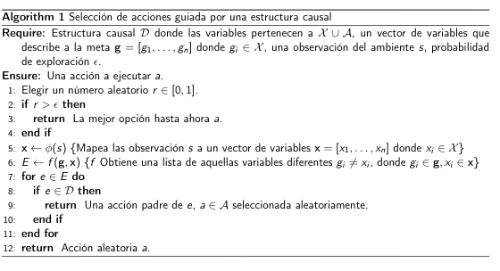

# Q-learning auxiliado por un modelo causal 

El método consiste en extender la política de selección de acciones durante el entrenamiento del algoritmo <em>Q</em>-learning. Normalmente, la política de selección de acciones es <em>epsilon</em>-greddy, es decir, con una probabilidad <em>epsilon</em> el agente selecciona una acción aleatoriamente y con una probablidad de 1 - <em>epsilon</em> selecciona la mejor acción hasta ese punto (la que maximice la función <em>Q</em>). Se propone que durante la exploración se consulte un modelo causal compuesto por variables de estado y de acción. 

El ambiente de un agente puede estar gobernado por un modelo causal. Dadas las acciones de un agente, la configuración de su mundo se modifica. Por lo tanto, contar con el modelo causal que controla el mundo, el agente puede guiar su búsqueda durante la exploración del ambiente que habita. Se propone definir un <em>ambiente causal</em> como una tupla de <<em>A</em>, <em>X</em>, <em>D</em>, <em>p</em>>,  <em>A</em> es el espacio de acciones, <em>X</em> es el conjunto de variables que representan las observaciones del agente en un alto nivel,  <em>D</em> es un grafo que define las relaciones causales entre los conjuntos <em>A</em> y <em>X</em> , <em>p</em> define la dinámica de transición y determina las relaciones causales subyacentes de acciones y estados. 

## Metodología 

Un agente interactúa con el ambiente a través de acciones. Éste percibe los cambios de su mundo en forma de observaciones denotadas por <em>s</em> y además recibe una señal de recompensa numérica <em>r</em>.
En el algoritmo Q-learning la selección de acciones consiste de una política <em>epsilon</em> greedy.

Si se cuenta con la estructura <em>D</em> del ambiente, durante la exploración se puede consultar qué pasa si se realiza una acción dada la observación <em>s</em>.
Una modificación de la política <em>epsilon</em> greedy para seleccionar una acción durante el entrenamiento se muestra a continuación.

## Configuración de los experimentos 

El objetivo de los experimentos es mostrar que un algoritmo de Q-learning usando un modelo causal aprende más rápido que sin éste.

### Ambiente 

Para los experimentos se propone resolver el siguiente problema.
La tarea consiste en encender los interruptores
de tal forma que se alcance una configuración final
del ambiente donde haya zonas prendidas y otras apagadas.

Un agente tiene el control de <em>N</em> interruptores que controlan <em>N</em> luces en un sitio. Cada acción <em> a ∈ A </em> corresponde a mover un interruptor o a no mover ninguno, por lo tanto <em>|A| = N + 1</em>. El agente puede percibir dos tipos de señales del ambiente, una imagen <em>s</em> con una vista cenital del sitio, o variables en forma de vectores binarios <em><strong>x</strong> ∈ {0, 1}N </em>, que codifican las luces prendidas, donde <em>xi = 1</em> si la luz en la zona i está prendida, de otro modo toma el valor <em>xi = 1</em>. 

El objetivo del agente es que dado una configuración
inicial del ambiente, moviendo los interruptores
correspondientes, alcance un estado final (meta).

Existen tres tipos de estructuras subyacentes entre los interruptores y las zonas del sitio. 
El tipo de estructura uno a uno donde
cada interruptor corresponde a una sola luz. 
El segundo tipo de efecto común, donde cada interruptor
controla una sola luz, aunque múltiples interruptores
pueden controlar la misma luz.
Por último el tipo de causa común donde todas
las luces son controladas a lo más por un interruptor pero un
solo interruptor puede controlar más de una luz.

En la siguiente imagen se muestra un ambiente con <em>N = 5</em>, una estructura <em>D</em> de tipo uno a uno. 

Es un problema donde se interactúa con un ambiente
y se deben tomar una secuencia de decisiones
que maximicen la recompensa (alcanzar la configuración meta). Por lo tanto, 
un enfoque conveniente es aprendizaje por refuerzo. En particular, dado el espacio de acciones
discreto, el algoritmo Q learning es adecuado.

### Esquemas de comparación

Se propone comparar cuatro algoritmos, Q-learning sin información 
adicional, Q-learning con una estructural causal completa, Q-learning
con una estructura causal incompleta y una variante donde la estructura
causal con la que cuenta el agente puede presentar relaciones
incorrectas.

* Q-learning. Esta versión del algoritmo es la más simple, usando una tabla o un aproximador de la función Q como DQN. Sigue una política *epsilon* greedy clásica.

* Q-learning + estructura causal completa. Durante la
política de selección de acciones, el agente cuenta con la estructura causal del ambiente completa y verdadera *D*.
* Q-learning + estructura causal incompleta. En este caso el agente cuenta con un subgrafo *D'* del grafo *D*. Este subgrafo se genera eliminando aristas de *D*
aleatoriamente.
* Q-learning + estructura causal incorrecta. Durante la política de selección de acciones, este algoritmo
consulta un modelo *D''* con relaciones espurias y sin
algunas relaciones verdaderas. Este grafo *D''* se obtiene generando un subgrafo de *D* como en el caso 
anterior y agregando aristas aleatoriamente.

Cómo me evalúo, cómo mido la recompensa, es la recompensa promedio por episodio.

Los parámetros, H, N, epsilon, explicar como se va decrementando. Cuántos experimentos, que cada experimento le corresponde una estructura y una meta,
y una configuración inicial del ambiente aleatoria.

Cada uno de los algoritmos se ejecuta en una versión determinista y 
otra estocástica del ambiente. Esta última es una variante del ambiente
donde con una probabilidad baja el realizar una acción (mover un
interruptor) provocará lo contrario a lo que se espera.
Además, la estructura causal subyacente en el ambiente, puede
ser una de tres estructuras ya mencionadas.
Por ahora el número de interruptores <em>N</em>, y por lo tanto de luces, puede ser 5, 7 o 9. 

# Cosas por hacer

## Programación

+ Programar pruebas estadísticas para Taxi.
+ Módulo para análizar los archivos de recompensas de los experimentos. Pero, ¿qué quiero analizar? Por ahora:
	<!-- + Graficar las recompensas promedio -->
	+ Calcular recomensas acumuladas
	+ Buscar qué pruebas estadísticas son adecuadas para los resultados que tengo. Tal vez puedo calcular algo aproximado a una recompensa óptima?
+ Automatizar los experimentos para el caso continuo.
+ Checar ese mensaje de INVALID KEY de mujoco.

## Tesis

+ Rev 1: 
	+ Justificación formal más sólida
	+ Los experimentos podrían enriquecerse para tener algo de más solidez en su validez por concurrencia.
	+ El experimento de la Sec 5.2.5 es bastante interesante.
	+ Terminar bien el capítulo 6 de conclusiones que en su formato actual son muy someras, y pulir lo que resta de los anteriores; por ejemplo, la discusión en 5.3 es más bien una repetición de los resultados más que una discusión que aporte validez nomológica, y los marcos teórico y referencial aún pueden enriquecerse.
	+ Falta la estadística inferencial que corresponda.
	+ Dependiendo del tiempo, podrían afinarse algunos experimentos, pero no lo veo como algo que pueda poner en riesgo la graduación del estudiante.

+ Sup 1:
