<h1>Experiment-Delta-Epsilon</h1><h2>Tamaño racha: 20<h3>Ambiente: deterministic</h3><h3>Porcenjate de modificación: low 025</h3><h3>Tipo de estructura: many to one </h3><h3>N: 5 </h3><h3>Simulaciones: 10 </h3><h3>Episodios: 5000 </h3><h3>Delta: 0.75 </h3><table>
  <tr>
    <th>Algoritmo</th>
    <th>M</th>
    <th>SD</th>
    <th>t</th>
    <th>df</th>
    <th>p</th>
    <th>Decisión</th>
    <th>d de Cohen</th>
  </tr>
  <tr>
    <td>$Q_1$</td>
    <td>5000.00</td>
    <td>0.00</td>
    <td>nan</td>
    <td>nan</td>
    <td>nan</td>
    <td>$h_0$ rechazada</td>
    <td>nan</td>
  </tr>
  <tr>
    <td>$Q_2$</td>
    <td>790.00</td>
    <td>580.02</td>
    <td>-21.78</td>
    <td>9.00</td>
    <td>0.00</td>
    <td>$h_0$ rechazada</td>
    <td>9.74</td>
  </tr>
  <tr>
    <td>$Q_3$</td>
    <td>2118.00</td>
    <td>2014.38</td>
    <td>-4.29</td>
    <td>9.00</td>
    <td>0.00</td>
    <td>$h_0$ rechazada</td>
    <td>1.92</td>
  </tr>
  <tr>
    <td>$Q_4$</td>
    <td>2648.00</td>
    <td>2155.63</td>
    <td>-3.27</td>
    <td>9.00</td>
    <td>0.01</td>
    <td>$h_0$ rechazada</td>
    <td>1.46</td>
  </tr>
</table><h3>Ambiente: deterministic</h3><h3>Porcenjate de modificación: low 025</h3><h3>Tipo de estructura: many to one </h3><h3>N: 5 </h3><h3>Simulaciones: 10 </h3><h3>Episodios: 5000 </h3><h3>Delta: 0.25 </h3><table>
  <tr>
    <th>Algoritmo</th>
    <th>M</th>
    <th>SD</th>
    <th>t</th>
    <th>df</th>
    <th>p</th>
    <th>Decisión</th>
    <th>d de Cohen</th>
  </tr>
  <tr>
    <td>$Q_1$</td>
    <td>4556.00</td>
    <td>889.62</td>
    <td>0.00</td>
    <td>18.00</td>
    <td>1.00</td>
    <td>$h_0$ aceptada</td>
    <td>0.00</td>
  </tr>
  <tr>
    <td>$Q_2$</td>
    <td>3564.00</td>
    <td>1749.60</td>
    <td>-1.52</td>
    <td>13.36</td>
    <td>0.15</td>
    <td>$h_0$ aceptada</td>
    <td>0.68</td>
  </tr>
  <tr>
    <td>$Q_3$</td>
    <td>4116.00</td>
    <td>1478.83</td>
    <td>-0.76</td>
    <td>14.76</td>
    <td>0.46</td>
    <td>$h_0$ aceptada</td>
    <td>0.34</td>
  </tr>
  <tr>
    <td>$Q_4$</td>
    <td>3536.00</td>
    <td>1876.99</td>
    <td>-1.47</td>
    <td>12.85</td>
    <td>0.16</td>
    <td>$h_0$ aceptada</td>
    <td>0.66</td>
  </tr>
</table><h3>Ambiente: deterministic</h3><h3>Porcenjate de modificación: low 025</h3><h3>Tipo de estructura: many to one </h3><h3>N: 7 </h3><h3>Simulaciones: 10 </h3><h3>Episodios: 5000 </h3><h3>Delta: 0.75 </h3><table>
  <tr>
    <th>Algoritmo</th>
    <th>M</th>
    <th>SD</th>
    <th>t</th>
    <th>df</th>
    <th>p</th>
    <th>Decisión</th>
    <th>d de Cohen</th>
  </tr>
  <tr>
    <td>$Q_1$</td>
    <td>5000.00</td>
    <td>0.00</td>
    <td>nan</td>
    <td>nan</td>
    <td>nan</td>
    <td>$h_0$ rechazada</td>
    <td>nan</td>
  </tr>
  <tr>
    <td>$Q_2$</td>
    <td>1530.00</td>
    <td>1747.64</td>
    <td>-5.96</td>
    <td>9.00</td>
    <td>0.00</td>
    <td>$h_0$ rechazada</td>
    <td>2.66</td>
  </tr>
  <tr>
    <td>$Q_3$</td>
    <td>2166.00</td>
    <td>1958.04</td>
    <td>-4.34</td>
    <td>9.00</td>
    <td>0.00</td>
    <td>$h_0$ rechazada</td>
    <td>1.94</td>
  </tr>
  <tr>
    <td>$Q_4$</td>
    <td>1486.00</td>
    <td>1428.74</td>
    <td>-7.38</td>
    <td>9.00</td>
    <td>0.00</td>
    <td>$h_0$ rechazada</td>
    <td>3.30</td>
  </tr>
</table><h3>Ambiente: deterministic</h3><h3>Porcenjate de modificación: low 025</h3><h3>Tipo de estructura: many to one </h3><h3>N: 7 </h3><h3>Simulaciones: 10 </h3><h3>Episodios: 5000 </h3><h3>Delta: 0.25 </h3><table>
  <tr>
    <th>Algoritmo</th>
    <th>M</th>
    <th>SD</th>
    <th>t</th>
    <th>df</th>
    <th>p</th>
    <th>Decisión</th>
    <th>d de Cohen</th>
  </tr>
  <tr>
    <td>$Q_1$</td>
    <td>4704.00</td>
    <td>636.04</td>
    <td>0.00</td>
    <td>18.00</td>
    <td>1.00</td>
    <td>$h_0$ aceptada</td>
    <td>0.00</td>
  </tr>
  <tr>
    <td>$Q_2$</td>
    <td>3002.00</td>
    <td>2086.73</td>
    <td>-2.34</td>
    <td>10.66</td>
    <td>0.04</td>
    <td>$h_0$ rechazada</td>
    <td>1.05</td>
  </tr>
  <tr>
    <td>$Q_3$</td>
    <td>3542.00</td>
    <td>1766.57</td>
    <td>-1.86</td>
    <td>11.29</td>
    <td>0.09</td>
    <td>$h_0$ aceptada</td>
    <td>0.83</td>
  </tr>
  <tr>
    <td>$Q_4$</td>
    <td>3508.00</td>
    <td>1675.69</td>
    <td>-2.00</td>
    <td>11.54</td>
    <td>0.07</td>
    <td>$h_0$ aceptada</td>
    <td>0.90</td>
  </tr>
</table>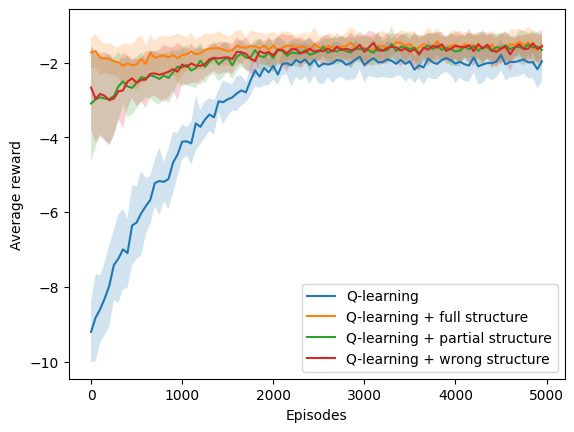<h3>Ambiente: deterministic</h3><h3>Porcenjate de modificación: low 025</h3><h3>Tipo de estructura: many to one </h3><h3>N: 9 </h3><h3>Simulaciones: 10 </h3><h3>Episodios: 10000 </h3><h3>Delta: 0.25 </h3><table>
  <tr>
    <th>Algoritmo</th>
    <th>M</th>
    <th>SD</th>
    <th>t</th>
    <th>df</th>
    <th>p</th>
    <th>Decisión</th>
    <th>d de Cohen</th>
  </tr>
  <tr>
    <td>$Q_1$</td>
    <td>8400.00</td>
    <td>2213.72</td>
    <td>0.00</td>
    <td>18.00</td>
    <td>1.00</td>
    <td>$h_0$ aceptada</td>
    <td>0.00</td>
  </tr>
  <tr>
    <td>$Q_2$</td>
    <td>6120.00</td>
    <td>4159.65</td>
    <td>-1.45</td>
    <td>13.72</td>
    <td>0.17</td>
    <td>$h_0$ aceptada</td>
    <td>0.65</td>
  </tr>
  <tr>
    <td>$Q_3$</td>
    <td>7024.00</td>
    <td>3154.77</td>
    <td>-1.07</td>
    <td>16.13</td>
    <td>0.30</td>
    <td>$h_0$ aceptada</td>
    <td>0.48</td>
  </tr>
  <tr>
    <td>$Q_4$</td>
    <td>7178.00</td>
    <td>3695.23</td>
    <td>-0.85</td>
    <td>14.72</td>
    <td>0.41</td>
    <td>$h_0$ aceptada</td>
    <td>0.38</td>
  </tr>
</table>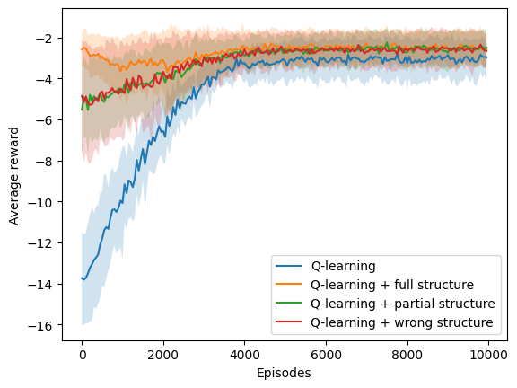<h3>Ambiente: deterministic</h3><h3>Porcenjate de modificación: low 025</h3><h3>Tipo de estructura: many to one </h3><h3>N: 9 </h3><h3>Simulaciones: 10 </h3><h3>Episodios: 10000 </h3><h3>Delta: 0.75 </h3><table>
  <tr>
    <th>Algoritmo</th>
    <th>M</th>
    <th>SD</th>
    <th>t</th>
    <th>df</th>
    <th>p</th>
    <th>Decisión</th>
    <th>d de Cohen</th>
  </tr>
  <tr>
    <td>$Q_1$</td>
    <td>10000.00</td>
    <td>0.00</td>
    <td>nan</td>
    <td>nan</td>
    <td>nan</td>
    <td>$h_0$ rechazada</td>
    <td>nan</td>
  </tr>
  <tr>
    <td>$Q_2$</td>
    <td>4342.00</td>
    <td>3783.73</td>
    <td>-4.49</td>
    <td>9.00</td>
    <td>0.00</td>
    <td>$h_0$ rechazada</td>
    <td>2.01</td>
  </tr>
  <tr>
    <td>$Q_3$</td>
    <td>6970.00</td>
    <td>2792.95</td>
    <td>-3.25</td>
    <td>9.00</td>
    <td>0.01</td>
    <td>$h_0$ rechazada</td>
    <td>1.46</td>
  </tr>
  <tr>
    <td>$Q_4$</td>
    <td>6320.00</td>
    <td>3424.89</td>
    <td>-3.22</td>
    <td>9.00</td>
    <td>0.01</td>
    <td>$h_0$ rechazada</td>
    <td>1.44</td>
  </tr>
</table><h3>Ambiente: deterministic</h3><h3>Porcenjate de modificación: low 025</h3><h3>Tipo de estructura: one to many </h3><h3>N: 5 </h3><h3>Simulaciones: 10 </h3><h3>Episodios: 5000 </h3><h3>Delta: 0.75 </h3><table>
  <tr>
    <th>Algoritmo</th>
    <th>M</th>
    <th>SD</th>
    <th>t</th>
    <th>df</th>
    <th>p</th>
    <th>Decisión</th>
    <th>d de Cohen</th>
  </tr>
  <tr>
    <td>$Q_1$</td>
    <td>5000.00</td>
    <td>0.00</td>
    <td>nan</td>
    <td>nan</td>
    <td>nan</td>
    <td>$h_0$ rechazada</td>
    <td>nan</td>
  </tr>
  <tr>
    <td>$Q_2$</td>
    <td>746.00</td>
    <td>550.06</td>
    <td>-23.20</td>
    <td>9.00</td>
    <td>0.00</td>
    <td>$h_0$ rechazada</td>
    <td>10.38</td>
  </tr>
  <tr>
    <td>$Q_3$</td>
    <td>2304.00</td>
    <td>1880.00</td>
    <td>-4.30</td>
    <td>9.00</td>
    <td>0.00</td>
    <td>$h_0$ rechazada</td>
    <td>1.92</td>
  </tr>
  <tr>
    <td>$Q_4$</td>
    <td>2806.00</td>
    <td>1973.22</td>
    <td>-3.34</td>
    <td>9.00</td>
    <td>0.01</td>
    <td>$h_0$ rechazada</td>
    <td>1.49</td>
  </tr>
</table>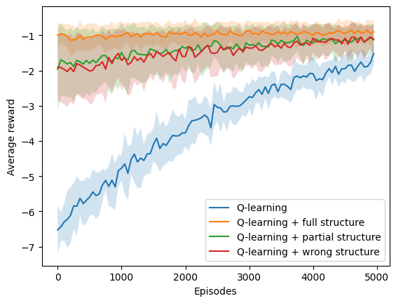<h3>Ambiente: deterministic</h3><h3>Porcenjate de modificación: low 025</h3><h3>Tipo de estructura: one to many </h3><h3>N: 5 </h3><h3>Simulaciones: 10 </h3><h3>Episodios: 5000 </h3><h3>Delta: 0.25 </h3><table>
  <tr>
    <th>Algoritmo</th>
    <th>M</th>
    <th>SD</th>
    <th>t</th>
    <th>df</th>
    <th>p</th>
    <th>Decisión</th>
    <th>d de Cohen</th>
  </tr>
  <tr>
    <td>$Q_1$</td>
    <td>5000.00</td>
    <td>0.00</td>
    <td>nan</td>
    <td>nan</td>
    <td>nan</td>
    <td>$h_0$ rechazada</td>
    <td>nan</td>
  </tr>
  <tr>
    <td>$Q_2$</td>
    <td>3234.00</td>
    <td>986.51</td>
    <td>-5.37</td>
    <td>9.00</td>
    <td>0.00</td>
    <td>$h_0$ rechazada</td>
    <td>2.40</td>
  </tr>
  <tr>
    <td>$Q_3$</td>
    <td>3702.00</td>
    <td>923.32</td>
    <td>-4.22</td>
    <td>9.00</td>
    <td>0.00</td>
    <td>$h_0$ rechazada</td>
    <td>1.89</td>
  </tr>
  <tr>
    <td>$Q_4$</td>
    <td>4258.00</td>
    <td>560.03</td>
    <td>-3.97</td>
    <td>9.00</td>
    <td>0.00</td>
    <td>$h_0$ rechazada</td>
    <td>1.78</td>
  </tr>
</table><h3>Ambiente: deterministic</h3><h3>Porcenjate de modificación: low 025</h3><h3>Tipo de estructura: one to many </h3><h3>N: 7 </h3><h3>Simulaciones: 10 </h3><h3>Episodios: 5000 </h3><h3>Delta: 0.75 </h3><table>
  <tr>
    <th>Algoritmo</th>
    <th>M</th>
    <th>SD</th>
    <th>t</th>
    <th>df</th>
    <th>p</th>
    <th>Decisión</th>
    <th>d de Cohen</th>
  </tr>
  <tr>
    <td>$Q_1$</td>
    <td>5000.00</td>
    <td>0.00</td>
    <td>nan</td>
    <td>nan</td>
    <td>nan</td>
    <td>$h_0$ rechazada</td>
    <td>nan</td>
  </tr>
  <tr>
    <td>$Q_2$</td>
    <td>1438.00</td>
    <td>1567.66</td>
    <td>-6.82</td>
    <td>9.00</td>
    <td>0.00</td>
    <td>$h_0$ rechazada</td>
    <td>3.05</td>
  </tr>
  <tr>
    <td>$Q_3$</td>
    <td>2982.00</td>
    <td>1444.34</td>
    <td>-4.19</td>
    <td>9.00</td>
    <td>0.00</td>
    <td>$h_0$ rechazada</td>
    <td>1.87</td>
  </tr>
  <tr>
    <td>$Q_4$</td>
    <td>2582.00</td>
    <td>1830.29</td>
    <td>-3.96</td>
    <td>9.00</td>
    <td>0.00</td>
    <td>$h_0$ rechazada</td>
    <td>1.77</td>
  </tr>
</table><h3>Ambiente: deterministic</h3><h3>Porcenjate de modificación: low 025</h3><h3>Tipo de estructura: one to many </h3><h3>N: 7 </h3><h3>Simulaciones: 10 </h3><h3>Episodios: 5000 </h3><h3>Delta: 0.25 </h3><table>
  <tr>
    <th>Algoritmo</th>
    <th>M</th>
    <th>SD</th>
    <th>t</th>
    <th>df</th>
    <th>p</th>
    <th>Decisión</th>
    <th>d de Cohen</th>
  </tr>
  <tr>
    <td>$Q_1$</td>
    <td>4136.00</td>
    <td>913.45</td>
    <td>0.00</td>
    <td>18.00</td>
    <td>1.00</td>
    <td>$h_0$ aceptada</td>
    <td>0.00</td>
  </tr>
  <tr>
    <td>$Q_2$</td>
    <td>3382.00</td>
    <td>1592.37</td>
    <td>-1.23</td>
    <td>14.34</td>
    <td>0.24</td>
    <td>$h_0$ aceptada</td>
    <td>0.55</td>
  </tr>
  <tr>
    <td>$Q_3$</td>
    <td>3244.00</td>
    <td>1812.46</td>
    <td>-1.32</td>
    <td>13.29</td>
    <td>0.21</td>
    <td>$h_0$ aceptada</td>
    <td>0.59</td>
  </tr>
  <tr>
    <td>$Q_4$</td>
    <td>3378.00</td>
    <td>1702.46</td>
    <td>-1.18</td>
    <td>13.79</td>
    <td>0.26</td>
    <td>$h_0$ aceptada</td>
    <td>0.53</td>
  </tr>
</table>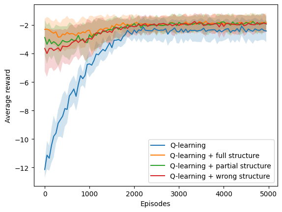<h3>Ambiente: deterministic</h3><h3>Porcenjate de modificación: low 025</h3><h3>Tipo de estructura: one to many </h3><h3>N: 9 </h3><h3>Simulaciones: 10 </h3><h3>Episodios: 10000 </h3><h3>Delta: 0.25 </h3><table>
  <tr>
    <th>Algoritmo</th>
    <th>M</th>
    <th>SD</th>
    <th>t</th>
    <th>df</th>
    <th>p</th>
    <th>Decisión</th>
    <th>d de Cohen</th>
  </tr>
  <tr>
    <td>$Q_1$</td>
    <td>8430.00</td>
    <td>1980.99</td>
    <td>0.00</td>
    <td>18.00</td>
    <td>1.00</td>
    <td>$h_0$ aceptada</td>
    <td>0.00</td>
  </tr>
  <tr>
    <td>$Q_2$</td>
    <td>6584.00</td>
    <td>3607.32</td>
    <td>-1.35</td>
    <td>13.98</td>
    <td>0.20</td>
    <td>$h_0$ aceptada</td>
    <td>0.60</td>
  </tr>
  <tr>
    <td>$Q_3$</td>
    <td>7236.00</td>
    <td>2660.60</td>
    <td>-1.08</td>
    <td>16.63</td>
    <td>0.30</td>
    <td>$h_0$ aceptada</td>
    <td>0.48</td>
  </tr>
  <tr>
    <td>$Q_4$</td>
    <td>8034.00</td>
    <td>1826.39</td>
    <td>-0.44</td>
    <td>17.88</td>
    <td>0.66</td>
    <td>$h_0$ aceptada</td>
    <td>0.20</td>
  </tr>
</table><h3>Ambiente: deterministic</h3><h3>Porcenjate de modificación: low 025</h3><h3>Tipo de estructura: one to many </h3><h3>N: 9 </h3><h3>Simulaciones: 10 </h3><h3>Episodios: 10000 </h3><h3>Delta: 0.75 </h3><table>
  <tr>
    <th>Algoritmo</th>
    <th>M</th>
    <th>SD</th>
    <th>t</th>
    <th>df</th>
    <th>p</th>
    <th>Decisión</th>
    <th>d de Cohen</th>
  </tr>
  <tr>
    <td>$Q_1$</td>
    <td>10000.00</td>
    <td>0.00</td>
    <td>nan</td>
    <td>nan</td>
    <td>nan</td>
    <td>$h_0$ rechazada</td>
    <td>nan</td>
  </tr>
  <tr>
    <td>$Q_2$</td>
    <td>4094.00</td>
    <td>3322.83</td>
    <td>-5.33</td>
    <td>9.00</td>
    <td>0.00</td>
    <td>$h_0$ rechazada</td>
    <td>2.38</td>
  </tr>
  <tr>
    <td>$Q_3$</td>
    <td>7350.00</td>
    <td>2698.21</td>
    <td>-2.95</td>
    <td>9.00</td>
    <td>0.02</td>
    <td>$h_0$ rechazada</td>
    <td>1.32</td>
  </tr>
  <tr>
    <td>$Q_4$</td>
    <td>8292.00</td>
    <td>2203.71</td>
    <td>-2.33</td>
    <td>9.00</td>
    <td>0.05</td>
    <td>$h_0$ rechazada</td>
    <td>1.04</td>
  </tr>
</table>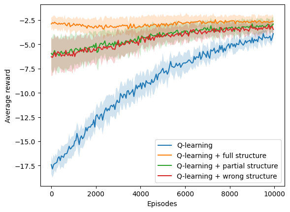<h3>Ambiente: deterministic</h3><h3>Porcenjate de modificación: low 025</h3><h3>Tipo de estructura: one to one </h3><h3>N: 5 </h3><h3>Simulaciones: 10 </h3><h3>Episodios: 5000 </h3><h3>Delta: 0.75 </h3><table>
  <tr>
    <th>Algoritmo</th>
    <th>M</th>
    <th>SD</th>
    <th>t</th>
    <th>df</th>
    <th>p</th>
    <th>Decisión</th>
    <th>d de Cohen</th>
  </tr>
  <tr>
    <td>$Q_1$</td>
    <td>5000.00</td>
    <td>0.00</td>
    <td>nan</td>
    <td>nan</td>
    <td>nan</td>
    <td>$h_0$ rechazada</td>
    <td>nan</td>
  </tr>
  <tr>
    <td>$Q_2$</td>
    <td>1744.00</td>
    <td>662.95</td>
    <td>-14.73</td>
    <td>9.00</td>
    <td>0.00</td>
    <td>$h_0$ rechazada</td>
    <td>6.59</td>
  </tr>
  <tr>
    <td>$Q_3$</td>
    <td>3660.00</td>
    <td>785.82</td>
    <td>-5.12</td>
    <td>9.00</td>
    <td>0.00</td>
    <td>$h_0$ rechazada</td>
    <td>2.29</td>
  </tr>
  <tr>
    <td>$Q_4$</td>
    <td>4358.00</td>
    <td>718.47</td>
    <td>-2.68</td>
    <td>9.00</td>
    <td>0.03</td>
    <td>$h_0$ rechazada</td>
    <td>1.20</td>
  </tr>
</table>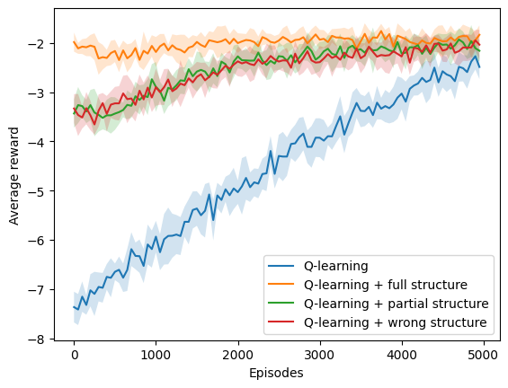<h3>Ambiente: deterministic</h3><h3>Porcenjate de modificación: low 025</h3><h3>Tipo de estructura: one to one </h3><h3>N: 5 </h3><h3>Simulaciones: 10 </h3><h3>Episodios: 5000 </h3><h3>Delta: 0.25 </h3><table>
  <tr>
    <th>Algoritmo</th>
    <th>M</th>
    <th>SD</th>
    <th>t</th>
    <th>df</th>
    <th>p</th>
    <th>Decisión</th>
    <th>d de Cohen</th>
  </tr>
  <tr>
    <td>$Q_1$</td>
    <td>5000.00</td>
    <td>0.00</td>
    <td>nan</td>
    <td>nan</td>
    <td>nan</td>
    <td>$h_0$ rechazada</td>
    <td>nan</td>
  </tr>
  <tr>
    <td>$Q_2$</td>
    <td>2762.00</td>
    <td>772.45</td>
    <td>-8.69</td>
    <td>9.00</td>
    <td>0.00</td>
    <td>$h_0$ rechazada</td>
    <td>3.89</td>
  </tr>
  <tr>
    <td>$Q_3$</td>
    <td>4512.00</td>
    <td>990.68</td>
    <td>-1.48</td>
    <td>9.00</td>
    <td>0.17</td>
    <td>$h_0$ aceptada</td>
    <td>0.66</td>
  </tr>
  <tr>
    <td>$Q_4$</td>
    <td>4542.00</td>
    <td>713.33</td>
    <td>-1.93</td>
    <td>9.00</td>
    <td>0.09</td>
    <td>$h_0$ aceptada</td>
    <td>0.86</td>
  </tr>
</table>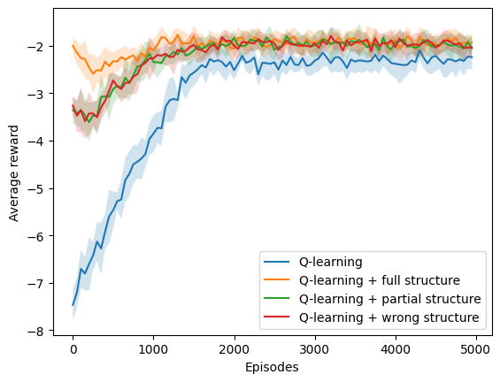<h3>Ambiente: deterministic</h3><h3>Porcenjate de modificación: low 025</h3><h3>Tipo de estructura: one to one </h3><h3>N: 7 </h3><h3>Simulaciones: 10 </h3><h3>Episodios: 5000 </h3><h3>Delta: 0.75 </h3><table>
  <tr>
    <th>Algoritmo</th>
    <th>M</th>
    <th>SD</th>
    <th>t</th>
    <th>df</th>
    <th>p</th>
    <th>Decisión</th>
    <th>d de Cohen</th>
  </tr>
  <tr>
    <td>$Q_1$</td>
    <td>5000.00</td>
    <td>0.00</td>
    <td>nan</td>
    <td>nan</td>
    <td>nan</td>
    <td>$h_0$ rechazada</td>
    <td>nan</td>
  </tr>
  <tr>
    <td>$Q_2$</td>
    <td>3924.00</td>
    <td>193.25</td>
    <td>-16.70</td>
    <td>9.00</td>
    <td>0.00</td>
    <td>$h_0$ rechazada</td>
    <td>7.47</td>
  </tr>
  <tr>
    <td>$Q_3$</td>
    <td>4284.00</td>
    <td>508.55</td>
    <td>-4.22</td>
    <td>9.00</td>
    <td>0.00</td>
    <td>$h_0$ rechazada</td>
    <td>1.89</td>
  </tr>
  <tr>
    <td>$Q_4$</td>
    <td>4116.00</td>
    <td>352.00</td>
    <td>-7.53</td>
    <td>9.00</td>
    <td>0.00</td>
    <td>$h_0$ rechazada</td>
    <td>3.37</td>
  </tr>
</table>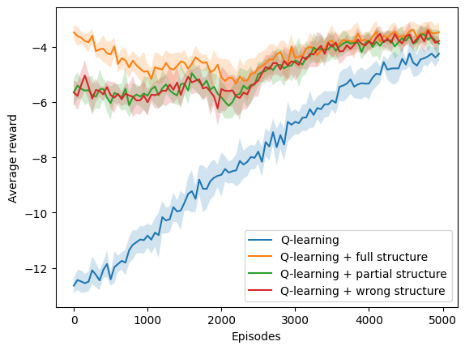<h3>Ambiente: deterministic</h3><h3>Porcenjate de modificación: low 025</h3><h3>Tipo de estructura: one to one </h3><h3>N: 7 </h3><h3>Simulaciones: 10 </h3><h3>Episodios: 5000 </h3><h3>Delta: 0.25 </h3><table>
  <tr>
    <th>Algoritmo</th>
    <th>M</th>
    <th>SD</th>
    <th>t</th>
    <th>df</th>
    <th>p</th>
    <th>Decisión</th>
    <th>d de Cohen</th>
  </tr>
  <tr>
    <td>$Q_1$</td>
    <td>5000.00</td>
    <td>0.00</td>
    <td>nan</td>
    <td>nan</td>
    <td>nan</td>
    <td>$h_0$ rechazada</td>
    <td>nan</td>
  </tr>
  <tr>
    <td>$Q_2$</td>
    <td>3472.00</td>
    <td>875.09</td>
    <td>-5.24</td>
    <td>9.00</td>
    <td>0.00</td>
    <td>$h_0$ rechazada</td>
    <td>2.34</td>
  </tr>
  <tr>
    <td>$Q_3$</td>
    <td>3338.00</td>
    <td>887.35</td>
    <td>-5.62</td>
    <td>9.00</td>
    <td>0.00</td>
    <td>$h_0$ rechazada</td>
    <td>2.51</td>
  </tr>
  <tr>
    <td>$Q_4$</td>
    <td>3742.00</td>
    <td>816.94</td>
    <td>-4.62</td>
    <td>9.00</td>
    <td>0.00</td>
    <td>$h_0$ rechazada</td>
    <td>2.07</td>
  </tr>
</table><h3>Ambiente: deterministic</h3><h3>Porcenjate de modificación: low 025</h3><h3>Tipo de estructura: one to one </h3><h3>N: 9 </h3><h3>Simulaciones: 10 </h3><h3>Episodios: 10000 </h3><h3>Delta: 0.25 </h3><table>
  <tr>
    <th>Algoritmo</th>
    <th>M</th>
    <th>SD</th>
    <th>t</th>
    <th>df</th>
    <th>p</th>
    <th>Decisión</th>
    <th>d de Cohen</th>
  </tr>
  <tr>
    <td>$Q_1$</td>
    <td>10000.00</td>
    <td>0.00</td>
    <td>nan</td>
    <td>nan</td>
    <td>nan</td>
    <td>$h_0$ rechazada</td>
    <td>nan</td>
  </tr>
  <tr>
    <td>$Q_2$</td>
    <td>9688.00</td>
    <td>519.32</td>
    <td>-1.80</td>
    <td>9.00</td>
    <td>0.10</td>
    <td>$h_0$ aceptada</td>
    <td>0.81</td>
  </tr>
  <tr>
    <td>$Q_3$</td>
    <td>9552.00</td>
    <td>719.07</td>
    <td>-1.87</td>
    <td>9.00</td>
    <td>0.09</td>
    <td>$h_0$ aceptada</td>
    <td>0.84</td>
  </tr>
  <tr>
    <td>$Q_4$</td>
    <td>9818.00</td>
    <td>290.03</td>
    <td>-1.88</td>
    <td>9.00</td>
    <td>0.09</td>
    <td>$h_0$ aceptada</td>
    <td>0.84</td>
  </tr>
</table><h3>Ambiente: deterministic</h3><h3>Porcenjate de modificación: low 025</h3><h3>Tipo de estructura: one to one </h3><h3>N: 9 </h3><h3>Simulaciones: 10 </h3><h3>Episodios: 10000 </h3><h3>Delta: 0.75 </h3><table>
  <tr>
    <th>Algoritmo</th>
    <th>M</th>
    <th>SD</th>
    <th>t</th>
    <th>df</th>
    <th>p</th>
    <th>Decisión</th>
    <th>d de Cohen</th>
  </tr>
  <tr>
    <td>$Q_1$</td>
    <td>10000.00</td>
    <td>0.00</td>
    <td>nan</td>
    <td>nan</td>
    <td>nan</td>
    <td>$h_0$ rechazada</td>
    <td>nan</td>
  </tr>
  <tr>
    <td>$Q_2$</td>
    <td>10000.00</td>
    <td>0.00</td>
    <td>nan</td>
    <td>nan</td>
    <td>nan</td>
    <td>$h_0$ rechazada</td>
    <td>nan</td>
  </tr>
  <tr>
    <td>$Q_3$</td>
    <td>10000.00</td>
    <td>0.00</td>
    <td>nan</td>
    <td>nan</td>
    <td>nan</td>
    <td>$h_0$ rechazada</td>
    <td>nan</td>
  </tr>
  <tr>
    <td>$Q_4$</td>
    <td>10000.00</td>
    <td>0.00</td>
    <td>nan</td>
    <td>nan</td>
    <td>nan</td>
    <td>$h_0$ rechazada</td>
    <td>nan</td>
  </tr>
</table>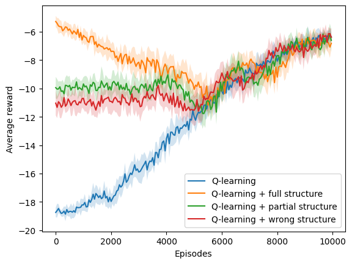<h3>Ambiente: stochastic</h3><h3>Porcenjate de modificación: low 025</h3><h3>Tipo de estructura: many to one </h3><h3>N: 5 </h3><h3>Simulaciones: 10 </h3><h3>Episodios: 5000 </h3><h3>Delta: 0.75 </h3><table>
  <tr>
    <th>Algoritmo</th>
    <th>M</th>
    <th>SD</th>
    <th>t</th>
    <th>df</th>
    <th>p</th>
    <th>Decisión</th>
    <th>d de Cohen</th>
  </tr>
  <tr>
    <td>$Q_1$</td>
    <td>4794.00</td>
    <td>618.00</td>
    <td>0.00</td>
    <td>18.00</td>
    <td>1.00</td>
    <td>$h_0$ aceptada</td>
    <td>0.00</td>
  </tr>
  <tr>
    <td>$Q_2$</td>
    <td>2206.00</td>
    <td>1725.09</td>
    <td>-4.24</td>
    <td>11.27</td>
    <td>0.00</td>
    <td>$h_0$ rechazada</td>
    <td>1.89</td>
  </tr>
  <tr>
    <td>$Q_3$</td>
    <td>2768.00</td>
    <td>1859.72</td>
    <td>-3.10</td>
    <td>10.96</td>
    <td>0.01</td>
    <td>$h_0$ rechazada</td>
    <td>1.39</td>
  </tr>
  <tr>
    <td>$Q_4$</td>
    <td>3326.00</td>
    <td>1925.78</td>
    <td>-2.18</td>
    <td>10.83</td>
    <td>0.05</td>
    <td>$h_0$ aceptada</td>
    <td>0.97</td>
  </tr>
</table><h3>Ambiente: stochastic</h3><h3>Porcenjate de modificación: low 025</h3><h3>Tipo de estructura: many to one </h3><h3>N: 5 </h3><h3>Simulaciones: 10 </h3><h3>Episodios: 5000 </h3><h3>Delta: 0.25 </h3><table>
  <tr>
    <th>Algoritmo</th>
    <th>M</th>
    <th>SD</th>
    <th>t</th>
    <th>df</th>
    <th>p</th>
    <th>Decisión</th>
    <th>d de Cohen</th>
  </tr>
  <tr>
    <td>$Q_1$</td>
    <td>3964.00</td>
    <td>1279.21</td>
    <td>0.00</td>
    <td>18.00</td>
    <td>1.00</td>
    <td>$h_0$ aceptada</td>
    <td>0.00</td>
  </tr>
  <tr>
    <td>$Q_2$</td>
    <td>3348.00</td>
    <td>1159.18</td>
    <td>-1.07</td>
    <td>17.83</td>
    <td>0.30</td>
    <td>$h_0$ aceptada</td>
    <td>0.48</td>
  </tr>
  <tr>
    <td>$Q_3$</td>
    <td>3454.00</td>
    <td>1000.00</td>
    <td>-0.94</td>
    <td>17.01</td>
    <td>0.36</td>
    <td>$h_0$ aceptada</td>
    <td>0.42</td>
  </tr>
  <tr>
    <td>$Q_4$</td>
    <td>3240.00</td>
    <td>1772.32</td>
    <td>-0.99</td>
    <td>16.38</td>
    <td>0.33</td>
    <td>$h_0$ aceptada</td>
    <td>0.44</td>
  </tr>
</table><h3>Ambiente: stochastic</h3><h3>Porcenjate de modificación: low 025</h3><h3>Tipo de estructura: many to one </h3><h3>N: 7 </h3><h3>Simulaciones: 10 </h3><h3>Episodios: 5000 </h3><h3>Delta: 0.75 </h3><table>
  <tr>
    <th>Algoritmo</th>
    <th>M</th>
    <th>SD</th>
    <th>t</th>
    <th>df</th>
    <th>p</th>
    <th>Decisión</th>
    <th>d de Cohen</th>
  </tr>
  <tr>
    <td>$Q_1$</td>
    <td>4654.00</td>
    <td>561.29</td>
    <td>0.00</td>
    <td>18.00</td>
    <td>1.00</td>
    <td>$h_0$ aceptada</td>
    <td>0.00</td>
  </tr>
  <tr>
    <td>$Q_2$</td>
    <td>1662.00</td>
    <td>1746.07</td>
    <td>-4.89</td>
    <td>10.84</td>
    <td>0.00</td>
    <td>$h_0$ rechazada</td>
    <td>2.19</td>
  </tr>
  <tr>
    <td>$Q_3$</td>
    <td>2512.00</td>
    <td>1814.79</td>
    <td>-3.38</td>
    <td>10.71</td>
    <td>0.01</td>
    <td>$h_0$ rechazada</td>
    <td>1.51</td>
  </tr>
  <tr>
    <td>$Q_4$</td>
    <td>2930.00</td>
    <td>1717.07</td>
    <td>-2.86</td>
    <td>10.90</td>
    <td>0.02</td>
    <td>$h_0$ rechazada</td>
    <td>1.28</td>
  </tr>
</table><h3>Ambiente: stochastic</h3><h3>Porcenjate de modificación: low 025</h3><h3>Tipo de estructura: many to one </h3><h3>N: 7 </h3><h3>Simulaciones: 10 </h3><h3>Episodios: 5000 </h3><h3>Delta: 0.25 </h3><table>
  <tr>
    <th>Algoritmo</th>
    <th>M</th>
    <th>SD</th>
    <th>t</th>
    <th>df</th>
    <th>p</th>
    <th>Decisión</th>
    <th>d de Cohen</th>
  </tr>
  <tr>
    <td>$Q_1$</td>
    <td>4262.00</td>
    <td>976.83</td>
    <td>0.00</td>
    <td>18.00</td>
    <td>1.00</td>
    <td>$h_0$ aceptada</td>
    <td>0.00</td>
  </tr>
  <tr>
    <td>$Q_2$</td>
    <td>2832.00</td>
    <td>1659.69</td>
    <td>-2.23</td>
    <td>14.57</td>
    <td>0.04</td>
    <td>$h_0$ rechazada</td>
    <td>1.00</td>
  </tr>
  <tr>
    <td>$Q_3$</td>
    <td>2802.00</td>
    <td>1847.60</td>
    <td>-2.10</td>
    <td>13.67</td>
    <td>0.06</td>
    <td>$h_0$ aceptada</td>
    <td>0.94</td>
  </tr>
  <tr>
    <td>$Q_4$</td>
    <td>3066.00</td>
    <td>1774.33</td>
    <td>-1.77</td>
    <td>14.00</td>
    <td>0.10</td>
    <td>$h_0$ aceptada</td>
    <td>0.79</td>
  </tr>
</table><h3>Ambiente: stochastic</h3><h3>Porcenjate de modificación: low 025</h3><h3>Tipo de estructura: many to one </h3><h3>N: 9 </h3><h3>Simulaciones: 10 </h3><h3>Episodios: 10000 </h3><h3>Delta: 0.25 </h3><table>
  <tr>
    <th>Algoritmo</th>
    <th>M</th>
    <th>SD</th>
    <th>t</th>
    <th>df</th>
    <th>p</th>
    <th>Decisión</th>
    <th>d de Cohen</th>
  </tr>
  <tr>
    <td>$Q_1$</td>
    <td>8358.00</td>
    <td>1969.48</td>
    <td>0.00</td>
    <td>18.00</td>
    <td>1.00</td>
    <td>$h_0$ aceptada</td>
    <td>0.00</td>
  </tr>
  <tr>
    <td>$Q_2$</td>
    <td>3144.00</td>
    <td>2543.95</td>
    <td>-4.86</td>
    <td>16.94</td>
    <td>0.00</td>
    <td>$h_0$ rechazada</td>
    <td>2.17</td>
  </tr>
  <tr>
    <td>$Q_3$</td>
    <td>5858.00</td>
    <td>2604.00</td>
    <td>-2.30</td>
    <td>16.76</td>
    <td>0.03</td>
    <td>$h_0$ rechazada</td>
    <td>1.03</td>
  </tr>
  <tr>
    <td>$Q_4$</td>
    <td>5508.00</td>
    <td>2665.07</td>
    <td>-2.58</td>
    <td>16.57</td>
    <td>0.02</td>
    <td>$h_0$ rechazada</td>
    <td>1.15</td>
  </tr>
</table><h3>Ambiente: stochastic</h3><h3>Porcenjate de modificación: low 025</h3><h3>Tipo de estructura: many to one </h3><h3>N: 9 </h3><h3>Simulaciones: 10 </h3><h3>Episodios: 10000 </h3><h3>Delta: 0.75 </h3><table>
  <tr>
    <th>Algoritmo</th>
    <th>M</th>
    <th>SD</th>
    <th>t</th>
    <th>df</th>
    <th>p</th>
    <th>Decisión</th>
    <th>d de Cohen</th>
  </tr>
  <tr>
    <td>$Q_1$</td>
    <td>9888.00</td>
    <td>336.00</td>
    <td>0.00</td>
    <td>18.00</td>
    <td>1.00</td>
    <td>$h_0$ aceptada</td>
    <td>0.00</td>
  </tr>
  <tr>
    <td>$Q_2$</td>
    <td>3508.00</td>
    <td>2931.53</td>
    <td>-6.49</td>
    <td>9.24</td>
    <td>0.00</td>
    <td>$h_0$ rechazada</td>
    <td>2.90</td>
  </tr>
  <tr>
    <td>$Q_3$</td>
    <td>5290.00</td>
    <td>3413.13</td>
    <td>-4.02</td>
    <td>9.17</td>
    <td>0.00</td>
    <td>$h_0$ rechazada</td>
    <td>1.80</td>
  </tr>
  <tr>
    <td>$Q_4$</td>
    <td>4810.00</td>
    <td>2748.50</td>
    <td>-5.50</td>
    <td>9.27</td>
    <td>0.00</td>
    <td>$h_0$ rechazada</td>
    <td>2.46</td>
  </tr>
</table><h3>Ambiente: stochastic</h3><h3>Porcenjate de modificación: low 025</h3><h3>Tipo de estructura: one to many </h3><h3>N: 5 </h3><h3>Simulaciones: 10 </h3><h3>Episodios: 5000 </h3><h3>Delta: 0.75 </h3><table>
  <tr>
    <th>Algoritmo</th>
    <th>M</th>
    <th>SD</th>
    <th>t</th>
    <th>df</th>
    <th>p</th>
    <th>Decisión</th>
    <th>d de Cohen</th>
  </tr>
  <tr>
    <td>$Q_1$</td>
    <td>5000.00</td>
    <td>0.00</td>
    <td>nan</td>
    <td>nan</td>
    <td>nan</td>
    <td>$h_0$ rechazada</td>
    <td>nan</td>
  </tr>
  <tr>
    <td>$Q_2$</td>
    <td>1284.00</td>
    <td>1403.82</td>
    <td>-7.94</td>
    <td>9.00</td>
    <td>0.00</td>
    <td>$h_0$ rechazada</td>
    <td>3.55</td>
  </tr>
  <tr>
    <td>$Q_3$</td>
    <td>2562.00</td>
    <td>1655.64</td>
    <td>-4.42</td>
    <td>9.00</td>
    <td>0.00</td>
    <td>$h_0$ rechazada</td>
    <td>1.98</td>
  </tr>
  <tr>
    <td>$Q_4$</td>
    <td>2974.00</td>
    <td>1738.64</td>
    <td>-3.50</td>
    <td>9.00</td>
    <td>0.01</td>
    <td>$h_0$ rechazada</td>
    <td>1.56</td>
  </tr>
</table><h3>Ambiente: stochastic</h3><h3>Porcenjate de modificación: low 025</h3><h3>Tipo de estructura: one to many </h3><h3>N: 5 </h3><h3>Simulaciones: 10 </h3><h3>Episodios: 5000 </h3><h3>Delta: 0.25 </h3><table>
  <tr>
    <th>Algoritmo</th>
    <th>M</th>
    <th>SD</th>
    <th>t</th>
    <th>df</th>
    <th>p</th>
    <th>Decisión</th>
    <th>d de Cohen</th>
  </tr>
  <tr>
    <td>$Q_1$</td>
    <td>5000.00</td>
    <td>0.00</td>
    <td>nan</td>
    <td>nan</td>
    <td>nan</td>
    <td>$h_0$ rechazada</td>
    <td>nan</td>
  </tr>
  <tr>
    <td>$Q_2$</td>
    <td>3214.00</td>
    <td>1570.91</td>
    <td>-3.41</td>
    <td>9.00</td>
    <td>0.01</td>
    <td>$h_0$ rechazada</td>
    <td>1.53</td>
  </tr>
  <tr>
    <td>$Q_3$</td>
    <td>3632.00</td>
    <td>1067.45</td>
    <td>-3.84</td>
    <td>9.00</td>
    <td>0.00</td>
    <td>$h_0$ rechazada</td>
    <td>1.72</td>
  </tr>
  <tr>
    <td>$Q_4$</td>
    <td>3410.00</td>
    <td>1622.79</td>
    <td>-2.94</td>
    <td>9.00</td>
    <td>0.02</td>
    <td>$h_0$ rechazada</td>
    <td>1.31</td>
  </tr>
</table><h3>Ambiente: stochastic</h3><h3>Porcenjate de modificación: low 025</h3><h3>Tipo de estructura: one to many </h3><h3>N: 7 </h3><h3>Simulaciones: 10 </h3><h3>Episodios: 5000 </h3><h3>Delta: 0.75 </h3><table>
  <tr>
    <th>Algoritmo</th>
    <th>M</th>
    <th>SD</th>
    <th>t</th>
    <th>df</th>
    <th>p</th>
    <th>Decisión</th>
    <th>d de Cohen</th>
  </tr>
  <tr>
    <td>$Q_1$</td>
    <td>4958.00</td>
    <td>126.00</td>
    <td>0.00</td>
    <td>18.00</td>
    <td>1.00</td>
    <td>$h_0$ aceptada</td>
    <td>0.00</td>
  </tr>
  <tr>
    <td>$Q_2$</td>
    <td>1086.00</td>
    <td>1364.26</td>
    <td>-8.48</td>
    <td>9.15</td>
    <td>0.00</td>
    <td>$h_0$ rechazada</td>
    <td>3.79</td>
  </tr>
  <tr>
    <td>$Q_3$</td>
    <td>2616.00</td>
    <td>1536.69</td>
    <td>-4.56</td>
    <td>9.12</td>
    <td>0.00</td>
    <td>$h_0$ rechazada</td>
    <td>2.04</td>
  </tr>
  <tr>
    <td>$Q_4$</td>
    <td>2208.00</td>
    <td>1562.11</td>
    <td>-5.26</td>
    <td>9.12</td>
    <td>0.00</td>
    <td>$h_0$ rechazada</td>
    <td>2.35</td>
  </tr>
</table><h3>Ambiente: stochastic</h3><h3>Porcenjate de modificación: low 025</h3><h3>Tipo de estructura: one to many </h3><h3>N: 7 </h3><h3>Simulaciones: 10 </h3><h3>Episodios: 5000 </h3><h3>Delta: 0.25 </h3><table>
  <tr>
    <th>Algoritmo</th>
    <th>M</th>
    <th>SD</th>
    <th>t</th>
    <th>df</th>
    <th>p</th>
    <th>Decisión</th>
    <th>d de Cohen</th>
  </tr>
  <tr>
    <td>$Q_1$</td>
    <td>4476.00</td>
    <td>1054.43</td>
    <td>0.00</td>
    <td>18.00</td>
    <td>1.00</td>
    <td>$h_0$ aceptada</td>
    <td>0.00</td>
  </tr>
  <tr>
    <td>$Q_2$</td>
    <td>2346.00</td>
    <td>1460.06</td>
    <td>-3.55</td>
    <td>16.38</td>
    <td>0.00</td>
    <td>$h_0$ rechazada</td>
    <td>1.59</td>
  </tr>
  <tr>
    <td>$Q_3$</td>
    <td>2694.00</td>
    <td>1438.14</td>
    <td>-3.00</td>
    <td>16.51</td>
    <td>0.01</td>
    <td>$h_0$ rechazada</td>
    <td>1.34</td>
  </tr>
  <tr>
    <td>$Q_4$</td>
    <td>2762.00</td>
    <td>1447.33</td>
    <td>-2.87</td>
    <td>16.45</td>
    <td>0.01</td>
    <td>$h_0$ rechazada</td>
    <td>1.28</td>
  </tr>
</table>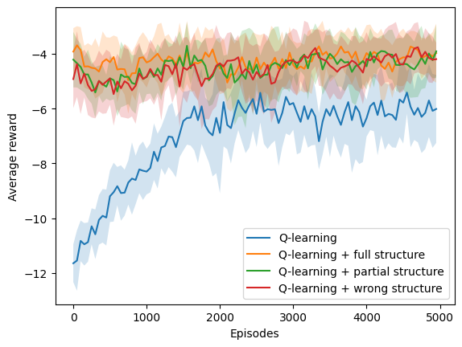<h3>Ambiente: stochastic</h3><h3>Porcenjate de modificación: low 025</h3><h3>Tipo de estructura: one to many </h3><h3>N: 9 </h3><h3>Simulaciones: 10 </h3><h3>Episodios: 10000 </h3><h3>Delta: 0.25 </h3><table>
  <tr>
    <th>Algoritmo</th>
    <th>M</th>
    <th>SD</th>
    <th>t</th>
    <th>df</th>
    <th>p</th>
    <th>Decisión</th>
    <th>d de Cohen</th>
  </tr>
  <tr>
    <td>$Q_1$</td>
    <td>7952.00</td>
    <td>2383.38</td>
    <td>0.00</td>
    <td>18.00</td>
    <td>1.00</td>
    <td>$h_0$ aceptada</td>
    <td>0.00</td>
  </tr>
  <tr>
    <td>$Q_2$</td>
    <td>3462.00</td>
    <td>3031.56</td>
    <td>-3.49</td>
    <td>17.05</td>
    <td>0.00</td>
    <td>$h_0$ rechazada</td>
    <td>1.56</td>
  </tr>
  <tr>
    <td>$Q_3$</td>
    <td>5904.00</td>
    <td>2324.89</td>
    <td>-1.85</td>
    <td>17.99</td>
    <td>0.08</td>
    <td>$h_0$ aceptada</td>
    <td>0.83</td>
  </tr>
  <tr>
    <td>$Q_4$</td>
    <td>4912.00</td>
    <td>3100.27</td>
    <td>-2.33</td>
    <td>16.88</td>
    <td>0.03</td>
    <td>$h_0$ rechazada</td>
    <td>1.04</td>
  </tr>
</table>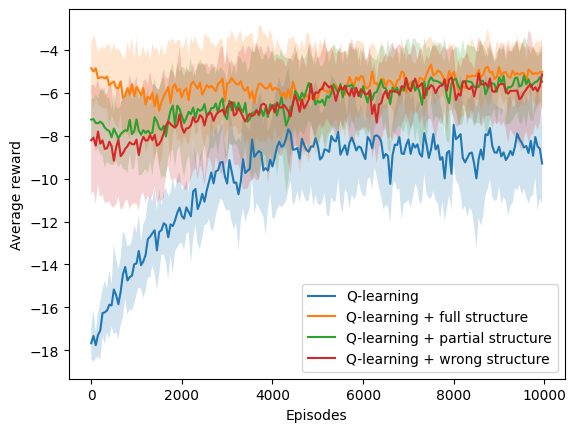<h3>Ambiente: stochastic</h3><h3>Porcenjate de modificación: low 025</h3><h3>Tipo de estructura: one to many </h3><h3>N: 9 </h3><h3>Simulaciones: 10 </h3><h3>Episodios: 10000 </h3><h3>Delta: 0.75 </h3><table>
  <tr>
    <th>Algoritmo</th>
    <th>M</th>
    <th>SD</th>
    <th>t</th>
    <th>df</th>
    <th>p</th>
    <th>Decisión</th>
    <th>d de Cohen</th>
  </tr>
  <tr>
    <td>$Q_1$</td>
    <td>9922.00</td>
    <td>234.00</td>
    <td>0.00</td>
    <td>18.00</td>
    <td>1.00</td>
    <td>$h_0$ aceptada</td>
    <td>0.00</td>
  </tr>
  <tr>
    <td>$Q_2$</td>
    <td>3206.00</td>
    <td>2787.92</td>
    <td>-7.20</td>
    <td>9.13</td>
    <td>0.00</td>
    <td>$h_0$ rechazada</td>
    <td>3.22</td>
  </tr>
  <tr>
    <td>$Q_3$</td>
    <td>6054.00</td>
    <td>1791.85</td>
    <td>-6.42</td>
    <td>9.31</td>
    <td>0.00</td>
    <td>$h_0$ rechazada</td>
    <td>2.87</td>
  </tr>
  <tr>
    <td>$Q_4$</td>
    <td>5774.00</td>
    <td>3540.25</td>
    <td>-3.51</td>
    <td>9.08</td>
    <td>0.01</td>
    <td>$h_0$ rechazada</td>
    <td>1.57</td>
  </tr>
</table><h3>Ambiente: stochastic</h3><h3>Porcenjate de modificación: low 025</h3><h3>Tipo de estructura: one to one </h3><h3>N: 5 </h3><h3>Simulaciones: 10 </h3><h3>Episodios: 5000 </h3><h3>Delta: 0.75 </h3><table>
  <tr>
    <th>Algoritmo</th>
    <th>M</th>
    <th>SD</th>
    <th>t</th>
    <th>df</th>
    <th>p</th>
    <th>Decisión</th>
    <th>d de Cohen</th>
  </tr>
  <tr>
    <td>$Q_1$</td>
    <td>4926.00</td>
    <td>222.00</td>
    <td>0.00</td>
    <td>18.00</td>
    <td>1.00</td>
    <td>$h_0$ aceptada</td>
    <td>0.00</td>
  </tr>
  <tr>
    <td>$Q_2$</td>
    <td>2000.00</td>
    <td>801.25</td>
    <td>-10.56</td>
    <td>10.37</td>
    <td>0.00</td>
    <td>$h_0$ rechazada</td>
    <td>4.72</td>
  </tr>
  <tr>
    <td>$Q_3$</td>
    <td>3114.00</td>
    <td>933.25</td>
    <td>-5.67</td>
    <td>10.02</td>
    <td>0.00</td>
    <td>$h_0$ rechazada</td>
    <td>2.53</td>
  </tr>
  <tr>
    <td>$Q_4$</td>
    <td>2848.00</td>
    <td>1343.26</td>
    <td>-4.58</td>
    <td>9.49</td>
    <td>0.00</td>
    <td>$h_0$ rechazada</td>
    <td>2.05</td>
  </tr>
</table><h3>Ambiente: stochastic</h3><h3>Porcenjate de modificación: low 025</h3><h3>Tipo de estructura: one to one </h3><h3>N: 5 </h3><h3>Simulaciones: 10 </h3><h3>Episodios: 5000 </h3><h3>Delta: 0.25 </h3><table>
  <tr>
    <th>Algoritmo</th>
    <th>M</th>
    <th>SD</th>
    <th>t</th>
    <th>df</th>
    <th>p</th>
    <th>Decisión</th>
    <th>d de Cohen</th>
  </tr>
  <tr>
    <td>$Q_1$</td>
    <td>5000.00</td>
    <td>0.00</td>
    <td>nan</td>
    <td>nan</td>
    <td>nan</td>
    <td>$h_0$ rechazada</td>
    <td>nan</td>
  </tr>
  <tr>
    <td>$Q_2$</td>
    <td>2936.00</td>
    <td>947.62</td>
    <td>-6.53</td>
    <td>9.00</td>
    <td>0.00</td>
    <td>$h_0$ rechazada</td>
    <td>2.92</td>
  </tr>
  <tr>
    <td>$Q_3$</td>
    <td>3018.00</td>
    <td>583.81</td>
    <td>-10.18</td>
    <td>9.00</td>
    <td>0.00</td>
    <td>$h_0$ rechazada</td>
    <td>4.55</td>
  </tr>
  <tr>
    <td>$Q_4$</td>
    <td>3480.00</td>
    <td>662.78</td>
    <td>-6.88</td>
    <td>9.00</td>
    <td>0.00</td>
    <td>$h_0$ rechazada</td>
    <td>3.08</td>
  </tr>
</table>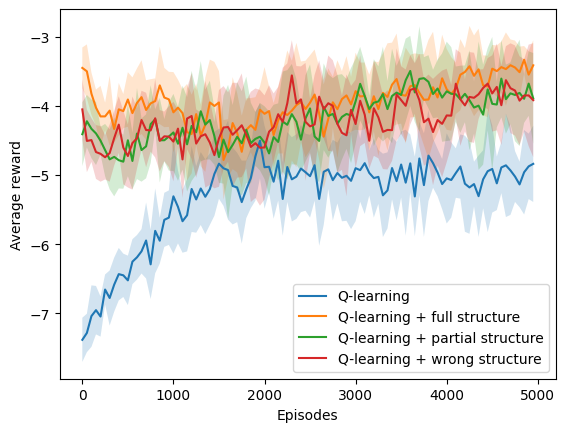<h3>Ambiente: stochastic</h3><h3>Porcenjate de modificación: low 025</h3><h3>Tipo de estructura: one to one </h3><h3>N: 7 </h3><h3>Simulaciones: 10 </h3><h3>Episodios: 5000 </h3><h3>Delta: 0.75 </h3><table>
  <tr>
    <th>Algoritmo</th>
    <th>M</th>
    <th>SD</th>
    <th>t</th>
    <th>df</th>
    <th>p</th>
    <th>Decisión</th>
    <th>d de Cohen</th>
  </tr>
  <tr>
    <td>$Q_1$</td>
    <td>5000.00</td>
    <td>0.00</td>
    <td>nan</td>
    <td>nan</td>
    <td>nan</td>
    <td>$h_0$ rechazada</td>
    <td>nan</td>
  </tr>
  <tr>
    <td>$Q_2$</td>
    <td>2326.00</td>
    <td>1087.68</td>
    <td>-7.38</td>
    <td>9.00</td>
    <td>0.00</td>
    <td>$h_0$ rechazada</td>
    <td>3.30</td>
  </tr>
  <tr>
    <td>$Q_3$</td>
    <td>2188.00</td>
    <td>1163.73</td>
    <td>-7.25</td>
    <td>9.00</td>
    <td>0.00</td>
    <td>$h_0$ rechazada</td>
    <td>3.24</td>
  </tr>
  <tr>
    <td>$Q_4$</td>
    <td>2360.00</td>
    <td>1049.61</td>
    <td>-7.55</td>
    <td>9.00</td>
    <td>0.00</td>
    <td>$h_0$ rechazada</td>
    <td>3.37</td>
  </tr>
</table>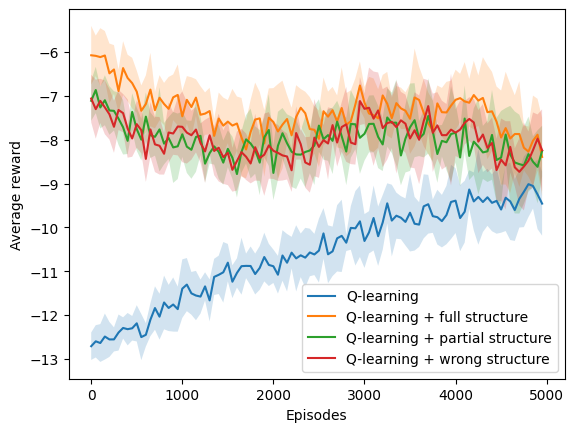<h3>Ambiente: stochastic</h3><h3>Porcenjate de modificación: low 025</h3><h3>Tipo de estructura: one to one </h3><h3>N: 7 </h3><h3>Simulaciones: 10 </h3><h3>Episodios: 5000 </h3><h3>Delta: 0.25 </h3><table>
  <tr>
    <th>Algoritmo</th>
    <th>M</th>
    <th>SD</th>
    <th>t</th>
    <th>df</th>
    <th>p</th>
    <th>Decisión</th>
    <th>d de Cohen</th>
  </tr>
  <tr>
    <td>$Q_1$</td>
    <td>5000.00</td>
    <td>0.00</td>
    <td>nan</td>
    <td>nan</td>
    <td>nan</td>
    <td>$h_0$ rechazada</td>
    <td>nan</td>
  </tr>
  <tr>
    <td>$Q_2$</td>
    <td>3426.00</td>
    <td>720.67</td>
    <td>-6.55</td>
    <td>9.00</td>
    <td>0.00</td>
    <td>$h_0$ rechazada</td>
    <td>2.93</td>
  </tr>
  <tr>
    <td>$Q_3$</td>
    <td>3576.00</td>
    <td>413.84</td>
    <td>-10.32</td>
    <td>9.00</td>
    <td>0.00</td>
    <td>$h_0$ rechazada</td>
    <td>4.62</td>
  </tr>
  <tr>
    <td>$Q_4$</td>
    <td>3388.00</td>
    <td>639.14</td>
    <td>-7.57</td>
    <td>9.00</td>
    <td>0.00</td>
    <td>$h_0$ rechazada</td>
    <td>3.38</td>
  </tr>
</table>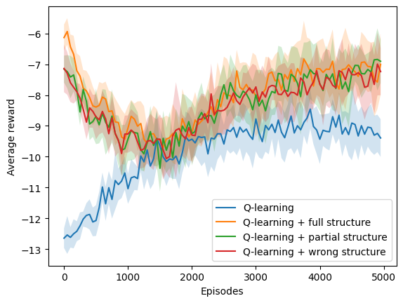<h3>Ambiente: stochastic</h3><h3>Porcenjate de modificación: low 025</h3><h3>Tipo de estructura: one to one </h3><h3>N: 9 </h3><h3>Simulaciones: 10 </h3><h3>Episodios: 10000 </h3><h3>Delta: 0.25 </h3><table>
  <tr>
    <th>Algoritmo</th>
    <th>M</th>
    <th>SD</th>
    <th>t</th>
    <th>df</th>
    <th>p</th>
    <th>Decisión</th>
    <th>d de Cohen</th>
  </tr>
  <tr>
    <td>$Q_1$</td>
    <td>10000.00</td>
    <td>0.00</td>
    <td>nan</td>
    <td>nan</td>
    <td>nan</td>
    <td>$h_0$ rechazada</td>
    <td>nan</td>
  </tr>
  <tr>
    <td>$Q_2$</td>
    <td>7850.00</td>
    <td>986.68</td>
    <td>-6.54</td>
    <td>9.00</td>
    <td>0.00</td>
    <td>$h_0$ rechazada</td>
    <td>2.92</td>
  </tr>
  <tr>
    <td>$Q_3$</td>
    <td>8532.00</td>
    <td>550.29</td>
    <td>-8.00</td>
    <td>9.00</td>
    <td>0.00</td>
    <td>$h_0$ rechazada</td>
    <td>3.58</td>
  </tr>
  <tr>
    <td>$Q_4$</td>
    <td>8014.00</td>
    <td>996.40</td>
    <td>-5.98</td>
    <td>9.00</td>
    <td>0.00</td>
    <td>$h_0$ rechazada</td>
    <td>2.67</td>
  </tr>
</table>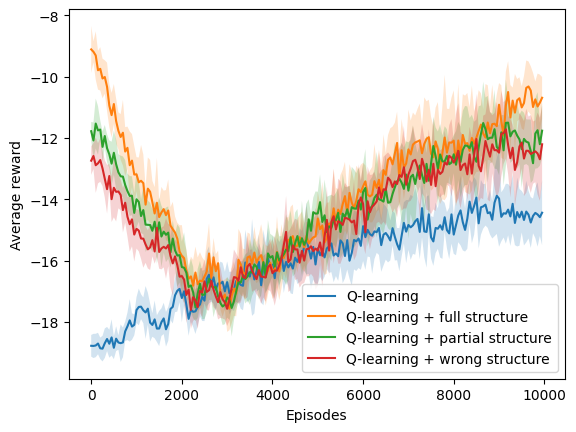<h3>Ambiente: stochastic</h3><h3>Porcenjate de modificación: low 025</h3><h3>Tipo de estructura: one to one </h3><h3>N: 9 </h3><h3>Simulaciones: 10 </h3><h3>Episodios: 10000 </h3><h3>Delta: 0.75 </h3><table>
  <tr>
    <th>Algoritmo</th>
    <th>M</th>
    <th>SD</th>
    <th>t</th>
    <th>df</th>
    <th>p</th>
    <th>Decisión</th>
    <th>d de Cohen</th>
  </tr>
  <tr>
    <td>$Q_1$</td>
    <td>10000.00</td>
    <td>0.00</td>
    <td>nan</td>
    <td>nan</td>
    <td>nan</td>
    <td>$h_0$ rechazada</td>
    <td>nan</td>
  </tr>
  <tr>
    <td>$Q_2$</td>
    <td>1116.00</td>
    <td>236.27</td>
    <td>-112.80</td>
    <td>9.00</td>
    <td>0.00</td>
    <td>$h_0$ rechazada</td>
    <td>50.45</td>
  </tr>
  <tr>
    <td>$Q_3$</td>
    <td>3014.00</td>
    <td>3498.70</td>
    <td>-5.99</td>
    <td>9.00</td>
    <td>0.00</td>
    <td>$h_0$ rechazada</td>
    <td>2.68</td>
  </tr>
  <tr>
    <td>$Q_4$</td>
    <td>9168.00</td>
    <td>2496.00</td>
    <td>-1.00</td>
    <td>9.00</td>
    <td>0.34</td>
    <td>$h_0$ aceptada</td>
    <td>0.45</td>
  </tr>
</table>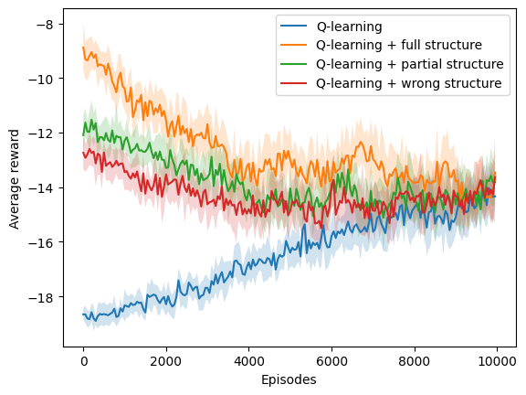