<h1>Experiment-DQN</h1><h2>Tamaño racha: 10<h3>Ambiente: deterministic</h3><h3>Porcenjate de modificación: low 025</h3><h3>Tipo de estructura: many to one </h3><h3>N: 5 </h3><h3>Simulaciones: 10 </h3><h3>Episodios: 200 </h3><h3>Delta: 0.075 </h3><table>
  <tr>
    <th>Algoritmo</th>
    <th>M</th>
    <th>SD</th>
    <th>t</th>
    <th>df</th>
    <th>p</th>
    <th>Decisión</th>
    <th>d de Cohen</th>
  </tr>
  <tr>
    <td>$Q_1$</td>
    <td>194.50</td>
    <td>16.50</td>
    <td>0.00</td>
    <td>18.00</td>
    <td>1.00</td>
    <td>$h_0$ aceptada</td>
    <td>0.00</td>
  </tr>
  <tr>
    <td>$Q_2$</td>
    <td>46.50</td>
    <td>38.41</td>
    <td>-10.62</td>
    <td>12.21</td>
    <td>0.00</td>
    <td>$h_0$ rechazada</td>
    <td>4.75</td>
  </tr>
  <tr>
    <td>$Q_3$</td>
    <td>47.50</td>
    <td>58.19</td>
    <td>-7.29</td>
    <td>10.44</td>
    <td>0.00</td>
    <td>$h_0$ rechazada</td>
    <td>3.26</td>
  </tr>
  <tr>
    <td>$Q_4$</td>
    <td>84.00</td>
    <td>67.74</td>
    <td>-4.75</td>
    <td>10.06</td>
    <td>0.00</td>
    <td>$h_0$ rechazada</td>
    <td>2.13</td>
  </tr>
</table>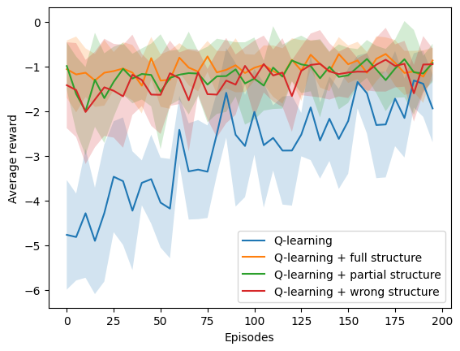<h3>Ambiente: deterministic</h3><h3>Porcenjate de modificación: low 025</h3><h3>Tipo de estructura: many to one </h3><h3>N: 7 </h3><h3>Simulaciones: 10 </h3><h3>Episodios: 200 </h3><h3>Delta: 0.05357142857142857 </h3><table>
  <tr>
    <th>Algoritmo</th>
    <th>M</th>
    <th>SD</th>
    <th>t</th>
    <th>df</th>
    <th>p</th>
    <th>Decisión</th>
    <th>d de Cohen</th>
  </tr>
  <tr>
    <td>$Q_1$</td>
    <td>187.50</td>
    <td>25.22</td>
    <td>0.00</td>
    <td>18.00</td>
    <td>1.00</td>
    <td>$h_0$ aceptada</td>
    <td>0.00</td>
  </tr>
  <tr>
    <td>$Q_2$</td>
    <td>79.00</td>
    <td>67.11</td>
    <td>-4.54</td>
    <td>11.49</td>
    <td>0.00</td>
    <td>$h_0$ rechazada</td>
    <td>2.03</td>
  </tr>
  <tr>
    <td>$Q_3$</td>
    <td>110.50</td>
    <td>76.37</td>
    <td>-2.87</td>
    <td>10.94</td>
    <td>0.02</td>
    <td>$h_0$ rechazada</td>
    <td>1.28</td>
  </tr>
  <tr>
    <td>$Q_4$</td>
    <td>98.00</td>
    <td>75.17</td>
    <td>-3.39</td>
    <td>11.00</td>
    <td>0.01</td>
    <td>$h_0$ rechazada</td>
    <td>1.51</td>
  </tr>
</table><h3>Ambiente: deterministic</h3><h3>Porcenjate de modificación: low 025</h3><h3>Tipo de estructura: many to one </h3><h3>N: 9 </h3><h3>Simulaciones: 10 </h3><h3>Episodios: 200 </h3><h3>Delta: 0.041666666666666664 </h3><table>
  <tr>
    <th>Algoritmo</th>
    <th>M</th>
    <th>SD</th>
    <th>t</th>
    <th>df</th>
    <th>p</th>
    <th>Decisión</th>
    <th>d de Cohen</th>
  </tr>
  <tr>
    <td>$Q_1$</td>
    <td>194.50</td>
    <td>16.50</td>
    <td>0.00</td>
    <td>18.00</td>
    <td>1.00</td>
    <td>$h_0$ aceptada</td>
    <td>0.00</td>
  </tr>
  <tr>
    <td>$Q_2$</td>
    <td>25.00</td>
    <td>8.37</td>
    <td>-27.49</td>
    <td>13.34</td>
    <td>0.00</td>
    <td>$h_0$ rechazada</td>
    <td>12.29</td>
  </tr>
  <tr>
    <td>$Q_3$</td>
    <td>97.00</td>
    <td>52.21</td>
    <td>-5.34</td>
    <td>10.78</td>
    <td>0.00</td>
    <td>$h_0$ rechazada</td>
    <td>2.39</td>
  </tr>
  <tr>
    <td>$Q_4$</td>
    <td>111.00</td>
    <td>57.09</td>
    <td>-4.22</td>
    <td>10.49</td>
    <td>0.00</td>
    <td>$h_0$ rechazada</td>
    <td>1.89</td>
  </tr>
</table>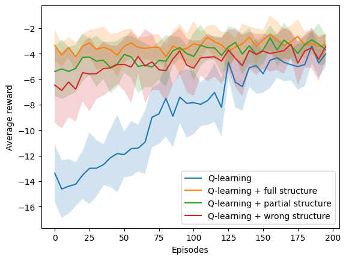<h3>Ambiente: deterministic</h3><h3>Porcenjate de modificación: low 025</h3><h3>Tipo de estructura: one to many </h3><h3>N: 5 </h3><h3>Simulaciones: 10 </h3><h3>Episodios: 200 </h3><h3>Delta: 0.075 </h3><table>
  <tr>
    <th>Algoritmo</th>
    <th>M</th>
    <th>SD</th>
    <th>t</th>
    <th>df</th>
    <th>p</th>
    <th>Decisión</th>
    <th>d de Cohen</th>
  </tr>
  <tr>
    <td>$Q_1$</td>
    <td>200.00</td>
    <td>0.00</td>
    <td>nan</td>
    <td>nan</td>
    <td>nan</td>
    <td>$h_0$ rechazada</td>
    <td>nan</td>
  </tr>
  <tr>
    <td>$Q_2$</td>
    <td>67.50</td>
    <td>36.00</td>
    <td>-11.04</td>
    <td>9.00</td>
    <td>0.00</td>
    <td>$h_0$ rechazada</td>
    <td>4.94</td>
  </tr>
  <tr>
    <td>$Q_3$</td>
    <td>104.50</td>
    <td>71.78</td>
    <td>-3.99</td>
    <td>9.00</td>
    <td>0.00</td>
    <td>$h_0$ rechazada</td>
    <td>1.79</td>
  </tr>
  <tr>
    <td>$Q_4$</td>
    <td>146.00</td>
    <td>82.49</td>
    <td>-1.96</td>
    <td>9.00</td>
    <td>0.08</td>
    <td>$h_0$ aceptada</td>
    <td>0.88</td>
  </tr>
</table><h3>Ambiente: deterministic</h3><h3>Porcenjate de modificación: low 025</h3><h3>Tipo de estructura: one to many </h3><h3>N: 7 </h3><h3>Simulaciones: 10 </h3><h3>Episodios: 200 </h3><h3>Delta: 0.05357142857142857 </h3><table>
  <tr>
    <th>Algoritmo</th>
    <th>M</th>
    <th>SD</th>
    <th>t</th>
    <th>df</th>
    <th>p</th>
    <th>Decisión</th>
    <th>d de Cohen</th>
  </tr>
  <tr>
    <td>$Q_1$</td>
    <td>200.00</td>
    <td>0.00</td>
    <td>nan</td>
    <td>nan</td>
    <td>nan</td>
    <td>$h_0$ rechazada</td>
    <td>nan</td>
  </tr>
  <tr>
    <td>$Q_2$</td>
    <td>64.50</td>
    <td>59.01</td>
    <td>-6.89</td>
    <td>9.00</td>
    <td>0.00</td>
    <td>$h_0$ rechazada</td>
    <td>3.08</td>
  </tr>
  <tr>
    <td>$Q_3$</td>
    <td>105.00</td>
    <td>75.30</td>
    <td>-3.78</td>
    <td>9.00</td>
    <td>0.00</td>
    <td>$h_0$ rechazada</td>
    <td>1.69</td>
  </tr>
  <tr>
    <td>$Q_4$</td>
    <td>72.00</td>
    <td>65.20</td>
    <td>-5.89</td>
    <td>9.00</td>
    <td>0.00</td>
    <td>$h_0$ rechazada</td>
    <td>2.63</td>
  </tr>
</table>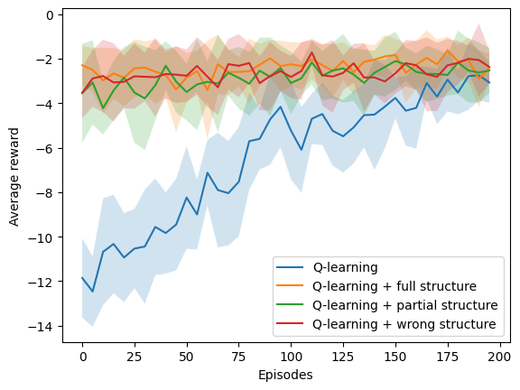<h3>Ambiente: deterministic</h3><h3>Porcenjate de modificación: low 025</h3><h3>Tipo de estructura: one to many </h3><h3>N: 9 </h3><h3>Simulaciones: 10 </h3><h3>Episodios: 200 </h3><h3>Delta: 0.041666666666666664 </h3><table>
  <tr>
    <th>Algoritmo</th>
    <th>M</th>
    <th>SD</th>
    <th>t</th>
    <th>df</th>
    <th>p</th>
    <th>Decisión</th>
    <th>d de Cohen</th>
  </tr>
  <tr>
    <td>$Q_1$</td>
    <td>200.00</td>
    <td>0.00</td>
    <td>nan</td>
    <td>nan</td>
    <td>nan</td>
    <td>$h_0$ rechazada</td>
    <td>nan</td>
  </tr>
  <tr>
    <td>$Q_2$</td>
    <td>85.50</td>
    <td>69.19</td>
    <td>-4.96</td>
    <td>9.00</td>
    <td>0.00</td>
    <td>$h_0$ rechazada</td>
    <td>2.22</td>
  </tr>
  <tr>
    <td>$Q_3$</td>
    <td>125.00</td>
    <td>69.43</td>
    <td>-3.24</td>
    <td>9.00</td>
    <td>0.01</td>
    <td>$h_0$ rechazada</td>
    <td>1.45</td>
  </tr>
  <tr>
    <td>$Q_4$</td>
    <td>163.00</td>
    <td>46.11</td>
    <td>-2.41</td>
    <td>9.00</td>
    <td>0.04</td>
    <td>$h_0$ rechazada</td>
    <td>1.08</td>
  </tr>
</table>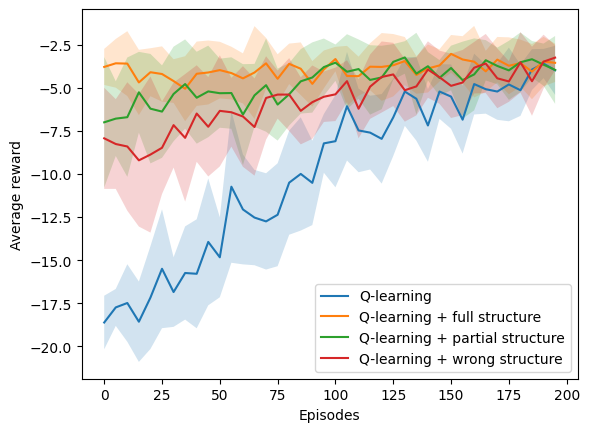<h3>Ambiente: deterministic</h3><h3>Porcenjate de modificación: low 025</h3><h3>Tipo de estructura: one to one </h3><h3>N: 5 </h3><h3>Simulaciones: 10 </h3><h3>Episodios: 200 </h3><h3>Delta: 0.075 </h3><table>
  <tr>
    <th>Algoritmo</th>
    <th>M</th>
    <th>SD</th>
    <th>t</th>
    <th>df</th>
    <th>p</th>
    <th>Decisión</th>
    <th>d de Cohen</th>
  </tr>
  <tr>
    <td>$Q_1$</td>
    <td>200.00</td>
    <td>0.00</td>
    <td>nan</td>
    <td>nan</td>
    <td>nan</td>
    <td>$h_0$ rechazada</td>
    <td>nan</td>
  </tr>
  <tr>
    <td>$Q_2$</td>
    <td>104.50</td>
    <td>47.30</td>
    <td>-6.06</td>
    <td>9.00</td>
    <td>0.00</td>
    <td>$h_0$ rechazada</td>
    <td>2.71</td>
  </tr>
  <tr>
    <td>$Q_3$</td>
    <td>165.00</td>
    <td>47.75</td>
    <td>-2.20</td>
    <td>9.00</td>
    <td>0.06</td>
    <td>$h_0$ aceptada</td>
    <td>0.98</td>
  </tr>
  <tr>
    <td>$Q_4$</td>
    <td>170.50</td>
    <td>37.04</td>
    <td>-2.39</td>
    <td>9.00</td>
    <td>0.04</td>
    <td>$h_0$ rechazada</td>
    <td>1.07</td>
  </tr>
</table>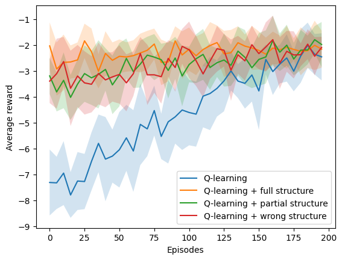<h3>Ambiente: deterministic</h3><h3>Porcenjate de modificación: low 025</h3><h3>Tipo de estructura: one to one </h3><h3>N: 7 </h3><h3>Simulaciones: 10 </h3><h3>Episodios: 200 </h3><h3>Delta: 0.05357142857142857 </h3><table>
  <tr>
    <th>Algoritmo</th>
    <th>M</th>
    <th>SD</th>
    <th>t</th>
    <th>df</th>
    <th>p</th>
    <th>Decisión</th>
    <th>d de Cohen</th>
  </tr>
  <tr>
    <td>$Q_1$</td>
    <td>194.50</td>
    <td>16.50</td>
    <td>0.00</td>
    <td>18.00</td>
    <td>1.00</td>
    <td>$h_0$ aceptada</td>
    <td>0.00</td>
  </tr>
  <tr>
    <td>$Q_2$</td>
    <td>67.50</td>
    <td>25.42</td>
    <td>-12.57</td>
    <td>15.44</td>
    <td>0.00</td>
    <td>$h_0$ rechazada</td>
    <td>5.62</td>
  </tr>
  <tr>
    <td>$Q_3$</td>
    <td>144.50</td>
    <td>48.24</td>
    <td>-2.94</td>
    <td>11.08</td>
    <td>0.01</td>
    <td>$h_0$ rechazada</td>
    <td>1.32</td>
  </tr>
  <tr>
    <td>$Q_4$</td>
    <td>107.00</td>
    <td>52.45</td>
    <td>-4.77</td>
    <td>10.76</td>
    <td>0.00</td>
    <td>$h_0$ rechazada</td>
    <td>2.14</td>
  </tr>
</table>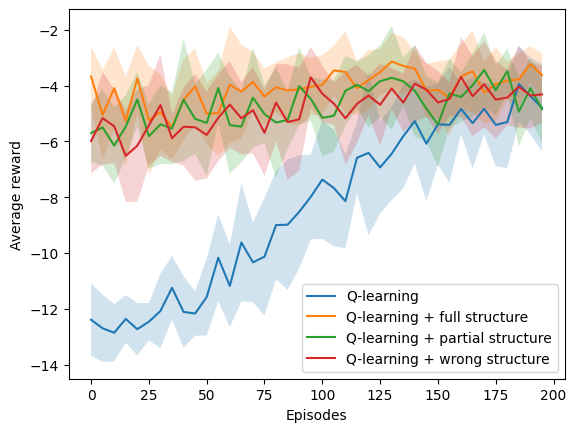<h3>Ambiente: deterministic</h3><h3>Porcenjate de modificación: low 025</h3><h3>Tipo de estructura: one to one </h3><h3>N: 9 </h3><h3>Simulaciones: 10 </h3><h3>Episodios: 200 </h3><h3>Delta: 0.041666666666666664 </h3><table>
  <tr>
    <th>Algoritmo</th>
    <th>M</th>
    <th>SD</th>
    <th>t</th>
    <th>df</th>
    <th>p</th>
    <th>Decisión</th>
    <th>d de Cohen</th>
  </tr>
  <tr>
    <td>$Q_1$</td>
    <td>169.00</td>
    <td>31.37</td>
    <td>0.00</td>
    <td>18.00</td>
    <td>1.00</td>
    <td>$h_0$ aceptada</td>
    <td>0.00</td>
  </tr>
  <tr>
    <td>$Q_2$</td>
    <td>82.00</td>
    <td>38.42</td>
    <td>-5.26</td>
    <td>17.31</td>
    <td>0.00</td>
    <td>$h_0$ rechazada</td>
    <td>2.35</td>
  </tr>
  <tr>
    <td>$Q_3$</td>
    <td>113.00</td>
    <td>38.55</td>
    <td>-3.38</td>
    <td>17.29</td>
    <td>0.00</td>
    <td>$h_0$ rechazada</td>
    <td>1.51</td>
  </tr>
  <tr>
    <td>$Q_4$</td>
    <td>154.00</td>
    <td>46.79</td>
    <td>-0.80</td>
    <td>15.73</td>
    <td>0.44</td>
    <td>$h_0$ aceptada</td>
    <td>0.36</td>
  </tr>
</table><h3>Ambiente: stochastic</h3><h3>Porcenjate de modificación: low 025</h3><h3>Tipo de estructura: many to one </h3><h3>N: 5 </h3><h3>Simulaciones: 10 </h3><h3>Episodios: 200 </h3><h3>Delta: 0.075 </h3><table>
  <tr>
    <th>Algoritmo</th>
    <th>M</th>
    <th>SD</th>
    <th>t</th>
    <th>df</th>
    <th>p</th>
    <th>Decisión</th>
    <th>d de Cohen</th>
  </tr>
  <tr>
    <td>$Q_1$</td>
    <td>200.00</td>
    <td>0.00</td>
    <td>nan</td>
    <td>nan</td>
    <td>nan</td>
    <td>$h_0$ rechazada</td>
    <td>nan</td>
  </tr>
  <tr>
    <td>$Q_2$</td>
    <td>43.50</td>
    <td>25.60</td>
    <td>-18.34</td>
    <td>9.00</td>
    <td>0.00</td>
    <td>$h_0$ rechazada</td>
    <td>8.20</td>
  </tr>
  <tr>
    <td>$Q_3$</td>
    <td>68.50</td>
    <td>50.99</td>
    <td>-7.74</td>
    <td>9.00</td>
    <td>0.00</td>
    <td>$h_0$ rechazada</td>
    <td>3.46</td>
  </tr>
  <tr>
    <td>$Q_4$</td>
    <td>88.50</td>
    <td>76.36</td>
    <td>-4.38</td>
    <td>9.00</td>
    <td>0.00</td>
    <td>$h_0$ rechazada</td>
    <td>1.96</td>
  </tr>
</table>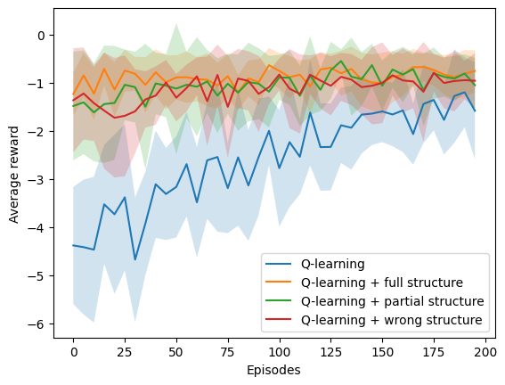<h3>Ambiente: stochastic</h3><h3>Porcenjate de modificación: low 025</h3><h3>Tipo de estructura: many to one </h3><h3>N: 7 </h3><h3>Simulaciones: 10 </h3><h3>Episodios: 200 </h3><h3>Delta: 0.05357142857142857 </h3><table>
  <tr>
    <th>Algoritmo</th>
    <th>M</th>
    <th>SD</th>
    <th>t</th>
    <th>df</th>
    <th>p</th>
    <th>Decisión</th>
    <th>d de Cohen</th>
  </tr>
  <tr>
    <td>$Q_1$</td>
    <td>200.00</td>
    <td>0.00</td>
    <td>nan</td>
    <td>nan</td>
    <td>nan</td>
    <td>$h_0$ rechazada</td>
    <td>nan</td>
  </tr>
  <tr>
    <td>$Q_2$</td>
    <td>56.00</td>
    <td>55.13</td>
    <td>-7.84</td>
    <td>9.00</td>
    <td>0.00</td>
    <td>$h_0$ rechazada</td>
    <td>3.50</td>
  </tr>
  <tr>
    <td>$Q_3$</td>
    <td>86.50</td>
    <td>63.37</td>
    <td>-5.37</td>
    <td>9.00</td>
    <td>0.00</td>
    <td>$h_0$ rechazada</td>
    <td>2.40</td>
  </tr>
  <tr>
    <td>$Q_4$</td>
    <td>106.00</td>
    <td>65.34</td>
    <td>-4.32</td>
    <td>9.00</td>
    <td>0.00</td>
    <td>$h_0$ rechazada</td>
    <td>1.93</td>
  </tr>
</table><h3>Ambiente: stochastic</h3><h3>Porcenjate de modificación: low 025</h3><h3>Tipo de estructura: many to one </h3><h3>N: 9 </h3><h3>Simulaciones: 10 </h3><h3>Episodios: 200 </h3><h3>Delta: 0.041666666666666664 </h3><table>
  <tr>
    <th>Algoritmo</th>
    <th>M</th>
    <th>SD</th>
    <th>t</th>
    <th>df</th>
    <th>p</th>
    <th>Decisión</th>
    <th>d de Cohen</th>
  </tr>
  <tr>
    <td>$Q_1$</td>
    <td>200.00</td>
    <td>0.00</td>
    <td>nan</td>
    <td>nan</td>
    <td>nan</td>
    <td>$h_0$ rechazada</td>
    <td>nan</td>
  </tr>
  <tr>
    <td>$Q_2$</td>
    <td>53.00</td>
    <td>39.45</td>
    <td>-11.18</td>
    <td>9.00</td>
    <td>0.00</td>
    <td>$h_0$ rechazada</td>
    <td>5.00</td>
  </tr>
  <tr>
    <td>$Q_3$</td>
    <td>87.50</td>
    <td>78.14</td>
    <td>-4.32</td>
    <td>9.00</td>
    <td>0.00</td>
    <td>$h_0$ rechazada</td>
    <td>1.93</td>
  </tr>
  <tr>
    <td>$Q_4$</td>
    <td>127.50</td>
    <td>78.65</td>
    <td>-2.77</td>
    <td>9.00</td>
    <td>0.02</td>
    <td>$h_0$ rechazada</td>
    <td>1.24</td>
  </tr>
</table><h3>Ambiente: stochastic</h3><h3>Porcenjate de modificación: low 025</h3><h3>Tipo de estructura: one to many </h3><h3>N: 5 </h3><h3>Simulaciones: 10 </h3><h3>Episodios: 200 </h3><h3>Delta: 0.075 </h3><table>
  <tr>
    <th>Algoritmo</th>
    <th>M</th>
    <th>SD</th>
    <th>t</th>
    <th>df</th>
    <th>p</th>
    <th>Decisión</th>
    <th>d de Cohen</th>
  </tr>
  <tr>
    <td>$Q_1$</td>
    <td>200.00</td>
    <td>0.00</td>
    <td>nan</td>
    <td>nan</td>
    <td>nan</td>
    <td>$h_0$ rechazada</td>
    <td>nan</td>
  </tr>
  <tr>
    <td>$Q_2$</td>
    <td>59.50</td>
    <td>52.70</td>
    <td>-8.00</td>
    <td>9.00</td>
    <td>0.00</td>
    <td>$h_0$ rechazada</td>
    <td>3.58</td>
  </tr>
  <tr>
    <td>$Q_3$</td>
    <td>105.00</td>
    <td>71.87</td>
    <td>-3.97</td>
    <td>9.00</td>
    <td>0.00</td>
    <td>$h_0$ rechazada</td>
    <td>1.77</td>
  </tr>
  <tr>
    <td>$Q_4$</td>
    <td>107.50</td>
    <td>66.94</td>
    <td>-4.15</td>
    <td>9.00</td>
    <td>0.00</td>
    <td>$h_0$ rechazada</td>
    <td>1.85</td>
  </tr>
</table>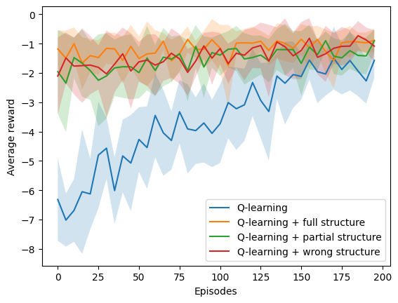<h3>Ambiente: stochastic</h3><h3>Porcenjate de modificación: low 025</h3><h3>Tipo de estructura: one to many </h3><h3>N: 7 </h3><h3>Simulaciones: 10 </h3><h3>Episodios: 200 </h3><h3>Delta: 0.05357142857142857 </h3><table>
  <tr>
    <th>Algoritmo</th>
    <th>M</th>
    <th>SD</th>
    <th>t</th>
    <th>df</th>
    <th>p</th>
    <th>Decisión</th>
    <th>d de Cohen</th>
  </tr>
  <tr>
    <td>$Q_1$</td>
    <td>193.50</td>
    <td>19.50</td>
    <td>0.00</td>
    <td>18.00</td>
    <td>1.00</td>
    <td>$h_0$ aceptada</td>
    <td>0.00</td>
  </tr>
  <tr>
    <td>$Q_2$</td>
    <td>73.00</td>
    <td>51.00</td>
    <td>-6.62</td>
    <td>11.58</td>
    <td>0.00</td>
    <td>$h_0$ rechazada</td>
    <td>2.96</td>
  </tr>
  <tr>
    <td>$Q_3$</td>
    <td>140.50</td>
    <td>46.34</td>
    <td>-3.16</td>
    <td>12.09</td>
    <td>0.01</td>
    <td>$h_0$ rechazada</td>
    <td>1.41</td>
  </tr>
  <tr>
    <td>$Q_4$</td>
    <td>144.50</td>
    <td>74.24</td>
    <td>-1.91</td>
    <td>10.24</td>
    <td>0.08</td>
    <td>$h_0$ aceptada</td>
    <td>0.86</td>
  </tr>
</table><h3>Ambiente: stochastic</h3><h3>Porcenjate de modificación: low 025</h3><h3>Tipo de estructura: one to many </h3><h3>N: 9 </h3><h3>Simulaciones: 10 </h3><h3>Episodios: 200 </h3><h3>Delta: 0.041666666666666664 </h3><table>
  <tr>
    <th>Algoritmo</th>
    <th>M</th>
    <th>SD</th>
    <th>t</th>
    <th>df</th>
    <th>p</th>
    <th>Decisión</th>
    <th>d de Cohen</th>
  </tr>
  <tr>
    <td>$Q_1$</td>
    <td>200.00</td>
    <td>0.00</td>
    <td>nan</td>
    <td>nan</td>
    <td>nan</td>
    <td>$h_0$ rechazada</td>
    <td>nan</td>
  </tr>
  <tr>
    <td>$Q_2$</td>
    <td>74.00</td>
    <td>56.60</td>
    <td>-6.68</td>
    <td>9.00</td>
    <td>0.00</td>
    <td>$h_0$ rechazada</td>
    <td>2.99</td>
  </tr>
  <tr>
    <td>$Q_3$</td>
    <td>118.50</td>
    <td>75.83</td>
    <td>-3.22</td>
    <td>9.00</td>
    <td>0.01</td>
    <td>$h_0$ rechazada</td>
    <td>1.44</td>
  </tr>
  <tr>
    <td>$Q_4$</td>
    <td>167.00</td>
    <td>52.74</td>
    <td>-1.88</td>
    <td>9.00</td>
    <td>0.09</td>
    <td>$h_0$ aceptada</td>
    <td>0.84</td>
  </tr>
</table>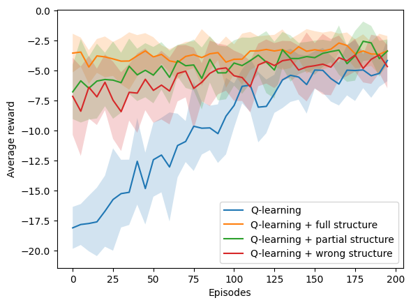<h3>Ambiente: stochastic</h3><h3>Porcenjate de modificación: low 025</h3><h3>Tipo de estructura: one to one </h3><h3>N: 5 </h3><h3>Simulaciones: 10 </h3><h3>Episodios: 200 </h3><h3>Delta: 0.075 </h3><table>
  <tr>
    <th>Algoritmo</th>
    <th>M</th>
    <th>SD</th>
    <th>t</th>
    <th>df</th>
    <th>p</th>
    <th>Decisión</th>
    <th>d de Cohen</th>
  </tr>
  <tr>
    <td>$Q_1$</td>
    <td>200.00</td>
    <td>0.00</td>
    <td>nan</td>
    <td>nan</td>
    <td>nan</td>
    <td>$h_0$ rechazada</td>
    <td>nan</td>
  </tr>
  <tr>
    <td>$Q_2$</td>
    <td>82.00</td>
    <td>43.20</td>
    <td>-8.19</td>
    <td>9.00</td>
    <td>0.00</td>
    <td>$h_0$ rechazada</td>
    <td>3.66</td>
  </tr>
  <tr>
    <td>$Q_3$</td>
    <td>156.50</td>
    <td>47.33</td>
    <td>-2.76</td>
    <td>9.00</td>
    <td>0.02</td>
    <td>$h_0$ rechazada</td>
    <td>1.23</td>
  </tr>
  <tr>
    <td>$Q_4$</td>
    <td>161.50</td>
    <td>41.66</td>
    <td>-2.77</td>
    <td>9.00</td>
    <td>0.02</td>
    <td>$h_0$ rechazada</td>
    <td>1.24</td>
  </tr>
</table>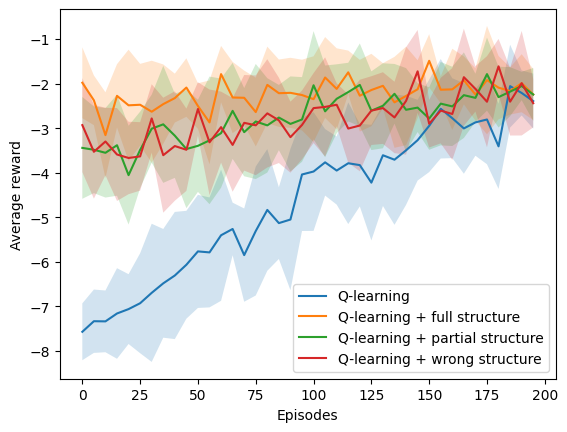<h3>Ambiente: stochastic</h3><h3>Porcenjate de modificación: low 025</h3><h3>Tipo de estructura: one to one </h3><h3>N: 7 </h3><h3>Simulaciones: 10 </h3><h3>Episodios: 200 </h3><h3>Delta: 0.05357142857142857 </h3><table>
  <tr>
    <th>Algoritmo</th>
    <th>M</th>
    <th>SD</th>
    <th>t</th>
    <th>df</th>
    <th>p</th>
    <th>Decisión</th>
    <th>d de Cohen</th>
  </tr>
  <tr>
    <td>$Q_1$</td>
    <td>194.50</td>
    <td>16.50</td>
    <td>0.00</td>
    <td>18.00</td>
    <td>1.00</td>
    <td>$h_0$ aceptada</td>
    <td>0.00</td>
  </tr>
  <tr>
    <td>$Q_2$</td>
    <td>92.00</td>
    <td>62.50</td>
    <td>-4.76</td>
    <td>10.25</td>
    <td>0.00</td>
    <td>$h_0$ rechazada</td>
    <td>2.13</td>
  </tr>
  <tr>
    <td>$Q_3$</td>
    <td>150.00</td>
    <td>58.27</td>
    <td>-2.20</td>
    <td>10.43</td>
    <td>0.05</td>
    <td>$h_0$ aceptada</td>
    <td>0.99</td>
  </tr>
  <tr>
    <td>$Q_4$</td>
    <td>152.50</td>
    <td>48.33</td>
    <td>-2.47</td>
    <td>11.07</td>
    <td>0.03</td>
    <td>$h_0$ rechazada</td>
    <td>1.10</td>
  </tr>
</table><h3>Ambiente: stochastic</h3><h3>Porcenjate de modificación: low 025</h3><h3>Tipo de estructura: one to one </h3><h3>N: 9 </h3><h3>Simulaciones: 10 </h3><h3>Episodios: 200 </h3><h3>Delta: 0.041666666666666664 </h3><table>
  <tr>
    <th>Algoritmo</th>
    <th>M</th>
    <th>SD</th>
    <th>t</th>
    <th>df</th>
    <th>p</th>
    <th>Decisión</th>
    <th>d de Cohen</th>
  </tr>
  <tr>
    <td>$Q_1$</td>
    <td>188.00</td>
    <td>24.10</td>
    <td>0.00</td>
    <td>18.00</td>
    <td>1.00</td>
    <td>$h_0$ aceptada</td>
    <td>0.00</td>
  </tr>
  <tr>
    <td>$Q_2$</td>
    <td>45.50</td>
    <td>23.18</td>
    <td>-12.78</td>
    <td>17.97</td>
    <td>0.00</td>
    <td>$h_0$ rechazada</td>
    <td>5.72</td>
  </tr>
  <tr>
    <td>$Q_3$</td>
    <td>88.00</td>
    <td>20.88</td>
    <td>-9.41</td>
    <td>17.64</td>
    <td>0.00</td>
    <td>$h_0$ rechazada</td>
    <td>4.21</td>
  </tr>
  <tr>
    <td>$Q_4$</td>
    <td>110.00</td>
    <td>38.73</td>
    <td>-5.13</td>
    <td>15.06</td>
    <td>0.00</td>
    <td>$h_0$ rechazada</td>
    <td>2.29</td>
  </tr>
</table>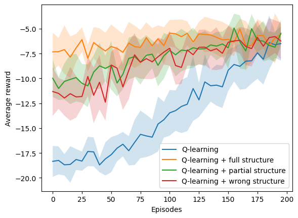<h2>Número de episodios en alcanzar racha de recompensas</h2><h3>one_to_one</h3><h3>one_to_many</h3><h3>many_to_one</h3>