<h1>Experiment-Pmod</h1><h2>Tamaño racha: 20<h3>Ambiente: deterministic</h3><h3>Porcentaje de modificación: high 075</h3><h3>Tipo de estructura: many to one </h3><h3>N: 5 </h3><h3>Simulaciones: 10 </h3><h3>Episodios: 10000 </h3><h3>Delta: 0.5 </h3><table>
  <tr>
    <th>Algoritmo</th>
    <th>M</th>
    <th>SD</th>
    <th>t</th>
    <th>df</th>
    <th>p</th>
    <th>H0</th>
    <th>d de Cohen</th>
  </tr>
  <tr>
    <td>$Q_1$</td>
    <td>9952.00</td>
    <td>144.00</td>
    <td>0.00</td>
    <td>18.00</td>
    <td>1.00</td>
    <td>aceptada</td>
    <td>0.00</td>
  </tr>
  <tr>
    <td>$Q_2$</td>
    <td>5346.00</td>
    <td>2790.90</td>
    <td>-4.94</td>
    <td>9.05</td>
    <td>0.00</td>
    <td>rechazada</td>
    <td>2.21</td>
  </tr>
  <tr>
    <td>$Q_3$</td>
    <td>9100.00</td>
    <td>2700.00</td>
    <td>-0.95</td>
    <td>9.05</td>
    <td>0.37</td>
    <td>aceptada</td>
    <td>0.42</td>
  </tr>
  <tr>
    <td>$Q_4$</td>
    <td>9100.00</td>
    <td>2700.00</td>
    <td>-0.95</td>
    <td>9.05</td>
    <td>0.37</td>
    <td>aceptada</td>
    <td>0.42</td>
  </tr>
</table><h3>Ambiente: deterministic</h3><h3>Porcentaje de modificación: high 075</h3><h3>Tipo de estructura: many to one </h3><h3>N: 7 </h3><h3>Simulaciones: 10 </h3><h3>Episodios: 10000 </h3><h3>Delta: 0.5 </h3><table>
  <tr>
    <th>Algoritmo</th>
    <th>M</th>
    <th>SD</th>
    <th>t</th>
    <th>df</th>
    <th>p</th>
    <th>H0</th>
    <th>d de Cohen</th>
  </tr>
  <tr>
    <td>$Q_1$</td>
    <td>9640.00</td>
    <td>557.71</td>
    <td>0.00</td>
    <td>18.00</td>
    <td>1.00</td>
    <td>aceptada</td>
    <td>0.00</td>
  </tr>
  <tr>
    <td>$Q_2$</td>
    <td>4846.00</td>
    <td>3776.21</td>
    <td>-3.77</td>
    <td>9.39</td>
    <td>0.00</td>
    <td>rechazada</td>
    <td>1.68</td>
  </tr>
  <tr>
    <td>$Q_3$</td>
    <td>9492.00</td>
    <td>664.96</td>
    <td>-0.51</td>
    <td>17.47</td>
    <td>0.62</td>
    <td>aceptada</td>
    <td>0.23</td>
  </tr>
  <tr>
    <td>$Q_4$</td>
    <td>9296.00</td>
    <td>999.19</td>
    <td>-0.90</td>
    <td>14.11</td>
    <td>0.38</td>
    <td>aceptada</td>
    <td>0.40</td>
  </tr>
</table>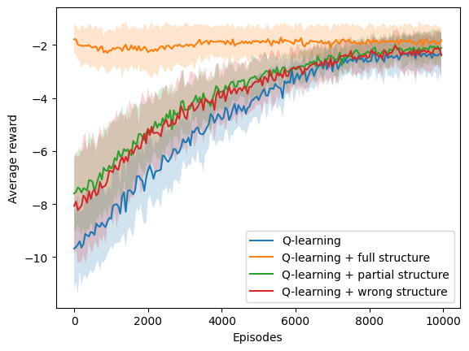<h3>Ambiente: deterministic</h3><h3>Porcentaje de modificación: high 075</h3><h3>Tipo de estructura: many to one </h3><h3>N: 9 </h3><h3>Simulaciones: 10 </h3><h3>Episodios: 20000 </h3><h3>Delta: 0.5 </h3><table>
  <tr>
    <th>Algoritmo</th>
    <th>M</th>
    <th>SD</th>
    <th>t</th>
    <th>df</th>
    <th>p</th>
    <th>H0</th>
    <th>d de Cohen</th>
  </tr>
  <tr>
    <td>$Q_1$</td>
    <td>19416.00</td>
    <td>785.05</td>
    <td>0.00</td>
    <td>18.00</td>
    <td>1.00</td>
    <td>aceptada</td>
    <td>0.00</td>
  </tr>
  <tr>
    <td>$Q_2$</td>
    <td>10980.00</td>
    <td>7079.43</td>
    <td>-3.55</td>
    <td>9.22</td>
    <td>0.01</td>
    <td>rechazada</td>
    <td>1.59</td>
  </tr>
  <tr>
    <td>$Q_3$</td>
    <td>19084.00</td>
    <td>1180.33</td>
    <td>-0.70</td>
    <td>15.66</td>
    <td>0.49</td>
    <td>aceptada</td>
    <td>0.31</td>
  </tr>
  <tr>
    <td>$Q_4$</td>
    <td>19364.00</td>
    <td>789.37</td>
    <td>-0.14</td>
    <td>18.00</td>
    <td>0.89</td>
    <td>aceptada</td>
    <td>0.06</td>
  </tr>
</table><h3>Ambiente: deterministic</h3><h3>Porcentaje de modificación: high 075</h3><h3>Tipo de estructura: one to many </h3><h3>N: 5 </h3><h3>Simulaciones: 10 </h3><h3>Episodios: 10000 </h3><h3>Delta: 0.5 </h3><table>
  <tr>
    <th>Algoritmo</th>
    <th>M</th>
    <th>SD</th>
    <th>t</th>
    <th>df</th>
    <th>p</th>
    <th>H0</th>
    <th>d de Cohen</th>
  </tr>
  <tr>
    <td>$Q_1$</td>
    <td>9700.00</td>
    <td>634.29</td>
    <td>0.00</td>
    <td>18.00</td>
    <td>1.00</td>
    <td>aceptada</td>
    <td>0.00</td>
  </tr>
  <tr>
    <td>$Q_2$</td>
    <td>7558.00</td>
    <td>3158.88</td>
    <td>-1.99</td>
    <td>9.72</td>
    <td>0.07</td>
    <td>aceptada</td>
    <td>0.89</td>
  </tr>
  <tr>
    <td>$Q_3$</td>
    <td>9876.00</td>
    <td>252.00</td>
    <td>0.77</td>
    <td>11.77</td>
    <td>0.45</td>
    <td>aceptada</td>
    <td>-0.35</td>
  </tr>
  <tr>
    <td>$Q_4$</td>
    <td>10000.00</td>
    <td>0.00</td>
    <td>1.42</td>
    <td>9.00</td>
    <td>0.19</td>
    <td>aceptada</td>
    <td>-0.63</td>
  </tr>
</table>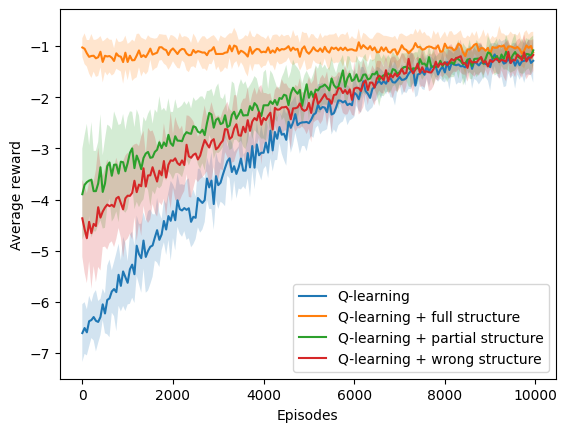<h3>Ambiente: deterministic</h3><h3>Porcentaje de modificación: high 075</h3><h3>Tipo de estructura: one to many </h3><h3>N: 7 </h3><h3>Simulaciones: 10 </h3><h3>Episodios: 10000 </h3><h3>Delta: 0.5 </h3><table>
  <tr>
    <th>Algoritmo</th>
    <th>M</th>
    <th>SD</th>
    <th>t</th>
    <th>df</th>
    <th>p</th>
    <th>H0</th>
    <th>d de Cohen</th>
  </tr>
  <tr>
    <td>$Q_1$</td>
    <td>9780.00</td>
    <td>338.94</td>
    <td>0.00</td>
    <td>18.00</td>
    <td>1.00</td>
    <td>aceptada</td>
    <td>0.00</td>
  </tr>
  <tr>
    <td>$Q_2$</td>
    <td>5754.00</td>
    <td>4252.86</td>
    <td>-2.83</td>
    <td>9.11</td>
    <td>0.02</td>
    <td>rechazada</td>
    <td>1.27</td>
  </tr>
  <tr>
    <td>$Q_3$</td>
    <td>9502.00</td>
    <td>598.16</td>
    <td>-1.21</td>
    <td>14.24</td>
    <td>0.24</td>
    <td>aceptada</td>
    <td>0.54</td>
  </tr>
  <tr>
    <td>$Q_4$</td>
    <td>9676.00</td>
    <td>516.51</td>
    <td>-0.51</td>
    <td>15.54</td>
    <td>0.62</td>
    <td>aceptada</td>
    <td>0.23</td>
  </tr>
</table><h3>Ambiente: deterministic</h3><h3>Porcentaje de modificación: high 075</h3><h3>Tipo de estructura: one to many </h3><h3>N: 9 </h3><h3>Simulaciones: 10 </h3><h3>Episodios: 20000 </h3><h3>Delta: 0.5 </h3><table>
  <tr>
    <th>Algoritmo</th>
    <th>M</th>
    <th>SD</th>
    <th>t</th>
    <th>df</th>
    <th>p</th>
    <th>H0</th>
    <th>d de Cohen</th>
  </tr>
  <tr>
    <td>$Q_1$</td>
    <td>19172.00</td>
    <td>1338.18</td>
    <td>0.00</td>
    <td>18.00</td>
    <td>1.00</td>
    <td>aceptada</td>
    <td>0.00</td>
  </tr>
  <tr>
    <td>$Q_2$</td>
    <td>14120.00</td>
    <td>7188.37</td>
    <td>-2.07</td>
    <td>9.62</td>
    <td>0.07</td>
    <td>aceptada</td>
    <td>0.93</td>
  </tr>
  <tr>
    <td>$Q_3$</td>
    <td>18808.00</td>
    <td>1862.80</td>
    <td>-0.48</td>
    <td>16.34</td>
    <td>0.64</td>
    <td>aceptada</td>
    <td>0.21</td>
  </tr>
  <tr>
    <td>$Q_4$</td>
    <td>19436.00</td>
    <td>912.00</td>
    <td>0.49</td>
    <td>15.88</td>
    <td>0.63</td>
    <td>aceptada</td>
    <td>-0.22</td>
  </tr>
</table><h3>Ambiente: deterministic</h3><h3>Porcentaje de modificación: high 075</h3><h3>Tipo de estructura: one to one </h3><h3>N: 5 </h3><h3>Simulaciones: 10 </h3><h3>Episodios: 10000 </h3><h3>Delta: 0.5 </h3><table>
  <tr>
    <th>Algoritmo</th>
    <th>M</th>
    <th>SD</th>
    <th>t</th>
    <th>df</th>
    <th>p</th>
    <th>H0</th>
    <th>d de Cohen</th>
  </tr>
  <tr>
    <td>$Q_1$</td>
    <td>10000.00</td>
    <td>0.00</td>
    <td>nan</td>
    <td>nan</td>
    <td>nan</td>
    <td>rechazada</td>
    <td>nan</td>
  </tr>
  <tr>
    <td>$Q_2$</td>
    <td>5326.00</td>
    <td>1737.29</td>
    <td>-8.07</td>
    <td>9.00</td>
    <td>0.00</td>
    <td>rechazada</td>
    <td>3.61</td>
  </tr>
  <tr>
    <td>$Q_3$</td>
    <td>9848.00</td>
    <td>312.31</td>
    <td>-1.46</td>
    <td>9.00</td>
    <td>0.18</td>
    <td>aceptada</td>
    <td>0.65</td>
  </tr>
  <tr>
    <td>$Q_4$</td>
    <td>10000.00</td>
    <td>0.00</td>
    <td>nan</td>
    <td>nan</td>
    <td>nan</td>
    <td>rechazada</td>
    <td>nan</td>
  </tr>
</table><h3>Ambiente: deterministic</h3><h3>Porcentaje de modificación: high 075</h3><h3>Tipo de estructura: one to one </h3><h3>N: 7 </h3><h3>Simulaciones: 10 </h3><h3>Episodios: 10000 </h3><h3>Delta: 0.5 </h3><table>
  <tr>
    <th>Algoritmo</th>
    <th>M</th>
    <th>SD</th>
    <th>t</th>
    <th>df</th>
    <th>p</th>
    <th>H0</th>
    <th>d de Cohen</th>
  </tr>
  <tr>
    <td>$Q_1$</td>
    <td>10000.00</td>
    <td>0.00</td>
    <td>nan</td>
    <td>nan</td>
    <td>nan</td>
    <td>rechazada</td>
    <td>nan</td>
  </tr>
  <tr>
    <td>$Q_2$</td>
    <td>6998.00</td>
    <td>1228.31</td>
    <td>-7.33</td>
    <td>9.00</td>
    <td>0.00</td>
    <td>rechazada</td>
    <td>3.28</td>
  </tr>
  <tr>
    <td>$Q_3$</td>
    <td>9074.00</td>
    <td>1253.16</td>
    <td>-2.22</td>
    <td>9.00</td>
    <td>0.05</td>
    <td>aceptada</td>
    <td>0.99</td>
  </tr>
  <tr>
    <td>$Q_4$</td>
    <td>9822.00</td>
    <td>534.00</td>
    <td>-1.00</td>
    <td>9.00</td>
    <td>0.34</td>
    <td>aceptada</td>
    <td>0.45</td>
  </tr>
</table><h3>Ambiente: deterministic</h3><h3>Porcentaje de modificación: high 075</h3><h3>Tipo de estructura: one to one </h3><h3>N: 9 </h3><h3>Simulaciones: 10 </h3><h3>Episodios: 20000 </h3><h3>Delta: 0.5 </h3><table>
  <tr>
    <th>Algoritmo</th>
    <th>M</th>
    <th>SD</th>
    <th>t</th>
    <th>df</th>
    <th>p</th>
    <th>H0</th>
    <th>d de Cohen</th>
  </tr>
  <tr>
    <td>$Q_1$</td>
    <td>20000.00</td>
    <td>0.00</td>
    <td>nan</td>
    <td>nan</td>
    <td>nan</td>
    <td>rechazada</td>
    <td>nan</td>
  </tr>
  <tr>
    <td>$Q_2$</td>
    <td>17254.00</td>
    <td>1352.57</td>
    <td>-6.09</td>
    <td>9.00</td>
    <td>0.00</td>
    <td>rechazada</td>
    <td>2.72</td>
  </tr>
  <tr>
    <td>$Q_3$</td>
    <td>18408.00</td>
    <td>1587.00</td>
    <td>-3.01</td>
    <td>9.00</td>
    <td>0.01</td>
    <td>rechazada</td>
    <td>1.35</td>
  </tr>
  <tr>
    <td>$Q_4$</td>
    <td>20000.00</td>
    <td>0.00</td>
    <td>nan</td>
    <td>nan</td>
    <td>nan</td>
    <td>rechazada</td>
    <td>nan</td>
  </tr>
</table><h3>Ambiente: deterministic</h3><h3>Porcentaje de modificación: low 025</h3><h3>Tipo de estructura: many to one </h3><h3>N: 5 </h3><h3>Simulaciones: 10 </h3><h3>Episodios: 10000 </h3><h3>Delta: 0.5 </h3><table>
  <tr>
    <th>Algoritmo</th>
    <th>M</th>
    <th>SD</th>
    <th>t</th>
    <th>df</th>
    <th>p</th>
    <th>H0</th>
    <th>d de Cohen</th>
  </tr>
  <tr>
    <td>$Q_1$</td>
    <td>9640.00</td>
    <td>586.24</td>
    <td>0.00</td>
    <td>18.00</td>
    <td>1.00</td>
    <td>aceptada</td>
    <td>0.00</td>
  </tr>
  <tr>
    <td>$Q_2$</td>
    <td>5908.00</td>
    <td>4199.51</td>
    <td>-2.64</td>
    <td>9.35</td>
    <td>0.03</td>
    <td>rechazada</td>
    <td>1.18</td>
  </tr>
  <tr>
    <td>$Q_3$</td>
    <td>6574.00</td>
    <td>3699.45</td>
    <td>-2.46</td>
    <td>9.45</td>
    <td>0.04</td>
    <td>rechazada</td>
    <td>1.10</td>
  </tr>
  <tr>
    <td>$Q_4$</td>
    <td>7718.00</td>
    <td>3401.68</td>
    <td>-1.67</td>
    <td>9.53</td>
    <td>0.13</td>
    <td>aceptada</td>
    <td>0.75</td>
  </tr>
</table>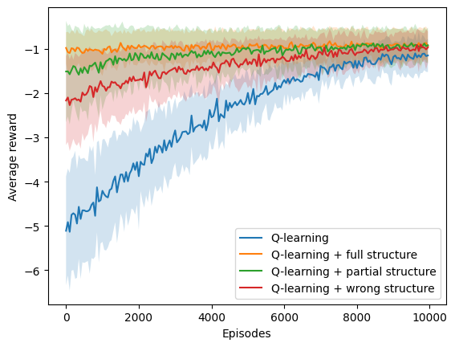<h3>Ambiente: deterministic</h3><h3>Porcentaje de modificación: low 025</h3><h3>Tipo de estructura: many to one </h3><h3>N: 7 </h3><h3>Simulaciones: 10 </h3><h3>Episodios: 10000 </h3><h3>Delta: 0.5 </h3><table>
  <tr>
    <th>Algoritmo</th>
    <th>M</th>
    <th>SD</th>
    <th>t</th>
    <th>df</th>
    <th>p</th>
    <th>H0</th>
    <th>d de Cohen</th>
  </tr>
  <tr>
    <td>$Q_1$</td>
    <td>9882.00</td>
    <td>238.07</td>
    <td>0.00</td>
    <td>18.00</td>
    <td>1.00</td>
    <td>aceptada</td>
    <td>0.00</td>
  </tr>
  <tr>
    <td>$Q_2$</td>
    <td>5088.00</td>
    <td>4093.05</td>
    <td>-3.51</td>
    <td>9.06</td>
    <td>0.01</td>
    <td>rechazada</td>
    <td>1.57</td>
  </tr>
  <tr>
    <td>$Q_3$</td>
    <td>5936.00</td>
    <td>4180.45</td>
    <td>-2.83</td>
    <td>9.06</td>
    <td>0.02</td>
    <td>rechazada</td>
    <td>1.26</td>
  </tr>
  <tr>
    <td>$Q_4$</td>
    <td>6110.00</td>
    <td>4007.58</td>
    <td>-2.82</td>
    <td>9.06</td>
    <td>0.02</td>
    <td>rechazada</td>
    <td>1.26</td>
  </tr>
</table><h3>Ambiente: deterministic</h3><h3>Porcentaje de modificación: low 025</h3><h3>Tipo de estructura: many to one </h3><h3>N: 9 </h3><h3>Simulaciones: 10 </h3><h3>Episodios: 20000 </h3><h3>Delta: 0.5 </h3><table>
  <tr>
    <th>Algoritmo</th>
    <th>M</th>
    <th>SD</th>
    <th>t</th>
    <th>df</th>
    <th>p</th>
    <th>H0</th>
    <th>d de Cohen</th>
  </tr>
  <tr>
    <td>$Q_1$</td>
    <td>19472.00</td>
    <td>859.73</td>
    <td>0.00</td>
    <td>18.00</td>
    <td>1.00</td>
    <td>aceptada</td>
    <td>0.00</td>
  </tr>
  <tr>
    <td>$Q_2$</td>
    <td>11604.00</td>
    <td>7828.16</td>
    <td>-3.00</td>
    <td>9.22</td>
    <td>0.01</td>
    <td>rechazada</td>
    <td>1.34</td>
  </tr>
  <tr>
    <td>$Q_3$</td>
    <td>12200.00</td>
    <td>7886.63</td>
    <td>-2.75</td>
    <td>9.21</td>
    <td>0.02</td>
    <td>rechazada</td>
    <td>1.23</td>
  </tr>
  <tr>
    <td>$Q_4$</td>
    <td>15102.00</td>
    <td>5861.00</td>
    <td>-2.21</td>
    <td>9.39</td>
    <td>0.05</td>
    <td>aceptada</td>
    <td>0.99</td>
  </tr>
</table>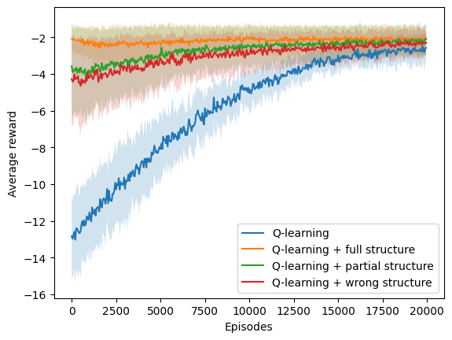<h3>Ambiente: deterministic</h3><h3>Porcentaje de modificación: low 025</h3><h3>Tipo de estructura: one to many </h3><h3>N: 5 </h3><h3>Simulaciones: 10 </h3><h3>Episodios: 10000 </h3><h3>Delta: 0.5 </h3><table>
  <tr>
    <th>Algoritmo</th>
    <th>M</th>
    <th>SD</th>
    <th>t</th>
    <th>df</th>
    <th>p</th>
    <th>H0</th>
    <th>d de Cohen</th>
  </tr>
  <tr>
    <td>$Q_1$</td>
    <td>10000.00</td>
    <td>0.00</td>
    <td>nan</td>
    <td>nan</td>
    <td>nan</td>
    <td>rechazada</td>
    <td>nan</td>
  </tr>
  <tr>
    <td>$Q_2$</td>
    <td>6856.00</td>
    <td>2181.46</td>
    <td>-4.32</td>
    <td>9.00</td>
    <td>0.00</td>
    <td>rechazada</td>
    <td>1.93</td>
  </tr>
  <tr>
    <td>$Q_3$</td>
    <td>8458.00</td>
    <td>2151.19</td>
    <td>-2.15</td>
    <td>9.00</td>
    <td>0.06</td>
    <td>aceptada</td>
    <td>0.96</td>
  </tr>
  <tr>
    <td>$Q_4$</td>
    <td>9172.00</td>
    <td>1682.10</td>
    <td>-1.48</td>
    <td>9.00</td>
    <td>0.17</td>
    <td>aceptada</td>
    <td>0.66</td>
  </tr>
</table>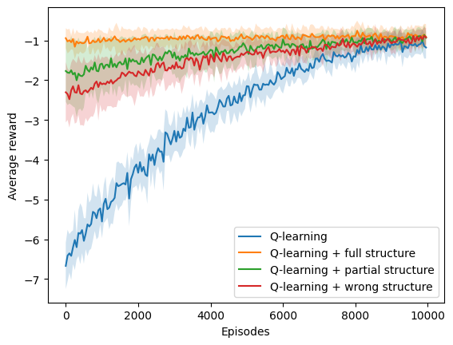<h3>Ambiente: deterministic</h3><h3>Porcentaje de modificación: low 025</h3><h3>Tipo de estructura: one to many </h3><h3>N: 7 </h3><h3>Simulaciones: 10 </h3><h3>Episodios: 10000 </h3><h3>Delta: 0.5 </h3><table>
  <tr>
    <th>Algoritmo</th>
    <th>M</th>
    <th>SD</th>
    <th>t</th>
    <th>df</th>
    <th>p</th>
    <th>H0</th>
    <th>d de Cohen</th>
  </tr>
  <tr>
    <td>$Q_1$</td>
    <td>9796.00</td>
    <td>314.81</td>
    <td>0.00</td>
    <td>18.00</td>
    <td>1.00</td>
    <td>aceptada</td>
    <td>0.00</td>
  </tr>
  <tr>
    <td>$Q_2$</td>
    <td>7976.00</td>
    <td>2683.87</td>
    <td>-2.02</td>
    <td>9.25</td>
    <td>0.07</td>
    <td>aceptada</td>
    <td>0.90</td>
  </tr>
  <tr>
    <td>$Q_3$</td>
    <td>8482.00</td>
    <td>2563.60</td>
    <td>-1.53</td>
    <td>9.27</td>
    <td>0.16</td>
    <td>aceptada</td>
    <td>0.68</td>
  </tr>
  <tr>
    <td>$Q_4$</td>
    <td>8866.00</td>
    <td>2124.81</td>
    <td>-1.30</td>
    <td>9.39</td>
    <td>0.22</td>
    <td>aceptada</td>
    <td>0.58</td>
  </tr>
</table><h3>Ambiente: deterministic</h3><h3>Porcentaje de modificación: low 025</h3><h3>Tipo de estructura: one to many </h3><h3>N: 9 </h3><h3>Simulaciones: 10 </h3><h3>Episodios: 20000 </h3><h3>Delta: 0.5 </h3><table>
  <tr>
    <th>Algoritmo</th>
    <th>M</th>
    <th>SD</th>
    <th>t</th>
    <th>df</th>
    <th>p</th>
    <th>H0</th>
    <th>d de Cohen</th>
  </tr>
  <tr>
    <td>$Q_1$</td>
    <td>19136.00</td>
    <td>1251.94</td>
    <td>0.00</td>
    <td>18.00</td>
    <td>1.00</td>
    <td>aceptada</td>
    <td>0.00</td>
  </tr>
  <tr>
    <td>$Q_2$</td>
    <td>13892.00</td>
    <td>7001.90</td>
    <td>-2.21</td>
    <td>9.57</td>
    <td>0.05</td>
    <td>aceptada</td>
    <td>0.99</td>
  </tr>
  <tr>
    <td>$Q_3$</td>
    <td>15942.00</td>
    <td>5708.64</td>
    <td>-1.64</td>
    <td>9.86</td>
    <td>0.13</td>
    <td>aceptada</td>
    <td>0.73</td>
  </tr>
  <tr>
    <td>$Q_4$</td>
    <td>18780.00</td>
    <td>1420.96</td>
    <td>-0.56</td>
    <td>17.72</td>
    <td>0.58</td>
    <td>aceptada</td>
    <td>0.25</td>
  </tr>
</table><h3>Ambiente: deterministic</h3><h3>Porcentaje de modificación: low 025</h3><h3>Tipo de estructura: one to one </h3><h3>N: 5 </h3><h3>Simulaciones: 10 </h3><h3>Episodios: 10000 </h3><h3>Delta: 0.5 </h3><table>
  <tr>
    <th>Algoritmo</th>
    <th>M</th>
    <th>SD</th>
    <th>t</th>
    <th>df</th>
    <th>p</th>
    <th>H0</th>
    <th>d de Cohen</th>
  </tr>
  <tr>
    <td>$Q_1$</td>
    <td>10000.00</td>
    <td>0.00</td>
    <td>nan</td>
    <td>nan</td>
    <td>nan</td>
    <td>rechazada</td>
    <td>nan</td>
  </tr>
  <tr>
    <td>$Q_2$</td>
    <td>4992.00</td>
    <td>2249.06</td>
    <td>-6.68</td>
    <td>9.00</td>
    <td>0.00</td>
    <td>rechazada</td>
    <td>2.99</td>
  </tr>
  <tr>
    <td>$Q_3$</td>
    <td>8062.00</td>
    <td>1360.22</td>
    <td>-4.27</td>
    <td>9.00</td>
    <td>0.00</td>
    <td>rechazada</td>
    <td>1.91</td>
  </tr>
  <tr>
    <td>$Q_4$</td>
    <td>8590.00</td>
    <td>1062.31</td>
    <td>-3.98</td>
    <td>9.00</td>
    <td>0.00</td>
    <td>rechazada</td>
    <td>1.78</td>
  </tr>
</table><h3>Ambiente: deterministic</h3><h3>Porcentaje de modificación: low 025</h3><h3>Tipo de estructura: one to one </h3><h3>N: 7 </h3><h3>Simulaciones: 10 </h3><h3>Episodios: 10000 </h3><h3>Delta: 0.5 </h3><table>
  <tr>
    <th>Algoritmo</th>
    <th>M</th>
    <th>SD</th>
    <th>t</th>
    <th>df</th>
    <th>p</th>
    <th>H0</th>
    <th>d de Cohen</th>
  </tr>
  <tr>
    <td>$Q_1$</td>
    <td>10000.00</td>
    <td>0.00</td>
    <td>nan</td>
    <td>nan</td>
    <td>nan</td>
    <td>rechazada</td>
    <td>nan</td>
  </tr>
  <tr>
    <td>$Q_2$</td>
    <td>6364.00</td>
    <td>1381.50</td>
    <td>-7.90</td>
    <td>9.00</td>
    <td>0.00</td>
    <td>rechazada</td>
    <td>3.53</td>
  </tr>
  <tr>
    <td>$Q_3$</td>
    <td>7794.00</td>
    <td>1016.23</td>
    <td>-6.51</td>
    <td>9.00</td>
    <td>0.00</td>
    <td>rechazada</td>
    <td>2.91</td>
  </tr>
  <tr>
    <td>$Q_4$</td>
    <td>7724.00</td>
    <td>1142.87</td>
    <td>-5.97</td>
    <td>9.00</td>
    <td>0.00</td>
    <td>rechazada</td>
    <td>2.67</td>
  </tr>
</table>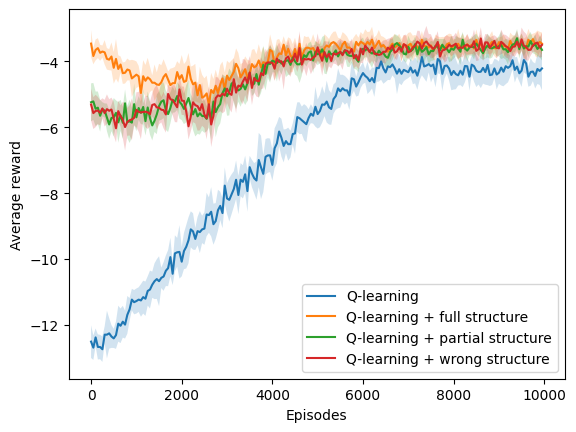<h3>Ambiente: deterministic</h3><h3>Porcentaje de modificación: low 025</h3><h3>Tipo de estructura: one to one </h3><h3>N: 9 </h3><h3>Simulaciones: 10 </h3><h3>Episodios: 20000 </h3><h3>Delta: 0.5 </h3><table>
  <tr>
    <th>Algoritmo</th>
    <th>M</th>
    <th>SD</th>
    <th>t</th>
    <th>df</th>
    <th>p</th>
    <th>H0</th>
    <th>d de Cohen</th>
  </tr>
  <tr>
    <td>$Q_1$</td>
    <td>20000.00</td>
    <td>0.00</td>
    <td>nan</td>
    <td>nan</td>
    <td>nan</td>
    <td>rechazada</td>
    <td>nan</td>
  </tr>
  <tr>
    <td>$Q_2$</td>
    <td>16584.00</td>
    <td>747.25</td>
    <td>-13.71</td>
    <td>9.00</td>
    <td>0.00</td>
    <td>rechazada</td>
    <td>6.13</td>
  </tr>
  <tr>
    <td>$Q_3$</td>
    <td>16984.00</td>
    <td>1495.99</td>
    <td>-6.05</td>
    <td>9.00</td>
    <td>0.00</td>
    <td>rechazada</td>
    <td>2.70</td>
  </tr>
  <tr>
    <td>$Q_4$</td>
    <td>17350.00</td>
    <td>1686.59</td>
    <td>-4.71</td>
    <td>9.00</td>
    <td>0.00</td>
    <td>rechazada</td>
    <td>2.11</td>
  </tr>
</table><h3>Ambiente: deterministic</h3><h3>Porcentaje de modificación: medium 05</h3><h3>Tipo de estructura: many to one </h3><h3>N: 5 </h3><h3>Simulaciones: 10 </h3><h3>Episodios: 10000 </h3><h3>Delta: 0.5 </h3><table>
  <tr>
    <th>Algoritmo</th>
    <th>M</th>
    <th>SD</th>
    <th>t</th>
    <th>df</th>
    <th>p</th>
    <th>H0</th>
    <th>d de Cohen</th>
  </tr>
  <tr>
    <td>$Q_1$</td>
    <td>9760.00</td>
    <td>493.88</td>
    <td>0.00</td>
    <td>18.00</td>
    <td>1.00</td>
    <td>aceptada</td>
    <td>0.00</td>
  </tr>
  <tr>
    <td>$Q_2$</td>
    <td>6638.00</td>
    <td>3129.82</td>
    <td>-2.96</td>
    <td>9.45</td>
    <td>0.02</td>
    <td>rechazada</td>
    <td>1.32</td>
  </tr>
  <tr>
    <td>$Q_3$</td>
    <td>8682.00</td>
    <td>2103.53</td>
    <td>-1.50</td>
    <td>9.99</td>
    <td>0.17</td>
    <td>aceptada</td>
    <td>0.67</td>
  </tr>
  <tr>
    <td>$Q_4$</td>
    <td>9650.00</td>
    <td>550.65</td>
    <td>-0.45</td>
    <td>17.79</td>
    <td>0.66</td>
    <td>aceptada</td>
    <td>0.20</td>
  </tr>
</table><h3>Ambiente: deterministic</h3><h3>Porcentaje de modificación: medium 05</h3><h3>Tipo de estructura: many to one </h3><h3>N: 7 </h3><h3>Simulaciones: 10 </h3><h3>Episodios: 10000 </h3><h3>Delta: 0.5 </h3><table>
  <tr>
    <th>Algoritmo</th>
    <th>M</th>
    <th>SD</th>
    <th>t</th>
    <th>df</th>
    <th>p</th>
    <th>H0</th>
    <th>d de Cohen</th>
  </tr>
  <tr>
    <td>$Q_1$</td>
    <td>9888.00</td>
    <td>336.00</td>
    <td>0.00</td>
    <td>18.00</td>
    <td>1.00</td>
    <td>aceptada</td>
    <td>0.00</td>
  </tr>
  <tr>
    <td>$Q_2$</td>
    <td>5350.00</td>
    <td>3915.97</td>
    <td>-3.46</td>
    <td>9.13</td>
    <td>0.01</td>
    <td>rechazada</td>
    <td>1.55</td>
  </tr>
  <tr>
    <td>$Q_3$</td>
    <td>9146.00</td>
    <td>1719.00</td>
    <td>-1.27</td>
    <td>9.69</td>
    <td>0.23</td>
    <td>aceptada</td>
    <td>0.57</td>
  </tr>
  <tr>
    <td>$Q_4$</td>
    <td>9024.00</td>
    <td>2684.25</td>
    <td>-0.96</td>
    <td>9.28</td>
    <td>0.36</td>
    <td>aceptada</td>
    <td>0.43</td>
  </tr>
</table>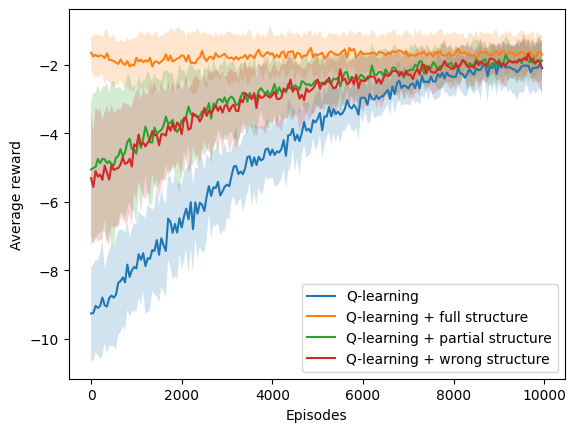<h3>Ambiente: deterministic</h3><h3>Porcentaje de modificación: medium 05</h3><h3>Tipo de estructura: many to one </h3><h3>N: 9 </h3><h3>Simulaciones: 10 </h3><h3>Episodios: 20000 </h3><h3>Delta: 0.5 </h3><table>
  <tr>
    <th>Algoritmo</th>
    <th>M</th>
    <th>SD</th>
    <th>t</th>
    <th>df</th>
    <th>p</th>
    <th>H0</th>
    <th>d de Cohen</th>
  </tr>
  <tr>
    <td>$Q_1$</td>
    <td>19452.00</td>
    <td>731.97</td>
    <td>0.00</td>
    <td>18.00</td>
    <td>1.00</td>
    <td>aceptada</td>
    <td>0.00</td>
  </tr>
  <tr>
    <td>$Q_2$</td>
    <td>11286.00</td>
    <td>6356.81</td>
    <td>-3.83</td>
    <td>9.24</td>
    <td>0.00</td>
    <td>rechazada</td>
    <td>1.71</td>
  </tr>
  <tr>
    <td>$Q_3$</td>
    <td>18616.00</td>
    <td>1878.87</td>
    <td>-1.24</td>
    <td>11.67</td>
    <td>0.24</td>
    <td>aceptada</td>
    <td>0.56</td>
  </tr>
  <tr>
    <td>$Q_4$</td>
    <td>19246.00</td>
    <td>1364.58</td>
    <td>-0.40</td>
    <td>13.78</td>
    <td>0.70</td>
    <td>aceptada</td>
    <td>0.18</td>
  </tr>
</table><h3>Ambiente: deterministic</h3><h3>Porcentaje de modificación: medium 05</h3><h3>Tipo de estructura: one to many </h3><h3>N: 5 </h3><h3>Simulaciones: 10 </h3><h3>Episodios: 10000 </h3><h3>Delta: 0.5 </h3><table>
  <tr>
    <th>Algoritmo</th>
    <th>M</th>
    <th>SD</th>
    <th>t</th>
    <th>df</th>
    <th>p</th>
    <th>H0</th>
    <th>d de Cohen</th>
  </tr>
  <tr>
    <td>$Q_1$</td>
    <td>9798.00</td>
    <td>406.98</td>
    <td>0.00</td>
    <td>18.00</td>
    <td>1.00</td>
    <td>aceptada</td>
    <td>0.00</td>
  </tr>
  <tr>
    <td>$Q_2$</td>
    <td>7604.00</td>
    <td>2606.45</td>
    <td>-2.50</td>
    <td>9.44</td>
    <td>0.03</td>
    <td>rechazada</td>
    <td>1.12</td>
  </tr>
  <tr>
    <td>$Q_3$</td>
    <td>8800.00</td>
    <td>2183.89</td>
    <td>-1.35</td>
    <td>9.62</td>
    <td>0.21</td>
    <td>aceptada</td>
    <td>0.60</td>
  </tr>
  <tr>
    <td>$Q_4$</td>
    <td>9908.00</td>
    <td>184.22</td>
    <td>0.74</td>
    <td>12.54</td>
    <td>0.47</td>
    <td>aceptada</td>
    <td>-0.33</td>
  </tr>
</table><h3>Ambiente: deterministic</h3><h3>Porcentaje de modificación: medium 05</h3><h3>Tipo de estructura: one to many </h3><h3>N: 7 </h3><h3>Simulaciones: 10 </h3><h3>Episodios: 10000 </h3><h3>Delta: 0.5 </h3><table>
  <tr>
    <th>Algoritmo</th>
    <th>M</th>
    <th>SD</th>
    <th>t</th>
    <th>df</th>
    <th>p</th>
    <th>H0</th>
    <th>d de Cohen</th>
  </tr>
  <tr>
    <td>$Q_1$</td>
    <td>9886.00</td>
    <td>342.00</td>
    <td>0.00</td>
    <td>18.00</td>
    <td>1.00</td>
    <td>aceptada</td>
    <td>0.00</td>
  </tr>
  <tr>
    <td>$Q_2$</td>
    <td>7660.00</td>
    <td>2665.42</td>
    <td>-2.49</td>
    <td>9.30</td>
    <td>0.03</td>
    <td>rechazada</td>
    <td>1.11</td>
  </tr>
  <tr>
    <td>$Q_3$</td>
    <td>9784.00</td>
    <td>433.48</td>
    <td>-0.55</td>
    <td>17.08</td>
    <td>0.59</td>
    <td>aceptada</td>
    <td>0.25</td>
  </tr>
  <tr>
    <td>$Q_4$</td>
    <td>10000.00</td>
    <td>0.00</td>
    <td>1.00</td>
    <td>9.00</td>
    <td>0.34</td>
    <td>aceptada</td>
    <td>-0.45</td>
  </tr>
</table><h3>Ambiente: deterministic</h3><h3>Porcentaje de modificación: medium 05</h3><h3>Tipo de estructura: one to many </h3><h3>N: 9 </h3><h3>Simulaciones: 10 </h3><h3>Episodios: 20000 </h3><h3>Delta: 0.5 </h3><table>
  <tr>
    <th>Algoritmo</th>
    <th>M</th>
    <th>SD</th>
    <th>t</th>
    <th>df</th>
    <th>p</th>
    <th>H0</th>
    <th>d de Cohen</th>
  </tr>
  <tr>
    <td>$Q_1$</td>
    <td>20000.00</td>
    <td>0.00</td>
    <td>nan</td>
    <td>nan</td>
    <td>nan</td>
    <td>rechazada</td>
    <td>nan</td>
  </tr>
  <tr>
    <td>$Q_2$</td>
    <td>12714.00</td>
    <td>7176.41</td>
    <td>-3.05</td>
    <td>9.00</td>
    <td>0.01</td>
    <td>rechazada</td>
    <td>1.36</td>
  </tr>
  <tr>
    <td>$Q_3$</td>
    <td>19116.00</td>
    <td>1172.24</td>
    <td>-2.26</td>
    <td>9.00</td>
    <td>0.05</td>
    <td>rechazada</td>
    <td>1.01</td>
  </tr>
  <tr>
    <td>$Q_4$</td>
    <td>19818.00</td>
    <td>365.34</td>
    <td>-1.49</td>
    <td>9.00</td>
    <td>0.17</td>
    <td>aceptada</td>
    <td>0.67</td>
  </tr>
</table>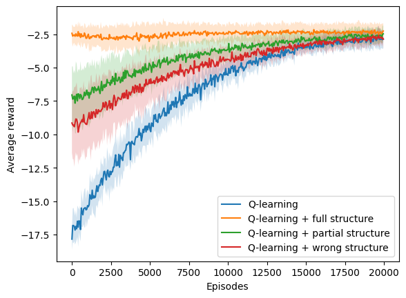<h3>Ambiente: deterministic</h3><h3>Porcentaje de modificación: medium 05</h3><h3>Tipo de estructura: one to one </h3><h3>N: 5 </h3><h3>Simulaciones: 10 </h3><h3>Episodios: 10000 </h3><h3>Delta: 0.5 </h3><table>
  <tr>
    <th>Algoritmo</th>
    <th>M</th>
    <th>SD</th>
    <th>t</th>
    <th>df</th>
    <th>p</th>
    <th>H0</th>
    <th>d de Cohen</th>
  </tr>
  <tr>
    <td>$Q_1$</td>
    <td>10000.00</td>
    <td>0.00</td>
    <td>nan</td>
    <td>nan</td>
    <td>nan</td>
    <td>rechazada</td>
    <td>nan</td>
  </tr>
  <tr>
    <td>$Q_2$</td>
    <td>5178.00</td>
    <td>1621.47</td>
    <td>-8.92</td>
    <td>9.00</td>
    <td>0.00</td>
    <td>rechazada</td>
    <td>3.99</td>
  </tr>
  <tr>
    <td>$Q_3$</td>
    <td>9396.00</td>
    <td>1044.02</td>
    <td>-1.74</td>
    <td>9.00</td>
    <td>0.12</td>
    <td>aceptada</td>
    <td>0.78</td>
  </tr>
  <tr>
    <td>$Q_4$</td>
    <td>9510.00</td>
    <td>827.78</td>
    <td>-1.78</td>
    <td>9.00</td>
    <td>0.11</td>
    <td>aceptada</td>
    <td>0.79</td>
  </tr>
</table>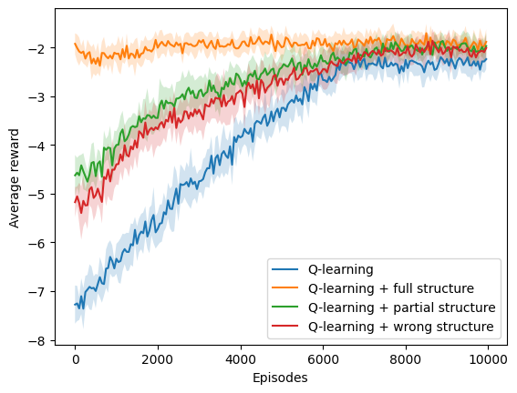<h3>Ambiente: deterministic</h3><h3>Porcentaje de modificación: medium 05</h3><h3>Tipo de estructura: one to one </h3><h3>N: 7 </h3><h3>Simulaciones: 10 </h3><h3>Episodios: 10000 </h3><h3>Delta: 0.5 </h3><table>
  <tr>
    <th>Algoritmo</th>
    <th>M</th>
    <th>SD</th>
    <th>t</th>
    <th>df</th>
    <th>p</th>
    <th>H0</th>
    <th>d de Cohen</th>
  </tr>
  <tr>
    <td>$Q_1$</td>
    <td>10000.00</td>
    <td>0.00</td>
    <td>nan</td>
    <td>nan</td>
    <td>nan</td>
    <td>rechazada</td>
    <td>nan</td>
  </tr>
  <tr>
    <td>$Q_2$</td>
    <td>7676.00</td>
    <td>957.91</td>
    <td>-7.28</td>
    <td>9.00</td>
    <td>0.00</td>
    <td>rechazada</td>
    <td>3.25</td>
  </tr>
  <tr>
    <td>$Q_3$</td>
    <td>8206.00</td>
    <td>1116.39</td>
    <td>-4.82</td>
    <td>9.00</td>
    <td>0.00</td>
    <td>rechazada</td>
    <td>2.16</td>
  </tr>
  <tr>
    <td>$Q_4$</td>
    <td>8182.00</td>
    <td>1238.37</td>
    <td>-4.40</td>
    <td>9.00</td>
    <td>0.00</td>
    <td>rechazada</td>
    <td>1.97</td>
  </tr>
</table><h3>Ambiente: deterministic</h3><h3>Porcentaje de modificación: medium 05</h3><h3>Tipo de estructura: one to one </h3><h3>N: 9 </h3><h3>Simulaciones: 10 </h3><h3>Episodios: 20000 </h3><h3>Delta: 0.5 </h3><table>
  <tr>
    <th>Algoritmo</th>
    <th>M</th>
    <th>SD</th>
    <th>t</th>
    <th>df</th>
    <th>p</th>
    <th>H0</th>
    <th>d de Cohen</th>
  </tr>
  <tr>
    <td>$Q_1$</td>
    <td>20000.00</td>
    <td>0.00</td>
    <td>nan</td>
    <td>nan</td>
    <td>nan</td>
    <td>rechazada</td>
    <td>nan</td>
  </tr>
  <tr>
    <td>$Q_2$</td>
    <td>17330.00</td>
    <td>1462.33</td>
    <td>-5.48</td>
    <td>9.00</td>
    <td>0.00</td>
    <td>rechazada</td>
    <td>2.45</td>
  </tr>
  <tr>
    <td>$Q_3$</td>
    <td>17992.00</td>
    <td>1458.39</td>
    <td>-4.13</td>
    <td>9.00</td>
    <td>0.00</td>
    <td>rechazada</td>
    <td>1.85</td>
  </tr>
  <tr>
    <td>$Q_4$</td>
    <td>18908.00</td>
    <td>1105.67</td>
    <td>-2.96</td>
    <td>9.00</td>
    <td>0.02</td>
    <td>rechazada</td>
    <td>1.33</td>
  </tr>
</table><h3>Ambiente: stochastic</h3><h3>Porcentaje de modificación: high 075</h3><h3>Tipo de estructura: many to one </h3><h3>N: 5 </h3><h3>Simulaciones: 10 </h3><h3>Episodios: 10000 </h3><h3>Delta: 0.5 </h3><table>
  <tr>
    <th>Algoritmo</th>
    <th>M</th>
    <th>SD</th>
    <th>t</th>
    <th>df</th>
    <th>p</th>
    <th>H0</th>
    <th>d de Cohen</th>
  </tr>
  <tr>
    <td>$Q_1$</td>
    <td>9540.00</td>
    <td>787.71</td>
    <td>0.00</td>
    <td>18.00</td>
    <td>1.00</td>
    <td>aceptada</td>
    <td>0.00</td>
  </tr>
  <tr>
    <td>$Q_2$</td>
    <td>5122.00</td>
    <td>3747.85</td>
    <td>-3.46</td>
    <td>9.79</td>
    <td>0.01</td>
    <td>rechazada</td>
    <td>1.55</td>
  </tr>
  <tr>
    <td>$Q_3$</td>
    <td>8384.00</td>
    <td>2572.06</td>
    <td>-1.29</td>
    <td>10.67</td>
    <td>0.22</td>
    <td>aceptada</td>
    <td>0.58</td>
  </tr>
  <tr>
    <td>$Q_4$</td>
    <td>7938.00</td>
    <td>3554.52</td>
    <td>-1.32</td>
    <td>9.88</td>
    <td>0.22</td>
    <td>aceptada</td>
    <td>0.59</td>
  </tr>
</table><h3>Ambiente: stochastic</h3><h3>Porcentaje de modificación: high 075</h3><h3>Tipo de estructura: many to one </h3><h3>N: 7 </h3><h3>Simulaciones: 10 </h3><h3>Episodios: 10000 </h3><h3>Delta: 0.5 </h3><table>
  <tr>
    <th>Algoritmo</th>
    <th>M</th>
    <th>SD</th>
    <th>t</th>
    <th>df</th>
    <th>p</th>
    <th>H0</th>
    <th>d de Cohen</th>
  </tr>
  <tr>
    <td>$Q_1$</td>
    <td>8866.00</td>
    <td>1197.47</td>
    <td>0.00</td>
    <td>18.00</td>
    <td>1.00</td>
    <td>aceptada</td>
    <td>0.00</td>
  </tr>
  <tr>
    <td>$Q_2$</td>
    <td>3938.00</td>
    <td>3751.51</td>
    <td>-3.75</td>
    <td>10.82</td>
    <td>0.00</td>
    <td>rechazada</td>
    <td>1.68</td>
  </tr>
  <tr>
    <td>$Q_3$</td>
    <td>8832.00</td>
    <td>1117.75</td>
    <td>-0.06</td>
    <td>17.92</td>
    <td>0.95</td>
    <td>aceptada</td>
    <td>0.03</td>
  </tr>
  <tr>
    <td>$Q_4$</td>
    <td>8476.00</td>
    <td>1378.54</td>
    <td>-0.64</td>
    <td>17.65</td>
    <td>0.53</td>
    <td>aceptada</td>
    <td>0.29</td>
  </tr>
</table><h3>Ambiente: stochastic</h3><h3>Porcentaje de modificación: high 075</h3><h3>Tipo de estructura: many to one </h3><h3>N: 9 </h3><h3>Simulaciones: 10 </h3><h3>Episodios: 20000 </h3><h3>Delta: 0.5 </h3><table>
  <tr>
    <th>Algoritmo</th>
    <th>M</th>
    <th>SD</th>
    <th>t</th>
    <th>df</th>
    <th>p</th>
    <th>H0</th>
    <th>d de Cohen</th>
  </tr>
  <tr>
    <td>$Q_1$</td>
    <td>17718.00</td>
    <td>2934.67</td>
    <td>0.00</td>
    <td>18.00</td>
    <td>1.00</td>
    <td>aceptada</td>
    <td>0.00</td>
  </tr>
  <tr>
    <td>$Q_2$</td>
    <td>6030.00</td>
    <td>5621.74</td>
    <td>-5.53</td>
    <td>13.57</td>
    <td>0.00</td>
    <td>rechazada</td>
    <td>2.47</td>
  </tr>
  <tr>
    <td>$Q_3$</td>
    <td>17992.00</td>
    <td>2176.70</td>
    <td>0.22</td>
    <td>16.60</td>
    <td>0.82</td>
    <td>aceptada</td>
    <td>-0.10</td>
  </tr>
  <tr>
    <td>$Q_4$</td>
    <td>15602.00</td>
    <td>4433.34</td>
    <td>-1.19</td>
    <td>15.62</td>
    <td>0.25</td>
    <td>aceptada</td>
    <td>0.53</td>
  </tr>
</table><h3>Ambiente: stochastic</h3><h3>Porcentaje de modificación: high 075</h3><h3>Tipo de estructura: one to many </h3><h3>N: 5 </h3><h3>Simulaciones: 10 </h3><h3>Episodios: 10000 </h3><h3>Delta: 0.5 </h3><table>
  <tr>
    <th>Algoritmo</th>
    <th>M</th>
    <th>SD</th>
    <th>t</th>
    <th>df</th>
    <th>p</th>
    <th>H0</th>
    <th>d de Cohen</th>
  </tr>
  <tr>
    <td>$Q_1$</td>
    <td>9830.00</td>
    <td>510.00</td>
    <td>0.00</td>
    <td>18.00</td>
    <td>1.00</td>
    <td>aceptada</td>
    <td>0.00</td>
  </tr>
  <tr>
    <td>$Q_2$</td>
    <td>5420.00</td>
    <td>2869.94</td>
    <td>-4.54</td>
    <td>9.57</td>
    <td>0.00</td>
    <td>rechazada</td>
    <td>2.03</td>
  </tr>
  <tr>
    <td>$Q_3$</td>
    <td>8238.00</td>
    <td>1815.72</td>
    <td>-2.53</td>
    <td>10.41</td>
    <td>0.03</td>
    <td>rechazada</td>
    <td>1.13</td>
  </tr>
  <tr>
    <td>$Q_4$</td>
    <td>9380.00</td>
    <td>962.00</td>
    <td>-1.24</td>
    <td>13.69</td>
    <td>0.24</td>
    <td>aceptada</td>
    <td>0.55</td>
  </tr>
</table><h3>Ambiente: stochastic</h3><h3>Porcentaje de modificación: high 075</h3><h3>Tipo de estructura: one to many </h3><h3>N: 7 </h3><h3>Simulaciones: 10 </h3><h3>Episodios: 10000 </h3><h3>Delta: 0.5 </h3><table>
  <tr>
    <th>Algoritmo</th>
    <th>M</th>
    <th>SD</th>
    <th>t</th>
    <th>df</th>
    <th>p</th>
    <th>H0</th>
    <th>d de Cohen</th>
  </tr>
  <tr>
    <td>$Q_1$</td>
    <td>10000.00</td>
    <td>0.00</td>
    <td>nan</td>
    <td>nan</td>
    <td>nan</td>
    <td>rechazada</td>
    <td>nan</td>
  </tr>
  <tr>
    <td>$Q_2$</td>
    <td>3462.00</td>
    <td>1632.65</td>
    <td>-12.01</td>
    <td>9.00</td>
    <td>0.00</td>
    <td>rechazada</td>
    <td>5.37</td>
  </tr>
  <tr>
    <td>$Q_3$</td>
    <td>9138.00</td>
    <td>966.91</td>
    <td>-2.67</td>
    <td>9.00</td>
    <td>0.03</td>
    <td>rechazada</td>
    <td>1.20</td>
  </tr>
  <tr>
    <td>$Q_4$</td>
    <td>8932.00</td>
    <td>1003.72</td>
    <td>-3.19</td>
    <td>9.00</td>
    <td>0.01</td>
    <td>rechazada</td>
    <td>1.43</td>
  </tr>
</table><h3>Ambiente: stochastic</h3><h3>Porcentaje de modificación: high 075</h3><h3>Tipo de estructura: one to many </h3><h3>N: 9 </h3><h3>Simulaciones: 10 </h3><h3>Episodios: 20000 </h3><h3>Delta: 0.5 </h3><table>
  <tr>
    <th>Algoritmo</th>
    <th>M</th>
    <th>SD</th>
    <th>t</th>
    <th>df</th>
    <th>p</th>
    <th>H0</th>
    <th>d de Cohen</th>
  </tr>
  <tr>
    <td>$Q_1$</td>
    <td>17694.00</td>
    <td>3056.34</td>
    <td>0.00</td>
    <td>18.00</td>
    <td>1.00</td>
    <td>aceptada</td>
    <td>0.00</td>
  </tr>
  <tr>
    <td>$Q_2$</td>
    <td>4778.00</td>
    <td>3455.95</td>
    <td>-8.40</td>
    <td>17.73</td>
    <td>0.00</td>
    <td>rechazada</td>
    <td>3.76</td>
  </tr>
  <tr>
    <td>$Q_3$</td>
    <td>14086.00</td>
    <td>4910.85</td>
    <td>-1.87</td>
    <td>15.06</td>
    <td>0.08</td>
    <td>aceptada</td>
    <td>0.84</td>
  </tr>
  <tr>
    <td>$Q_4$</td>
    <td>15854.00</td>
    <td>3687.92</td>
    <td>-1.15</td>
    <td>17.40</td>
    <td>0.26</td>
    <td>aceptada</td>
    <td>0.52</td>
  </tr>
</table>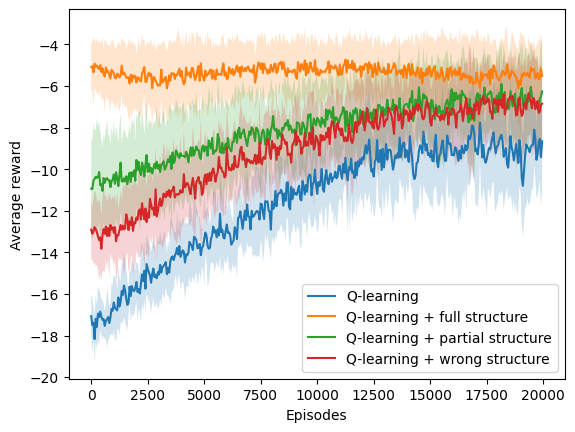<h3>Ambiente: stochastic</h3><h3>Porcentaje de modificación: high 075</h3><h3>Tipo de estructura: one to one </h3><h3>N: 5 </h3><h3>Simulaciones: 10 </h3><h3>Episodios: 10000 </h3><h3>Delta: 0.5 </h3><table>
  <tr>
    <th>Algoritmo</th>
    <th>M</th>
    <th>SD</th>
    <th>t</th>
    <th>df</th>
    <th>p</th>
    <th>H0</th>
    <th>d de Cohen</th>
  </tr>
  <tr>
    <td>$Q_1$</td>
    <td>10000.00</td>
    <td>0.00</td>
    <td>nan</td>
    <td>nan</td>
    <td>nan</td>
    <td>rechazada</td>
    <td>nan</td>
  </tr>
  <tr>
    <td>$Q_2$</td>
    <td>4368.00</td>
    <td>2900.43</td>
    <td>-5.83</td>
    <td>9.00</td>
    <td>0.00</td>
    <td>rechazada</td>
    <td>2.61</td>
  </tr>
  <tr>
    <td>$Q_3$</td>
    <td>8298.00</td>
    <td>1307.10</td>
    <td>-3.91</td>
    <td>9.00</td>
    <td>0.00</td>
    <td>rechazada</td>
    <td>1.75</td>
  </tr>
  <tr>
    <td>$Q_4$</td>
    <td>9036.00</td>
    <td>1503.03</td>
    <td>-1.92</td>
    <td>9.00</td>
    <td>0.09</td>
    <td>aceptada</td>
    <td>0.86</td>
  </tr>
</table>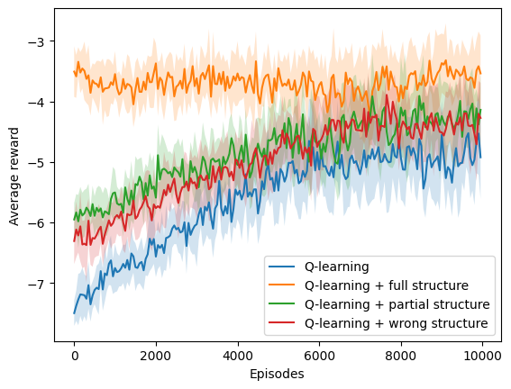<h3>Ambiente: stochastic</h3><h3>Porcentaje de modificación: high 075</h3><h3>Tipo de estructura: one to one </h3><h3>N: 7 </h3><h3>Simulaciones: 10 </h3><h3>Episodios: 10000 </h3><h3>Delta: 0.5 </h3><table>
  <tr>
    <th>Algoritmo</th>
    <th>M</th>
    <th>SD</th>
    <th>t</th>
    <th>df</th>
    <th>p</th>
    <th>H0</th>
    <th>d de Cohen</th>
  </tr>
  <tr>
    <td>$Q_1$</td>
    <td>10000.00</td>
    <td>0.00</td>
    <td>nan</td>
    <td>nan</td>
    <td>nan</td>
    <td>rechazada</td>
    <td>nan</td>
  </tr>
  <tr>
    <td>$Q_2$</td>
    <td>5040.00</td>
    <td>2513.04</td>
    <td>-5.92</td>
    <td>9.00</td>
    <td>0.00</td>
    <td>rechazada</td>
    <td>2.65</td>
  </tr>
  <tr>
    <td>$Q_3$</td>
    <td>9850.00</td>
    <td>450.00</td>
    <td>-1.00</td>
    <td>9.00</td>
    <td>0.34</td>
    <td>aceptada</td>
    <td>0.45</td>
  </tr>
  <tr>
    <td>$Q_4$</td>
    <td>9720.00</td>
    <td>840.00</td>
    <td>-1.00</td>
    <td>9.00</td>
    <td>0.34</td>
    <td>aceptada</td>
    <td>0.45</td>
  </tr>
</table><h3>Ambiente: stochastic</h3><h3>Porcentaje de modificación: high 075</h3><h3>Tipo de estructura: one to one </h3><h3>N: 9 </h3><h3>Simulaciones: 10 </h3><h3>Episodios: 20000 </h3><h3>Delta: 0.5 </h3><table>
  <tr>
    <th>Algoritmo</th>
    <th>M</th>
    <th>SD</th>
    <th>t</th>
    <th>df</th>
    <th>p</th>
    <th>H0</th>
    <th>d de Cohen</th>
  </tr>
  <tr>
    <td>$Q_1$</td>
    <td>20000.00</td>
    <td>0.00</td>
    <td>nan</td>
    <td>nan</td>
    <td>nan</td>
    <td>rechazada</td>
    <td>nan</td>
  </tr>
  <tr>
    <td>$Q_2$</td>
    <td>15610.00</td>
    <td>792.53</td>
    <td>-16.62</td>
    <td>9.00</td>
    <td>0.00</td>
    <td>rechazada</td>
    <td>7.43</td>
  </tr>
  <tr>
    <td>$Q_3$</td>
    <td>18128.00</td>
    <td>1328.49</td>
    <td>-4.23</td>
    <td>9.00</td>
    <td>0.00</td>
    <td>rechazada</td>
    <td>1.89</td>
  </tr>
  <tr>
    <td>$Q_4$</td>
    <td>17958.00</td>
    <td>2487.25</td>
    <td>-2.46</td>
    <td>9.00</td>
    <td>0.04</td>
    <td>rechazada</td>
    <td>1.10</td>
  </tr>
</table><h3>Ambiente: stochastic</h3><h3>Porcentaje de modificación: low 025</h3><h3>Tipo de estructura: many to one </h3><h3>N: 5 </h3><h3>Simulaciones: 10 </h3><h3>Episodios: 10000 </h3><h3>Delta: 0.5 </h3><table>
  <tr>
    <th>Algoritmo</th>
    <th>M</th>
    <th>SD</th>
    <th>t</th>
    <th>df</th>
    <th>p</th>
    <th>H0</th>
    <th>d de Cohen</th>
  </tr>
  <tr>
    <td>$Q_1$</td>
    <td>8676.00</td>
    <td>1694.93</td>
    <td>0.00</td>
    <td>18.00</td>
    <td>1.00</td>
    <td>aceptada</td>
    <td>0.00</td>
  </tr>
  <tr>
    <td>$Q_2$</td>
    <td>6038.00</td>
    <td>3701.40</td>
    <td>-1.94</td>
    <td>12.62</td>
    <td>0.07</td>
    <td>aceptada</td>
    <td>0.87</td>
  </tr>
  <tr>
    <td>$Q_3$</td>
    <td>5940.00</td>
    <td>3875.80</td>
    <td>-1.94</td>
    <td>12.32</td>
    <td>0.08</td>
    <td>aceptada</td>
    <td>0.87</td>
  </tr>
  <tr>
    <td>$Q_4$</td>
    <td>5780.00</td>
    <td>3818.38</td>
    <td>-2.08</td>
    <td>12.41</td>
    <td>0.06</td>
    <td>aceptada</td>
    <td>0.93</td>
  </tr>
</table><h3>Ambiente: stochastic</h3><h3>Porcentaje de modificación: low 025</h3><h3>Tipo de estructura: many to one </h3><h3>N: 7 </h3><h3>Simulaciones: 10 </h3><h3>Episodios: 10000 </h3><h3>Delta: 0.5 </h3><table>
  <tr>
    <th>Algoritmo</th>
    <th>M</th>
    <th>SD</th>
    <th>t</th>
    <th>df</th>
    <th>p</th>
    <th>H0</th>
    <th>d de Cohen</th>
  </tr>
  <tr>
    <td>$Q_1$</td>
    <td>9254.00</td>
    <td>999.88</td>
    <td>0.00</td>
    <td>18.00</td>
    <td>1.00</td>
    <td>aceptada</td>
    <td>0.00</td>
  </tr>
  <tr>
    <td>$Q_2$</td>
    <td>4110.00</td>
    <td>3178.22</td>
    <td>-4.63</td>
    <td>10.76</td>
    <td>0.00</td>
    <td>rechazada</td>
    <td>2.07</td>
  </tr>
  <tr>
    <td>$Q_3$</td>
    <td>6616.00</td>
    <td>3190.51</td>
    <td>-2.37</td>
    <td>10.75</td>
    <td>0.04</td>
    <td>rechazada</td>
    <td>1.06</td>
  </tr>
  <tr>
    <td>$Q_4$</td>
    <td>4022.00</td>
    <td>3093.21</td>
    <td>-4.83</td>
    <td>10.86</td>
    <td>0.00</td>
    <td>rechazada</td>
    <td>2.16</td>
  </tr>
</table><h3>Ambiente: stochastic</h3><h3>Porcentaje de modificación: low 025</h3><h3>Tipo de estructura: many to one </h3><h3>N: 9 </h3><h3>Simulaciones: 10 </h3><h3>Episodios: 20000 </h3><h3>Delta: 0.5 </h3><table>
  <tr>
    <th>Algoritmo</th>
    <th>M</th>
    <th>SD</th>
    <th>t</th>
    <th>df</th>
    <th>p</th>
    <th>H0</th>
    <th>d de Cohen</th>
  </tr>
  <tr>
    <td>$Q_1$</td>
    <td>17484.00</td>
    <td>2808.57</td>
    <td>0.00</td>
    <td>18.00</td>
    <td>1.00</td>
    <td>aceptada</td>
    <td>0.00</td>
  </tr>
  <tr>
    <td>$Q_2$</td>
    <td>5866.00</td>
    <td>5459.41</td>
    <td>-5.68</td>
    <td>13.45</td>
    <td>0.00</td>
    <td>rechazada</td>
    <td>2.54</td>
  </tr>
  <tr>
    <td>$Q_3$</td>
    <td>15000.00</td>
    <td>3595.27</td>
    <td>-1.63</td>
    <td>17.00</td>
    <td>0.12</td>
    <td>aceptada</td>
    <td>0.73</td>
  </tr>
  <tr>
    <td>$Q_4$</td>
    <td>11748.00</td>
    <td>6873.61</td>
    <td>-2.32</td>
    <td>11.92</td>
    <td>0.04</td>
    <td>rechazada</td>
    <td>1.04</td>
  </tr>
</table>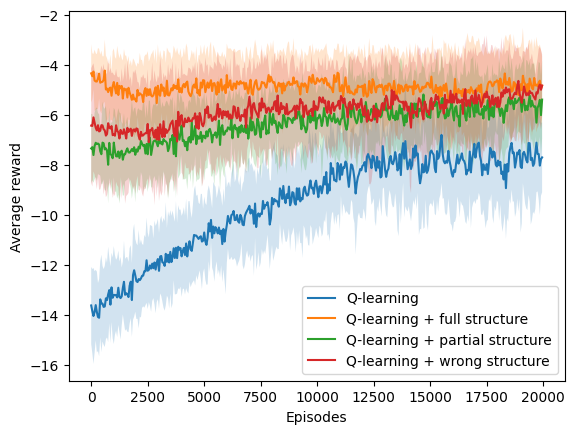<h3>Ambiente: stochastic</h3><h3>Porcentaje de modificación: low 025</h3><h3>Tipo de estructura: one to many </h3><h3>N: 5 </h3><h3>Simulaciones: 10 </h3><h3>Episodios: 10000 </h3><h3>Delta: 0.5 </h3><table>
  <tr>
    <th>Algoritmo</th>
    <th>M</th>
    <th>SD</th>
    <th>t</th>
    <th>df</th>
    <th>p</th>
    <th>H0</th>
    <th>d de Cohen</th>
  </tr>
  <tr>
    <td>$Q_1$</td>
    <td>9724.00</td>
    <td>828.00</td>
    <td>0.00</td>
    <td>18.00</td>
    <td>1.00</td>
    <td>aceptada</td>
    <td>0.00</td>
  </tr>
  <tr>
    <td>$Q_2$</td>
    <td>4406.00</td>
    <td>3203.12</td>
    <td>-4.82</td>
    <td>10.20</td>
    <td>0.00</td>
    <td>rechazada</td>
    <td>2.16</td>
  </tr>
  <tr>
    <td>$Q_3$</td>
    <td>6728.00</td>
    <td>2948.86</td>
    <td>-2.93</td>
    <td>10.41</td>
    <td>0.01</td>
    <td>rechazada</td>
    <td>1.31</td>
  </tr>
  <tr>
    <td>$Q_4$</td>
    <td>6760.00</td>
    <td>2547.39</td>
    <td>-3.32</td>
    <td>10.88</td>
    <td>0.01</td>
    <td>rechazada</td>
    <td>1.48</td>
  </tr>
</table><h3>Ambiente: stochastic</h3><h3>Porcentaje de modificación: low 025</h3><h3>Tipo de estructura: one to many </h3><h3>N: 7 </h3><h3>Simulaciones: 10 </h3><h3>Episodios: 10000 </h3><h3>Delta: 0.5 </h3><table>
  <tr>
    <th>Algoritmo</th>
    <th>M</th>
    <th>SD</th>
    <th>t</th>
    <th>df</th>
    <th>p</th>
    <th>H0</th>
    <th>d de Cohen</th>
  </tr>
  <tr>
    <td>$Q_1$</td>
    <td>8274.00</td>
    <td>1648.22</td>
    <td>0.00</td>
    <td>18.00</td>
    <td>1.00</td>
    <td>aceptada</td>
    <td>0.00</td>
  </tr>
  <tr>
    <td>$Q_2$</td>
    <td>2048.00</td>
    <td>1342.87</td>
    <td>-8.79</td>
    <td>17.29</td>
    <td>0.00</td>
    <td>rechazada</td>
    <td>3.93</td>
  </tr>
  <tr>
    <td>$Q_3$</td>
    <td>4836.00</td>
    <td>3791.25</td>
    <td>-2.49</td>
    <td>12.28</td>
    <td>0.03</td>
    <td>rechazada</td>
    <td>1.12</td>
  </tr>
  <tr>
    <td>$Q_4$</td>
    <td>4122.00</td>
    <td>3949.93</td>
    <td>-2.91</td>
    <td>12.04</td>
    <td>0.01</td>
    <td>rechazada</td>
    <td>1.30</td>
  </tr>
</table>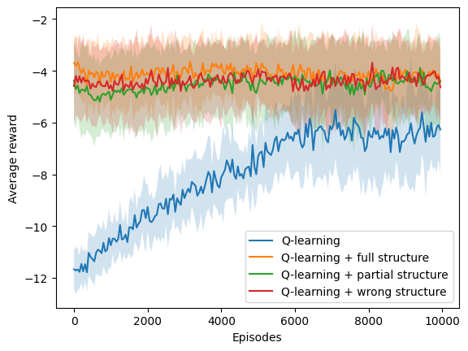<h3>Ambiente: stochastic</h3><h3>Porcentaje de modificación: low 025</h3><h3>Tipo de estructura: one to many </h3><h3>N: 9 </h3><h3>Simulaciones: 10 </h3><h3>Episodios: 20000 </h3><h3>Delta: 0.5 </h3><table>
  <tr>
    <th>Algoritmo</th>
    <th>M</th>
    <th>SD</th>
    <th>t</th>
    <th>df</th>
    <th>p</th>
    <th>H0</th>
    <th>d de Cohen</th>
  </tr>
  <tr>
    <td>$Q_1$</td>
    <td>19006.00</td>
    <td>1161.24</td>
    <td>0.00</td>
    <td>18.00</td>
    <td>1.00</td>
    <td>aceptada</td>
    <td>0.00</td>
  </tr>
  <tr>
    <td>$Q_2$</td>
    <td>3642.00</td>
    <td>2264.59</td>
    <td>-18.11</td>
    <td>13.43</td>
    <td>0.00</td>
    <td>rechazada</td>
    <td>8.10</td>
  </tr>
  <tr>
    <td>$Q_3$</td>
    <td>8690.00</td>
    <td>5633.01</td>
    <td>-5.38</td>
    <td>9.76</td>
    <td>0.00</td>
    <td>rechazada</td>
    <td>2.41</td>
  </tr>
  <tr>
    <td>$Q_4$</td>
    <td>11264.00</td>
    <td>6645.45</td>
    <td>-3.44</td>
    <td>9.55</td>
    <td>0.01</td>
    <td>rechazada</td>
    <td>1.54</td>
  </tr>
</table><h3>Ambiente: stochastic</h3><h3>Porcentaje de modificación: low 025</h3><h3>Tipo de estructura: one to one </h3><h3>N: 5 </h3><h3>Simulaciones: 10 </h3><h3>Episodios: 10000 </h3><h3>Delta: 0.5 </h3><table>
  <tr>
    <th>Algoritmo</th>
    <th>M</th>
    <th>SD</th>
    <th>t</th>
    <th>df</th>
    <th>p</th>
    <th>H0</th>
    <th>d de Cohen</th>
  </tr>
  <tr>
    <td>$Q_1$</td>
    <td>10000.00</td>
    <td>0.00</td>
    <td>nan</td>
    <td>nan</td>
    <td>nan</td>
    <td>rechazada</td>
    <td>nan</td>
  </tr>
  <tr>
    <td>$Q_2$</td>
    <td>6156.00</td>
    <td>2333.83</td>
    <td>-4.94</td>
    <td>9.00</td>
    <td>0.00</td>
    <td>rechazada</td>
    <td>2.21</td>
  </tr>
  <tr>
    <td>$Q_3$</td>
    <td>6176.00</td>
    <td>2330.42</td>
    <td>-4.92</td>
    <td>9.00</td>
    <td>0.00</td>
    <td>rechazada</td>
    <td>2.20</td>
  </tr>
  <tr>
    <td>$Q_4$</td>
    <td>8000.00</td>
    <td>951.97</td>
    <td>-6.30</td>
    <td>9.00</td>
    <td>0.00</td>
    <td>rechazada</td>
    <td>2.82</td>
  </tr>
</table><h3>Ambiente: stochastic</h3><h3>Porcentaje de modificación: low 025</h3><h3>Tipo de estructura: one to one </h3><h3>N: 7 </h3><h3>Simulaciones: 10 </h3><h3>Episodios: 10000 </h3><h3>Delta: 0.5 </h3><table>
  <tr>
    <th>Algoritmo</th>
    <th>M</th>
    <th>SD</th>
    <th>t</th>
    <th>df</th>
    <th>p</th>
    <th>H0</th>
    <th>d de Cohen</th>
  </tr>
  <tr>
    <td>$Q_1$</td>
    <td>10000.00</td>
    <td>0.00</td>
    <td>nan</td>
    <td>nan</td>
    <td>nan</td>
    <td>rechazada</td>
    <td>nan</td>
  </tr>
  <tr>
    <td>$Q_2$</td>
    <td>4028.00</td>
    <td>1805.66</td>
    <td>-9.92</td>
    <td>9.00</td>
    <td>0.00</td>
    <td>rechazada</td>
    <td>4.44</td>
  </tr>
  <tr>
    <td>$Q_3$</td>
    <td>7602.00</td>
    <td>1222.54</td>
    <td>-5.88</td>
    <td>9.00</td>
    <td>0.00</td>
    <td>rechazada</td>
    <td>2.63</td>
  </tr>
  <tr>
    <td>$Q_4$</td>
    <td>7854.00</td>
    <td>448.83</td>
    <td>-14.34</td>
    <td>9.00</td>
    <td>0.00</td>
    <td>rechazada</td>
    <td>6.41</td>
  </tr>
</table><h3>Ambiente: stochastic</h3><h3>Porcentaje de modificación: low 025</h3><h3>Tipo de estructura: one to one </h3><h3>N: 9 </h3><h3>Simulaciones: 10 </h3><h3>Episodios: 20000 </h3><h3>Delta: 0.5 </h3><table>
  <tr>
    <th>Algoritmo</th>
    <th>M</th>
    <th>SD</th>
    <th>t</th>
    <th>df</th>
    <th>p</th>
    <th>H0</th>
    <th>d de Cohen</th>
  </tr>
  <tr>
    <td>$Q_1$</td>
    <td>20000.00</td>
    <td>0.00</td>
    <td>nan</td>
    <td>nan</td>
    <td>nan</td>
    <td>rechazada</td>
    <td>nan</td>
  </tr>
  <tr>
    <td>$Q_2$</td>
    <td>15480.00</td>
    <td>1256.76</td>
    <td>-10.79</td>
    <td>9.00</td>
    <td>0.00</td>
    <td>rechazada</td>
    <td>4.83</td>
  </tr>
  <tr>
    <td>$Q_3$</td>
    <td>16334.00</td>
    <td>823.94</td>
    <td>-13.35</td>
    <td>9.00</td>
    <td>0.00</td>
    <td>rechazada</td>
    <td>5.97</td>
  </tr>
  <tr>
    <td>$Q_4$</td>
    <td>17052.00</td>
    <td>1414.05</td>
    <td>-6.25</td>
    <td>9.00</td>
    <td>0.00</td>
    <td>rechazada</td>
    <td>2.80</td>
  </tr>
</table>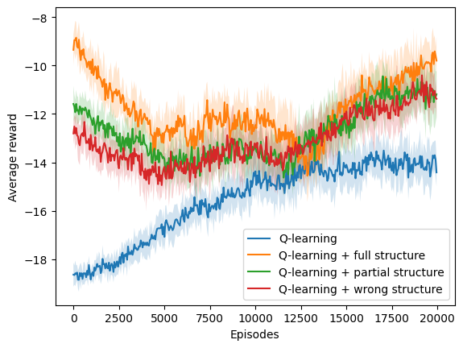<h3>Ambiente: stochastic</h3><h3>Porcentaje de modificación: medium 05</h3><h3>Tipo de estructura: many to one </h3><h3>N: 5 </h3><h3>Simulaciones: 10 </h3><h3>Episodios: 10000 </h3><h3>Delta: 0.5 </h3><table>
  <tr>
    <th>Algoritmo</th>
    <th>M</th>
    <th>SD</th>
    <th>t</th>
    <th>df</th>
    <th>p</th>
    <th>H0</th>
    <th>d de Cohen</th>
  </tr>
  <tr>
    <td>$Q_1$</td>
    <td>9832.00</td>
    <td>504.00</td>
    <td>0.00</td>
    <td>18.00</td>
    <td>1.00</td>
    <td>aceptada</td>
    <td>0.00</td>
  </tr>
  <tr>
    <td>$Q_2$</td>
    <td>4918.00</td>
    <td>2569.22</td>
    <td>-5.63</td>
    <td>9.69</td>
    <td>0.00</td>
    <td>rechazada</td>
    <td>2.52</td>
  </tr>
  <tr>
    <td>$Q_3$</td>
    <td>6922.00</td>
    <td>2752.26</td>
    <td>-3.12</td>
    <td>9.60</td>
    <td>0.01</td>
    <td>rechazada</td>
    <td>1.40</td>
  </tr>
  <tr>
    <td>$Q_4$</td>
    <td>8950.00</td>
    <td>1318.55</td>
    <td>-1.87</td>
    <td>11.57</td>
    <td>0.09</td>
    <td>aceptada</td>
    <td>0.84</td>
  </tr>
</table>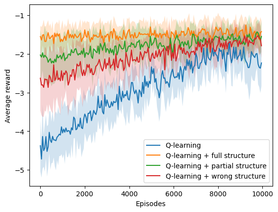<h3>Ambiente: stochastic</h3><h3>Porcentaje de modificación: medium 05</h3><h3>Tipo de estructura: many to one </h3><h3>N: 7 </h3><h3>Simulaciones: 10 </h3><h3>Episodios: 10000 </h3><h3>Delta: 0.5 </h3><table>
  <tr>
    <th>Algoritmo</th>
    <th>M</th>
    <th>SD</th>
    <th>t</th>
    <th>df</th>
    <th>p</th>
    <th>H0</th>
    <th>d de Cohen</th>
  </tr>
  <tr>
    <td>$Q_1$</td>
    <td>9332.00</td>
    <td>1137.20</td>
    <td>0.00</td>
    <td>18.00</td>
    <td>1.00</td>
    <td>aceptada</td>
    <td>0.00</td>
  </tr>
  <tr>
    <td>$Q_2$</td>
    <td>3042.00</td>
    <td>2402.96</td>
    <td>-7.10</td>
    <td>12.84</td>
    <td>0.00</td>
    <td>rechazada</td>
    <td>3.17</td>
  </tr>
  <tr>
    <td>$Q_3$</td>
    <td>6790.00</td>
    <td>3211.87</td>
    <td>-2.24</td>
    <td>11.22</td>
    <td>0.05</td>
    <td>rechazada</td>
    <td>1.00</td>
  </tr>
  <tr>
    <td>$Q_4$</td>
    <td>7886.00</td>
    <td>2595.52</td>
    <td>-1.53</td>
    <td>12.33</td>
    <td>0.15</td>
    <td>aceptada</td>
    <td>0.68</td>
  </tr>
</table><h3>Ambiente: stochastic</h3><h3>Porcentaje de modificación: medium 05</h3><h3>Tipo de estructura: many to one </h3><h3>N: 9 </h3><h3>Simulaciones: 10 </h3><h3>Episodios: 20000 </h3><h3>Delta: 0.5 </h3><table>
  <tr>
    <th>Algoritmo</th>
    <th>M</th>
    <th>SD</th>
    <th>t</th>
    <th>df</th>
    <th>p</th>
    <th>H0</th>
    <th>d de Cohen</th>
  </tr>
  <tr>
    <td>$Q_1$</td>
    <td>19098.00</td>
    <td>1393.77</td>
    <td>0.00</td>
    <td>18.00</td>
    <td>1.00</td>
    <td>aceptada</td>
    <td>0.00</td>
  </tr>
  <tr>
    <td>$Q_2$</td>
    <td>6740.00</td>
    <td>5322.11</td>
    <td>-6.74</td>
    <td>10.23</td>
    <td>0.00</td>
    <td>rechazada</td>
    <td>3.01</td>
  </tr>
  <tr>
    <td>$Q_3$</td>
    <td>15122.00</td>
    <td>2166.66</td>
    <td>-4.63</td>
    <td>15.36</td>
    <td>0.00</td>
    <td>rechazada</td>
    <td>2.07</td>
  </tr>
  <tr>
    <td>$Q_4$</td>
    <td>16230.00</td>
    <td>2243.41</td>
    <td>-3.26</td>
    <td>15.05</td>
    <td>0.01</td>
    <td>rechazada</td>
    <td>1.46</td>
  </tr>
</table><h3>Ambiente: stochastic</h3><h3>Porcentaje de modificación: medium 05</h3><h3>Tipo de estructura: one to many </h3><h3>N: 5 </h3><h3>Simulaciones: 10 </h3><h3>Episodios: 10000 </h3><h3>Delta: 0.5 </h3><table>
  <tr>
    <th>Algoritmo</th>
    <th>M</th>
    <th>SD</th>
    <th>t</th>
    <th>df</th>
    <th>p</th>
    <th>H0</th>
    <th>d de Cohen</th>
  </tr>
  <tr>
    <td>$Q_1$</td>
    <td>9902.00</td>
    <td>294.00</td>
    <td>0.00</td>
    <td>18.00</td>
    <td>1.00</td>
    <td>aceptada</td>
    <td>0.00</td>
  </tr>
  <tr>
    <td>$Q_2$</td>
    <td>5952.00</td>
    <td>2758.12</td>
    <td>-4.27</td>
    <td>9.20</td>
    <td>0.00</td>
    <td>rechazada</td>
    <td>1.91</td>
  </tr>
  <tr>
    <td>$Q_3$</td>
    <td>7898.00</td>
    <td>2195.62</td>
    <td>-2.71</td>
    <td>9.32</td>
    <td>0.02</td>
    <td>rechazada</td>
    <td>1.21</td>
  </tr>
  <tr>
    <td>$Q_4$</td>
    <td>8894.00</td>
    <td>946.36</td>
    <td>-3.05</td>
    <td>10.72</td>
    <td>0.01</td>
    <td>rechazada</td>
    <td>1.36</td>
  </tr>
</table><h3>Ambiente: stochastic</h3><h3>Porcentaje de modificación: medium 05</h3><h3>Tipo de estructura: one to many </h3><h3>N: 7 </h3><h3>Simulaciones: 10 </h3><h3>Episodios: 10000 </h3><h3>Delta: 0.5 </h3><table>
  <tr>
    <th>Algoritmo</th>
    <th>M</th>
    <th>SD</th>
    <th>t</th>
    <th>df</th>
    <th>p</th>
    <th>H0</th>
    <th>d de Cohen</th>
  </tr>
  <tr>
    <td>$Q_1$</td>
    <td>9594.00</td>
    <td>956.41</td>
    <td>0.00</td>
    <td>18.00</td>
    <td>1.00</td>
    <td>aceptada</td>
    <td>0.00</td>
  </tr>
  <tr>
    <td>$Q_2$</td>
    <td>3564.00</td>
    <td>3675.92</td>
    <td>-4.76</td>
    <td>10.21</td>
    <td>0.00</td>
    <td>rechazada</td>
    <td>2.13</td>
  </tr>
  <tr>
    <td>$Q_3$</td>
    <td>8598.00</td>
    <td>1060.85</td>
    <td>-2.09</td>
    <td>17.81</td>
    <td>0.05</td>
    <td>aceptada</td>
    <td>0.94</td>
  </tr>
  <tr>
    <td>$Q_4$</td>
    <td>7468.00</td>
    <td>1729.00</td>
    <td>-3.23</td>
    <td>14.04</td>
    <td>0.01</td>
    <td>rechazada</td>
    <td>1.44</td>
  </tr>
</table><h3>Ambiente: stochastic</h3><h3>Porcentaje de modificación: medium 05</h3><h3>Tipo de estructura: one to many </h3><h3>N: 9 </h3><h3>Simulaciones: 10 </h3><h3>Episodios: 20000 </h3><h3>Delta: 0.5 </h3><table>
  <tr>
    <th>Algoritmo</th>
    <th>M</th>
    <th>SD</th>
    <th>t</th>
    <th>df</th>
    <th>p</th>
    <th>H0</th>
    <th>d de Cohen</th>
  </tr>
  <tr>
    <td>$Q_1$</td>
    <td>17828.00</td>
    <td>2955.66</td>
    <td>0.00</td>
    <td>18.00</td>
    <td>1.00</td>
    <td>aceptada</td>
    <td>0.00</td>
  </tr>
  <tr>
    <td>$Q_2$</td>
    <td>3704.00</td>
    <td>2221.15</td>
    <td>-11.46</td>
    <td>16.71</td>
    <td>0.00</td>
    <td>rechazada</td>
    <td>5.13</td>
  </tr>
  <tr>
    <td>$Q_3$</td>
    <td>11822.00</td>
    <td>4370.72</td>
    <td>-3.41</td>
    <td>15.81</td>
    <td>0.00</td>
    <td>rechazada</td>
    <td>1.53</td>
  </tr>
  <tr>
    <td>$Q_4$</td>
    <td>15208.00</td>
    <td>3168.48</td>
    <td>-1.81</td>
    <td>17.91</td>
    <td>0.09</td>
    <td>aceptada</td>
    <td>0.81</td>
  </tr>
</table>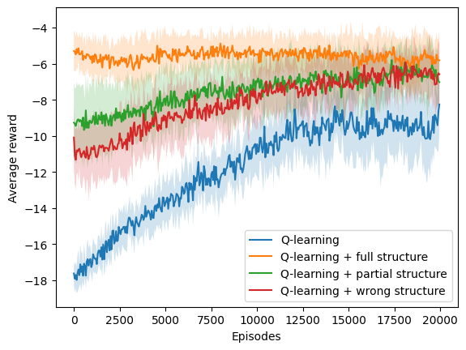<h3>Ambiente: stochastic</h3><h3>Porcentaje de modificación: medium 05</h3><h3>Tipo de estructura: one to one </h3><h3>N: 5 </h3><h3>Simulaciones: 10 </h3><h3>Episodios: 10000 </h3><h3>Delta: 0.5 </h3><table>
  <tr>
    <th>Algoritmo</th>
    <th>M</th>
    <th>SD</th>
    <th>t</th>
    <th>df</th>
    <th>p</th>
    <th>H0</th>
    <th>d de Cohen</th>
  </tr>
  <tr>
    <td>$Q_1$</td>
    <td>10000.00</td>
    <td>0.00</td>
    <td>nan</td>
    <td>nan</td>
    <td>nan</td>
    <td>rechazada</td>
    <td>nan</td>
  </tr>
  <tr>
    <td>$Q_2$</td>
    <td>5162.00</td>
    <td>2521.42</td>
    <td>-5.76</td>
    <td>9.00</td>
    <td>0.00</td>
    <td>rechazada</td>
    <td>2.57</td>
  </tr>
  <tr>
    <td>$Q_3$</td>
    <td>7646.00</td>
    <td>1047.86</td>
    <td>-6.74</td>
    <td>9.00</td>
    <td>0.00</td>
    <td>rechazada</td>
    <td>3.01</td>
  </tr>
  <tr>
    <td>$Q_4$</td>
    <td>8062.00</td>
    <td>979.73</td>
    <td>-5.93</td>
    <td>9.00</td>
    <td>0.00</td>
    <td>rechazada</td>
    <td>2.65</td>
  </tr>
</table>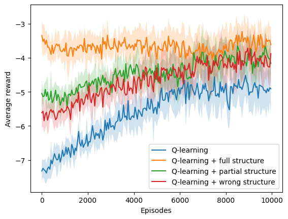<h3>Ambiente: stochastic</h3><h3>Porcentaje de modificación: medium 05</h3><h3>Tipo de estructura: one to one </h3><h3>N: 7 </h3><h3>Simulaciones: 10 </h3><h3>Episodios: 10000 </h3><h3>Delta: 0.5 </h3><table>
  <tr>
    <th>Algoritmo</th>
    <th>M</th>
    <th>SD</th>
    <th>t</th>
    <th>df</th>
    <th>p</th>
    <th>H0</th>
    <th>d de Cohen</th>
  </tr>
  <tr>
    <td>$Q_1$</td>
    <td>9946.00</td>
    <td>162.00</td>
    <td>0.00</td>
    <td>18.00</td>
    <td>1.00</td>
    <td>aceptada</td>
    <td>0.00</td>
  </tr>
  <tr>
    <td>$Q_2$</td>
    <td>4766.00</td>
    <td>1854.83</td>
    <td>-8.35</td>
    <td>9.14</td>
    <td>0.00</td>
    <td>rechazada</td>
    <td>3.73</td>
  </tr>
  <tr>
    <td>$Q_3$</td>
    <td>8214.00</td>
    <td>666.16</td>
    <td>-7.58</td>
    <td>10.06</td>
    <td>0.00</td>
    <td>rechazada</td>
    <td>3.39</td>
  </tr>
  <tr>
    <td>$Q_4$</td>
    <td>7776.00</td>
    <td>1054.51</td>
    <td>-6.10</td>
    <td>9.42</td>
    <td>0.00</td>
    <td>rechazada</td>
    <td>2.73</td>
  </tr>
</table><h3>Ambiente: stochastic</h3><h3>Porcentaje de modificación: medium 05</h3><h3>Tipo de estructura: one to one </h3><h3>N: 9 </h3><h3>Simulaciones: 10 </h3><h3>Episodios: 20000 </h3><h3>Delta: 0.5 </h3><table>
  <tr>
    <th>Algoritmo</th>
    <th>M</th>
    <th>SD</th>
    <th>t</th>
    <th>df</th>
    <th>p</th>
    <th>H0</th>
    <th>d de Cohen</th>
  </tr>
  <tr>
    <td>$Q_1$</td>
    <td>20000.00</td>
    <td>0.00</td>
    <td>nan</td>
    <td>nan</td>
    <td>nan</td>
    <td>rechazada</td>
    <td>nan</td>
  </tr>
  <tr>
    <td>$Q_2$</td>
    <td>15928.00</td>
    <td>996.08</td>
    <td>-12.26</td>
    <td>9.00</td>
    <td>0.00</td>
    <td>rechazada</td>
    <td>5.48</td>
  </tr>
  <tr>
    <td>$Q_3$</td>
    <td>17132.00</td>
    <td>1732.42</td>
    <td>-4.97</td>
    <td>9.00</td>
    <td>0.00</td>
    <td>rechazada</td>
    <td>2.22</td>
  </tr>
  <tr>
    <td>$Q_4$</td>
    <td>17646.00</td>
    <td>2257.20</td>
    <td>-3.13</td>
    <td>9.00</td>
    <td>0.01</td>
    <td>rechazada</td>
    <td>1.40</td>
  </tr>
</table>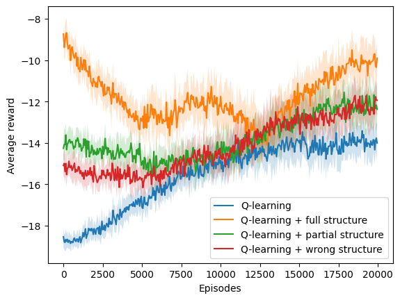<h2>Número de episodios en alcanzar racha de recompensas</h2><h3>deterministic one_to_one</h3><h3>deterministic many_to_one</h3><h3>deterministic one_to_many</h3><h3>stochastic one_to_one</h3><h3>stochastic many_to_one</h3><h3>stochastic one_to_many</h3><h3>one_to_one</h3><table border="1" class="dataframe">
  <thead>
    <tr style="text-align: right;">
      <th></th>
      <th>Ambiente</th>
      <th>N</th>
      <th>Parametro</th>
      <th>Algoritmo</th>
      <th>M</th>
      <th>STD</th>
      <th>t</th>
      <th>df</th>
      <th>p</th>
      <th>H0</th>
      <th>Cohend</th>
    </tr>
  </thead>
  <tbody>
    <tr>
      <th>0</th>
      <td>deterministic</td>
      <td>5</td>
      <td>0.25</td>
      <td>$Q_1$</td>
      <td>10000.00</td>
      <td>0.00</td>
      <td>nan</td>
      <td>nan</td>
      <td>nan</td>
      <td>rechazada</td>
      <td>nan</td>
    </tr>
    <tr>
      <th>1</th>
      <td>deterministic</td>
      <td>5</td>
      <td>0.25</td>
      <td>$Q_2$</td>
      <td>4992.00</td>
      <td>2249.06</td>
      <td>-6.68</td>
      <td>9.00</td>
      <td>0.00</td>
      <td>rechazada</td>
      <td>2.99</td>
    </tr>
    <tr>
      <th>2</th>
      <td>deterministic</td>
      <td>5</td>
      <td>0.25</td>
      <td>$Q_3$</td>
      <td>8062.00</td>
      <td>1360.22</td>
      <td>-4.27</td>
      <td>9.00</td>
      <td>0.00</td>
      <td>rechazada</td>
      <td>1.91</td>
    </tr>
    <tr>
      <th>3</th>
      <td>deterministic</td>
      <td>5</td>
      <td>0.25</td>
      <td>$Q_4$</td>
      <td>8590.00</td>
      <td>1062.31</td>
      <td>-3.98</td>
      <td>9.00</td>
      <td>0.00</td>
      <td>rechazada</td>
      <td>1.78</td>
    </tr>
    <tr>
      <th>4</th>
      <td>deterministic</td>
      <td>5</td>
      <td>0.5</td>
      <td>$Q_1$</td>
      <td>10000.00</td>
      <td>0.00</td>
      <td>nan</td>
      <td>nan</td>
      <td>nan</td>
      <td>rechazada</td>
      <td>nan</td>
    </tr>
    <tr>
      <th>5</th>
      <td>deterministic</td>
      <td>5</td>
      <td>0.5</td>
      <td>$Q_2$</td>
      <td>5178.00</td>
      <td>1621.47</td>
      <td>-8.92</td>
      <td>9.00</td>
      <td>0.00</td>
      <td>rechazada</td>
      <td>3.99</td>
    </tr>
    <tr>
      <th>6</th>
      <td>deterministic</td>
      <td>5</td>
      <td>0.5</td>
      <td>$Q_3$</td>
      <td>9396.00</td>
      <td>1044.02</td>
      <td>-1.74</td>
      <td>9.00</td>
      <td>0.12</td>
      <td>aceptada</td>
      <td>0.78</td>
    </tr>
    <tr>
      <th>7</th>
      <td>deterministic</td>
      <td>5</td>
      <td>0.5</td>
      <td>$Q_4$</td>
      <td>9510.00</td>
      <td>827.78</td>
      <td>-1.78</td>
      <td>9.00</td>
      <td>0.11</td>
      <td>aceptada</td>
      <td>0.79</td>
    </tr>
    <tr>
      <th>8</th>
      <td>deterministic</td>
      <td>5</td>
      <td>0.75</td>
      <td>$Q_1$</td>
      <td>10000.00</td>
      <td>0.00</td>
      <td>nan</td>
      <td>nan</td>
      <td>nan</td>
      <td>rechazada</td>
      <td>nan</td>
    </tr>
    <tr>
      <th>9</th>
      <td>deterministic</td>
      <td>5</td>
      <td>0.75</td>
      <td>$Q_2$</td>
      <td>5326.00</td>
      <td>1737.29</td>
      <td>-8.07</td>
      <td>9.00</td>
      <td>0.00</td>
      <td>rechazada</td>
      <td>3.61</td>
    </tr>
    <tr>
      <th>10</th>
      <td>deterministic</td>
      <td>5</td>
      <td>0.75</td>
      <td>$Q_3$</td>
      <td>9848.00</td>
      <td>312.31</td>
      <td>-1.46</td>
      <td>9.00</td>
      <td>0.18</td>
      <td>aceptada</td>
      <td>0.65</td>
    </tr>
    <tr>
      <th>11</th>
      <td>deterministic</td>
      <td>5</td>
      <td>0.75</td>
      <td>$Q_4$</td>
      <td>10000.00</td>
      <td>0.00</td>
      <td>nan</td>
      <td>nan</td>
      <td>nan</td>
      <td>rechazada</td>
      <td>nan</td>
    </tr>
    <tr>
      <th>12</th>
      <td>deterministic</td>
      <td>7</td>
      <td>0.25</td>
      <td>$Q_1$</td>
      <td>10000.00</td>
      <td>0.00</td>
      <td>nan</td>
      <td>nan</td>
      <td>nan</td>
      <td>rechazada</td>
      <td>nan</td>
    </tr>
    <tr>
      <th>13</th>
      <td>deterministic</td>
      <td>7</td>
      <td>0.25</td>
      <td>$Q_2$</td>
      <td>6364.00</td>
      <td>1381.50</td>
      <td>-7.90</td>
      <td>9.00</td>
      <td>0.00</td>
      <td>rechazada</td>
      <td>3.53</td>
    </tr>
    <tr>
      <th>14</th>
      <td>deterministic</td>
      <td>7</td>
      <td>0.25</td>
      <td>$Q_3$</td>
      <td>7794.00</td>
      <td>1016.23</td>
      <td>-6.51</td>
      <td>9.00</td>
      <td>0.00</td>
      <td>rechazada</td>
      <td>2.91</td>
    </tr>
    <tr>
      <th>15</th>
      <td>deterministic</td>
      <td>7</td>
      <td>0.25</td>
      <td>$Q_4$</td>
      <td>7724.00</td>
      <td>1142.87</td>
      <td>-5.97</td>
      <td>9.00</td>
      <td>0.00</td>
      <td>rechazada</td>
      <td>2.67</td>
    </tr>
    <tr>
      <th>16</th>
      <td>deterministic</td>
      <td>7</td>
      <td>0.5</td>
      <td>$Q_1$</td>
      <td>10000.00</td>
      <td>0.00</td>
      <td>nan</td>
      <td>nan</td>
      <td>nan</td>
      <td>rechazada</td>
      <td>nan</td>
    </tr>
    <tr>
      <th>17</th>
      <td>deterministic</td>
      <td>7</td>
      <td>0.5</td>
      <td>$Q_2$</td>
      <td>7676.00</td>
      <td>957.91</td>
      <td>-7.28</td>
      <td>9.00</td>
      <td>0.00</td>
      <td>rechazada</td>
      <td>3.25</td>
    </tr>
    <tr>
      <th>18</th>
      <td>deterministic</td>
      <td>7</td>
      <td>0.5</td>
      <td>$Q_3$</td>
      <td>8206.00</td>
      <td>1116.39</td>
      <td>-4.82</td>
      <td>9.00</td>
      <td>0.00</td>
      <td>rechazada</td>
      <td>2.16</td>
    </tr>
    <tr>
      <th>19</th>
      <td>deterministic</td>
      <td>7</td>
      <td>0.5</td>
      <td>$Q_4$</td>
      <td>8182.00</td>
      <td>1238.37</td>
      <td>-4.40</td>
      <td>9.00</td>
      <td>0.00</td>
      <td>rechazada</td>
      <td>1.97</td>
    </tr>
    <tr>
      <th>20</th>
      <td>deterministic</td>
      <td>7</td>
      <td>0.75</td>
      <td>$Q_1$</td>
      <td>10000.00</td>
      <td>0.00</td>
      <td>nan</td>
      <td>nan</td>
      <td>nan</td>
      <td>rechazada</td>
      <td>nan</td>
    </tr>
    <tr>
      <th>21</th>
      <td>deterministic</td>
      <td>7</td>
      <td>0.75</td>
      <td>$Q_2$</td>
      <td>6998.00</td>
      <td>1228.31</td>
      <td>-7.33</td>
      <td>9.00</td>
      <td>0.00</td>
      <td>rechazada</td>
      <td>3.28</td>
    </tr>
    <tr>
      <th>22</th>
      <td>deterministic</td>
      <td>7</td>
      <td>0.75</td>
      <td>$Q_3$</td>
      <td>9074.00</td>
      <td>1253.16</td>
      <td>-2.22</td>
      <td>9.00</td>
      <td>0.05</td>
      <td>aceptada</td>
      <td>0.99</td>
    </tr>
    <tr>
      <th>23</th>
      <td>deterministic</td>
      <td>7</td>
      <td>0.75</td>
      <td>$Q_4$</td>
      <td>9822.00</td>
      <td>534.00</td>
      <td>-1.00</td>
      <td>9.00</td>
      <td>0.34</td>
      <td>aceptada</td>
      <td>0.45</td>
    </tr>
    <tr>
      <th>24</th>
      <td>deterministic</td>
      <td>9</td>
      <td>0.25</td>
      <td>$Q_1$</td>
      <td>20000.00</td>
      <td>0.00</td>
      <td>nan</td>
      <td>nan</td>
      <td>nan</td>
      <td>rechazada</td>
      <td>nan</td>
    </tr>
    <tr>
      <th>25</th>
      <td>deterministic</td>
      <td>9</td>
      <td>0.25</td>
      <td>$Q_2$</td>
      <td>16584.00</td>
      <td>747.25</td>
      <td>-13.71</td>
      <td>9.00</td>
      <td>0.00</td>
      <td>rechazada</td>
      <td>6.13</td>
    </tr>
    <tr>
      <th>26</th>
      <td>deterministic</td>
      <td>9</td>
      <td>0.25</td>
      <td>$Q_3$</td>
      <td>16984.00</td>
      <td>1495.99</td>
      <td>-6.05</td>
      <td>9.00</td>
      <td>0.00</td>
      <td>rechazada</td>
      <td>2.70</td>
    </tr>
    <tr>
      <th>27</th>
      <td>deterministic</td>
      <td>9</td>
      <td>0.25</td>
      <td>$Q_4$</td>
      <td>17350.00</td>
      <td>1686.59</td>
      <td>-4.71</td>
      <td>9.00</td>
      <td>0.00</td>
      <td>rechazada</td>
      <td>2.11</td>
    </tr>
    <tr>
      <th>28</th>
      <td>deterministic</td>
      <td>9</td>
      <td>0.5</td>
      <td>$Q_1$</td>
      <td>20000.00</td>
      <td>0.00</td>
      <td>nan</td>
      <td>nan</td>
      <td>nan</td>
      <td>rechazada</td>
      <td>nan</td>
    </tr>
    <tr>
      <th>29</th>
      <td>deterministic</td>
      <td>9</td>
      <td>0.5</td>
      <td>$Q_2$</td>
      <td>17330.00</td>
      <td>1462.33</td>
      <td>-5.48</td>
      <td>9.00</td>
      <td>0.00</td>
      <td>rechazada</td>
      <td>2.45</td>
    </tr>
    <tr>
      <th>30</th>
      <td>deterministic</td>
      <td>9</td>
      <td>0.5</td>
      <td>$Q_3$</td>
      <td>17992.00</td>
      <td>1458.39</td>
      <td>-4.13</td>
      <td>9.00</td>
      <td>0.00</td>
      <td>rechazada</td>
      <td>1.85</td>
    </tr>
    <tr>
      <th>31</th>
      <td>deterministic</td>
      <td>9</td>
      <td>0.5</td>
      <td>$Q_4$</td>
      <td>18908.00</td>
      <td>1105.67</td>
      <td>-2.96</td>
      <td>9.00</td>
      <td>0.02</td>
      <td>rechazada</td>
      <td>1.33</td>
    </tr>
    <tr>
      <th>32</th>
      <td>deterministic</td>
      <td>9</td>
      <td>0.75</td>
      <td>$Q_1$</td>
      <td>20000.00</td>
      <td>0.00</td>
      <td>nan</td>
      <td>nan</td>
      <td>nan</td>
      <td>rechazada</td>
      <td>nan</td>
    </tr>
    <tr>
      <th>33</th>
      <td>deterministic</td>
      <td>9</td>
      <td>0.75</td>
      <td>$Q_2$</td>
      <td>17254.00</td>
      <td>1352.57</td>
      <td>-6.09</td>
      <td>9.00</td>
      <td>0.00</td>
      <td>rechazada</td>
      <td>2.72</td>
    </tr>
    <tr>
      <th>34</th>
      <td>deterministic</td>
      <td>9</td>
      <td>0.75</td>
      <td>$Q_3$</td>
      <td>18408.00</td>
      <td>1587.00</td>
      <td>-3.01</td>
      <td>9.00</td>
      <td>0.01</td>
      <td>rechazada</td>
      <td>1.35</td>
    </tr>
    <tr>
      <th>35</th>
      <td>deterministic</td>
      <td>9</td>
      <td>0.75</td>
      <td>$Q_4$</td>
      <td>20000.00</td>
      <td>0.00</td>
      <td>nan</td>
      <td>nan</td>
      <td>nan</td>
      <td>rechazada</td>
      <td>nan</td>
    </tr>
    <tr>
      <th>36</th>
      <td>stochastic</td>
      <td>5</td>
      <td>0.25</td>
      <td>$Q_1$</td>
      <td>10000.00</td>
      <td>0.00</td>
      <td>nan</td>
      <td>nan</td>
      <td>nan</td>
      <td>rechazada</td>
      <td>nan</td>
    </tr>
    <tr>
      <th>37</th>
      <td>stochastic</td>
      <td>5</td>
      <td>0.25</td>
      <td>$Q_2$</td>
      <td>6156.00</td>
      <td>2333.83</td>
      <td>-4.94</td>
      <td>9.00</td>
      <td>0.00</td>
      <td>rechazada</td>
      <td>2.21</td>
    </tr>
    <tr>
      <th>38</th>
      <td>stochastic</td>
      <td>5</td>
      <td>0.25</td>
      <td>$Q_3$</td>
      <td>6176.00</td>
      <td>2330.42</td>
      <td>-4.92</td>
      <td>9.00</td>
      <td>0.00</td>
      <td>rechazada</td>
      <td>2.20</td>
    </tr>
    <tr>
      <th>39</th>
      <td>stochastic</td>
      <td>5</td>
      <td>0.25</td>
      <td>$Q_4$</td>
      <td>8000.00</td>
      <td>951.97</td>
      <td>-6.30</td>
      <td>9.00</td>
      <td>0.00</td>
      <td>rechazada</td>
      <td>2.82</td>
    </tr>
    <tr>
      <th>40</th>
      <td>stochastic</td>
      <td>5</td>
      <td>0.5</td>
      <td>$Q_1$</td>
      <td>10000.00</td>
      <td>0.00</td>
      <td>nan</td>
      <td>nan</td>
      <td>nan</td>
      <td>rechazada</td>
      <td>nan</td>
    </tr>
    <tr>
      <th>41</th>
      <td>stochastic</td>
      <td>5</td>
      <td>0.5</td>
      <td>$Q_2$</td>
      <td>5162.00</td>
      <td>2521.42</td>
      <td>-5.76</td>
      <td>9.00</td>
      <td>0.00</td>
      <td>rechazada</td>
      <td>2.57</td>
    </tr>
    <tr>
      <th>42</th>
      <td>stochastic</td>
      <td>5</td>
      <td>0.5</td>
      <td>$Q_3$</td>
      <td>7646.00</td>
      <td>1047.86</td>
      <td>-6.74</td>
      <td>9.00</td>
      <td>0.00</td>
      <td>rechazada</td>
      <td>3.01</td>
    </tr>
    <tr>
      <th>43</th>
      <td>stochastic</td>
      <td>5</td>
      <td>0.5</td>
      <td>$Q_4$</td>
      <td>8062.00</td>
      <td>979.73</td>
      <td>-5.93</td>
      <td>9.00</td>
      <td>0.00</td>
      <td>rechazada</td>
      <td>2.65</td>
    </tr>
    <tr>
      <th>44</th>
      <td>stochastic</td>
      <td>5</td>
      <td>0.75</td>
      <td>$Q_1$</td>
      <td>10000.00</td>
      <td>0.00</td>
      <td>nan</td>
      <td>nan</td>
      <td>nan</td>
      <td>rechazada</td>
      <td>nan</td>
    </tr>
    <tr>
      <th>45</th>
      <td>stochastic</td>
      <td>5</td>
      <td>0.75</td>
      <td>$Q_2$</td>
      <td>4368.00</td>
      <td>2900.43</td>
      <td>-5.83</td>
      <td>9.00</td>
      <td>0.00</td>
      <td>rechazada</td>
      <td>2.61</td>
    </tr>
    <tr>
      <th>46</th>
      <td>stochastic</td>
      <td>5</td>
      <td>0.75</td>
      <td>$Q_3$</td>
      <td>8298.00</td>
      <td>1307.10</td>
      <td>-3.91</td>
      <td>9.00</td>
      <td>0.00</td>
      <td>rechazada</td>
      <td>1.75</td>
    </tr>
    <tr>
      <th>47</th>
      <td>stochastic</td>
      <td>5</td>
      <td>0.75</td>
      <td>$Q_4$</td>
      <td>9036.00</td>
      <td>1503.03</td>
      <td>-1.92</td>
      <td>9.00</td>
      <td>0.09</td>
      <td>aceptada</td>
      <td>0.86</td>
    </tr>
    <tr>
      <th>48</th>
      <td>stochastic</td>
      <td>7</td>
      <td>0.25</td>
      <td>$Q_1$</td>
      <td>10000.00</td>
      <td>0.00</td>
      <td>nan</td>
      <td>nan</td>
      <td>nan</td>
      <td>rechazada</td>
      <td>nan</td>
    </tr>
    <tr>
      <th>49</th>
      <td>stochastic</td>
      <td>7</td>
      <td>0.25</td>
      <td>$Q_2$</td>
      <td>4028.00</td>
      <td>1805.66</td>
      <td>-9.92</td>
      <td>9.00</td>
      <td>0.00</td>
      <td>rechazada</td>
      <td>4.44</td>
    </tr>
    <tr>
      <th>50</th>
      <td>stochastic</td>
      <td>7</td>
      <td>0.25</td>
      <td>$Q_3$</td>
      <td>7602.00</td>
      <td>1222.54</td>
      <td>-5.88</td>
      <td>9.00</td>
      <td>0.00</td>
      <td>rechazada</td>
      <td>2.63</td>
    </tr>
    <tr>
      <th>51</th>
      <td>stochastic</td>
      <td>7</td>
      <td>0.25</td>
      <td>$Q_4$</td>
      <td>7854.00</td>
      <td>448.83</td>
      <td>-14.34</td>
      <td>9.00</td>
      <td>0.00</td>
      <td>rechazada</td>
      <td>6.41</td>
    </tr>
    <tr>
      <th>52</th>
      <td>stochastic</td>
      <td>7</td>
      <td>0.5</td>
      <td>$Q_1$</td>
      <td>9946.00</td>
      <td>162.00</td>
      <td>0.00</td>
      <td>18.00</td>
      <td>1.00</td>
      <td>aceptada</td>
      <td>0.00</td>
    </tr>
    <tr>
      <th>53</th>
      <td>stochastic</td>
      <td>7</td>
      <td>0.5</td>
      <td>$Q_2$</td>
      <td>4766.00</td>
      <td>1854.83</td>
      <td>-8.35</td>
      <td>9.14</td>
      <td>0.00</td>
      <td>rechazada</td>
      <td>3.73</td>
    </tr>
    <tr>
      <th>54</th>
      <td>stochastic</td>
      <td>7</td>
      <td>0.5</td>
      <td>$Q_3$</td>
      <td>8214.00</td>
      <td>666.16</td>
      <td>-7.58</td>
      <td>10.06</td>
      <td>0.00</td>
      <td>rechazada</td>
      <td>3.39</td>
    </tr>
    <tr>
      <th>55</th>
      <td>stochastic</td>
      <td>7</td>
      <td>0.5</td>
      <td>$Q_4$</td>
      <td>7776.00</td>
      <td>1054.51</td>
      <td>-6.10</td>
      <td>9.42</td>
      <td>0.00</td>
      <td>rechazada</td>
      <td>2.73</td>
    </tr>
    <tr>
      <th>56</th>
      <td>stochastic</td>
      <td>7</td>
      <td>0.75</td>
      <td>$Q_1$</td>
      <td>10000.00</td>
      <td>0.00</td>
      <td>nan</td>
      <td>nan</td>
      <td>nan</td>
      <td>rechazada</td>
      <td>nan</td>
    </tr>
    <tr>
      <th>57</th>
      <td>stochastic</td>
      <td>7</td>
      <td>0.75</td>
      <td>$Q_2$</td>
      <td>5040.00</td>
      <td>2513.04</td>
      <td>-5.92</td>
      <td>9.00</td>
      <td>0.00</td>
      <td>rechazada</td>
      <td>2.65</td>
    </tr>
    <tr>
      <th>58</th>
      <td>stochastic</td>
      <td>7</td>
      <td>0.75</td>
      <td>$Q_3$</td>
      <td>9850.00</td>
      <td>450.00</td>
      <td>-1.00</td>
      <td>9.00</td>
      <td>0.34</td>
      <td>aceptada</td>
      <td>0.45</td>
    </tr>
    <tr>
      <th>59</th>
      <td>stochastic</td>
      <td>7</td>
      <td>0.75</td>
      <td>$Q_4$</td>
      <td>9720.00</td>
      <td>840.00</td>
      <td>-1.00</td>
      <td>9.00</td>
      <td>0.34</td>
      <td>aceptada</td>
      <td>0.45</td>
    </tr>
    <tr>
      <th>60</th>
      <td>stochastic</td>
      <td>9</td>
      <td>0.25</td>
      <td>$Q_1$</td>
      <td>20000.00</td>
      <td>0.00</td>
      <td>nan</td>
      <td>nan</td>
      <td>nan</td>
      <td>rechazada</td>
      <td>nan</td>
    </tr>
    <tr>
      <th>61</th>
      <td>stochastic</td>
      <td>9</td>
      <td>0.25</td>
      <td>$Q_2$</td>
      <td>15480.00</td>
      <td>1256.76</td>
      <td>-10.79</td>
      <td>9.00</td>
      <td>0.00</td>
      <td>rechazada</td>
      <td>4.83</td>
    </tr>
    <tr>
      <th>62</th>
      <td>stochastic</td>
      <td>9</td>
      <td>0.25</td>
      <td>$Q_3$</td>
      <td>16334.00</td>
      <td>823.94</td>
      <td>-13.35</td>
      <td>9.00</td>
      <td>0.00</td>
      <td>rechazada</td>
      <td>5.97</td>
    </tr>
    <tr>
      <th>63</th>
      <td>stochastic</td>
      <td>9</td>
      <td>0.25</td>
      <td>$Q_4$</td>
      <td>17052.00</td>
      <td>1414.05</td>
      <td>-6.25</td>
      <td>9.00</td>
      <td>0.00</td>
      <td>rechazada</td>
      <td>2.80</td>
    </tr>
    <tr>
      <th>64</th>
      <td>stochastic</td>
      <td>9</td>
      <td>0.5</td>
      <td>$Q_1$</td>
      <td>20000.00</td>
      <td>0.00</td>
      <td>nan</td>
      <td>nan</td>
      <td>nan</td>
      <td>rechazada</td>
      <td>nan</td>
    </tr>
    <tr>
      <th>65</th>
      <td>stochastic</td>
      <td>9</td>
      <td>0.5</td>
      <td>$Q_2$</td>
      <td>15928.00</td>
      <td>996.08</td>
      <td>-12.26</td>
      <td>9.00</td>
      <td>0.00</td>
      <td>rechazada</td>
      <td>5.48</td>
    </tr>
    <tr>
      <th>66</th>
      <td>stochastic</td>
      <td>9</td>
      <td>0.5</td>
      <td>$Q_3$</td>
      <td>17132.00</td>
      <td>1732.42</td>
      <td>-4.97</td>
      <td>9.00</td>
      <td>0.00</td>
      <td>rechazada</td>
      <td>2.22</td>
    </tr>
    <tr>
      <th>67</th>
      <td>stochastic</td>
      <td>9</td>
      <td>0.5</td>
      <td>$Q_4$</td>
      <td>17646.00</td>
      <td>2257.20</td>
      <td>-3.13</td>
      <td>9.00</td>
      <td>0.01</td>
      <td>rechazada</td>
      <td>1.40</td>
    </tr>
    <tr>
      <th>68</th>
      <td>stochastic</td>
      <td>9</td>
      <td>0.75</td>
      <td>$Q_1$</td>
      <td>20000.00</td>
      <td>0.00</td>
      <td>nan</td>
      <td>nan</td>
      <td>nan</td>
      <td>rechazada</td>
      <td>nan</td>
    </tr>
    <tr>
      <th>69</th>
      <td>stochastic</td>
      <td>9</td>
      <td>0.75</td>
      <td>$Q_2$</td>
      <td>15610.00</td>
      <td>792.53</td>
      <td>-16.62</td>
      <td>9.00</td>
      <td>0.00</td>
      <td>rechazada</td>
      <td>7.43</td>
    </tr>
    <tr>
      <th>70</th>
      <td>stochastic</td>
      <td>9</td>
      <td>0.75</td>
      <td>$Q_3$</td>
      <td>18128.00</td>
      <td>1328.49</td>
      <td>-4.23</td>
      <td>9.00</td>
      <td>0.00</td>
      <td>rechazada</td>
      <td>1.89</td>
    </tr>
    <tr>
      <th>71</th>
      <td>stochastic</td>
      <td>9</td>
      <td>0.75</td>
      <td>$Q_4$</td>
      <td>17958.00</td>
      <td>2487.25</td>
      <td>-2.46</td>
      <td>9.00</td>
      <td>0.04</td>
      <td>rechazada</td>
      <td>1.10</td>
    </tr>
  </tbody>
</table><h3>many_to_one</h3><table border="1" class="dataframe">
  <thead>
    <tr style="text-align: right;">
      <th></th>
      <th>Ambiente</th>
      <th>N</th>
      <th>Parametro</th>
      <th>Algoritmo</th>
      <th>M</th>
      <th>STD</th>
      <th>t</th>
      <th>df</th>
      <th>p</th>
      <th>H0</th>
      <th>Cohend</th>
    </tr>
  </thead>
  <tbody>
    <tr>
      <th>0</th>
      <td>deterministic</td>
      <td>5</td>
      <td>0.25</td>
      <td>$Q_1$</td>
      <td>9640.00</td>
      <td>586.24</td>
      <td>0.00</td>
      <td>18.00</td>
      <td>1.00</td>
      <td>aceptada</td>
      <td>0.00</td>
    </tr>
    <tr>
      <th>1</th>
      <td>deterministic</td>
      <td>5</td>
      <td>0.25</td>
      <td>$Q_2$</td>
      <td>5908.00</td>
      <td>4199.51</td>
      <td>-2.64</td>
      <td>9.35</td>
      <td>0.03</td>
      <td>rechazada</td>
      <td>1.18</td>
    </tr>
    <tr>
      <th>2</th>
      <td>deterministic</td>
      <td>5</td>
      <td>0.25</td>
      <td>$Q_3$</td>
      <td>6574.00</td>
      <td>3699.45</td>
      <td>-2.46</td>
      <td>9.45</td>
      <td>0.04</td>
      <td>rechazada</td>
      <td>1.10</td>
    </tr>
    <tr>
      <th>3</th>
      <td>deterministic</td>
      <td>5</td>
      <td>0.25</td>
      <td>$Q_4$</td>
      <td>7718.00</td>
      <td>3401.68</td>
      <td>-1.67</td>
      <td>9.53</td>
      <td>0.13</td>
      <td>aceptada</td>
      <td>0.75</td>
    </tr>
    <tr>
      <th>4</th>
      <td>deterministic</td>
      <td>5</td>
      <td>0.5</td>
      <td>$Q_1$</td>
      <td>9760.00</td>
      <td>493.88</td>
      <td>0.00</td>
      <td>18.00</td>
      <td>1.00</td>
      <td>aceptada</td>
      <td>0.00</td>
    </tr>
    <tr>
      <th>5</th>
      <td>deterministic</td>
      <td>5</td>
      <td>0.5</td>
      <td>$Q_2$</td>
      <td>6638.00</td>
      <td>3129.82</td>
      <td>-2.96</td>
      <td>9.45</td>
      <td>0.02</td>
      <td>rechazada</td>
      <td>1.32</td>
    </tr>
    <tr>
      <th>6</th>
      <td>deterministic</td>
      <td>5</td>
      <td>0.5</td>
      <td>$Q_3$</td>
      <td>8682.00</td>
      <td>2103.53</td>
      <td>-1.50</td>
      <td>9.99</td>
      <td>0.17</td>
      <td>aceptada</td>
      <td>0.67</td>
    </tr>
    <tr>
      <th>7</th>
      <td>deterministic</td>
      <td>5</td>
      <td>0.5</td>
      <td>$Q_4$</td>
      <td>9650.00</td>
      <td>550.65</td>
      <td>-0.45</td>
      <td>17.79</td>
      <td>0.66</td>
      <td>aceptada</td>
      <td>0.20</td>
    </tr>
    <tr>
      <th>8</th>
      <td>deterministic</td>
      <td>5</td>
      <td>0.75</td>
      <td>$Q_1$</td>
      <td>9952.00</td>
      <td>144.00</td>
      <td>0.00</td>
      <td>18.00</td>
      <td>1.00</td>
      <td>aceptada</td>
      <td>0.00</td>
    </tr>
    <tr>
      <th>9</th>
      <td>deterministic</td>
      <td>5</td>
      <td>0.75</td>
      <td>$Q_2$</td>
      <td>5346.00</td>
      <td>2790.90</td>
      <td>-4.94</td>
      <td>9.05</td>
      <td>0.00</td>
      <td>rechazada</td>
      <td>2.21</td>
    </tr>
    <tr>
      <th>10</th>
      <td>deterministic</td>
      <td>5</td>
      <td>0.75</td>
      <td>$Q_3$</td>
      <td>9100.00</td>
      <td>2700.00</td>
      <td>-0.95</td>
      <td>9.05</td>
      <td>0.37</td>
      <td>aceptada</td>
      <td>0.42</td>
    </tr>
    <tr>
      <th>11</th>
      <td>deterministic</td>
      <td>5</td>
      <td>0.75</td>
      <td>$Q_4$</td>
      <td>9100.00</td>
      <td>2700.00</td>
      <td>-0.95</td>
      <td>9.05</td>
      <td>0.37</td>
      <td>aceptada</td>
      <td>0.42</td>
    </tr>
    <tr>
      <th>12</th>
      <td>deterministic</td>
      <td>7</td>
      <td>0.25</td>
      <td>$Q_1$</td>
      <td>9882.00</td>
      <td>238.07</td>
      <td>0.00</td>
      <td>18.00</td>
      <td>1.00</td>
      <td>aceptada</td>
      <td>0.00</td>
    </tr>
    <tr>
      <th>13</th>
      <td>deterministic</td>
      <td>7</td>
      <td>0.25</td>
      <td>$Q_2$</td>
      <td>5088.00</td>
      <td>4093.05</td>
      <td>-3.51</td>
      <td>9.06</td>
      <td>0.01</td>
      <td>rechazada</td>
      <td>1.57</td>
    </tr>
    <tr>
      <th>14</th>
      <td>deterministic</td>
      <td>7</td>
      <td>0.25</td>
      <td>$Q_3$</td>
      <td>5936.00</td>
      <td>4180.45</td>
      <td>-2.83</td>
      <td>9.06</td>
      <td>0.02</td>
      <td>rechazada</td>
      <td>1.26</td>
    </tr>
    <tr>
      <th>15</th>
      <td>deterministic</td>
      <td>7</td>
      <td>0.25</td>
      <td>$Q_4$</td>
      <td>6110.00</td>
      <td>4007.58</td>
      <td>-2.82</td>
      <td>9.06</td>
      <td>0.02</td>
      <td>rechazada</td>
      <td>1.26</td>
    </tr>
    <tr>
      <th>16</th>
      <td>deterministic</td>
      <td>7</td>
      <td>0.5</td>
      <td>$Q_1$</td>
      <td>9888.00</td>
      <td>336.00</td>
      <td>0.00</td>
      <td>18.00</td>
      <td>1.00</td>
      <td>aceptada</td>
      <td>0.00</td>
    </tr>
    <tr>
      <th>17</th>
      <td>deterministic</td>
      <td>7</td>
      <td>0.5</td>
      <td>$Q_2$</td>
      <td>5350.00</td>
      <td>3915.97</td>
      <td>-3.46</td>
      <td>9.13</td>
      <td>0.01</td>
      <td>rechazada</td>
      <td>1.55</td>
    </tr>
    <tr>
      <th>18</th>
      <td>deterministic</td>
      <td>7</td>
      <td>0.5</td>
      <td>$Q_3$</td>
      <td>9146.00</td>
      <td>1719.00</td>
      <td>-1.27</td>
      <td>9.69</td>
      <td>0.23</td>
      <td>aceptada</td>
      <td>0.57</td>
    </tr>
    <tr>
      <th>19</th>
      <td>deterministic</td>
      <td>7</td>
      <td>0.5</td>
      <td>$Q_4$</td>
      <td>9024.00</td>
      <td>2684.25</td>
      <td>-0.96</td>
      <td>9.28</td>
      <td>0.36</td>
      <td>aceptada</td>
      <td>0.43</td>
    </tr>
    <tr>
      <th>20</th>
      <td>deterministic</td>
      <td>7</td>
      <td>0.75</td>
      <td>$Q_1$</td>
      <td>9640.00</td>
      <td>557.71</td>
      <td>0.00</td>
      <td>18.00</td>
      <td>1.00</td>
      <td>aceptada</td>
      <td>0.00</td>
    </tr>
    <tr>
      <th>21</th>
      <td>deterministic</td>
      <td>7</td>
      <td>0.75</td>
      <td>$Q_2$</td>
      <td>4846.00</td>
      <td>3776.21</td>
      <td>-3.77</td>
      <td>9.39</td>
      <td>0.00</td>
      <td>rechazada</td>
      <td>1.68</td>
    </tr>
    <tr>
      <th>22</th>
      <td>deterministic</td>
      <td>7</td>
      <td>0.75</td>
      <td>$Q_3$</td>
      <td>9492.00</td>
      <td>664.96</td>
      <td>-0.51</td>
      <td>17.47</td>
      <td>0.62</td>
      <td>aceptada</td>
      <td>0.23</td>
    </tr>
    <tr>
      <th>23</th>
      <td>deterministic</td>
      <td>7</td>
      <td>0.75</td>
      <td>$Q_4$</td>
      <td>9296.00</td>
      <td>999.19</td>
      <td>-0.90</td>
      <td>14.11</td>
      <td>0.38</td>
      <td>aceptada</td>
      <td>0.40</td>
    </tr>
    <tr>
      <th>24</th>
      <td>deterministic</td>
      <td>9</td>
      <td>0.25</td>
      <td>$Q_1$</td>
      <td>19472.00</td>
      <td>859.73</td>
      <td>0.00</td>
      <td>18.00</td>
      <td>1.00</td>
      <td>aceptada</td>
      <td>0.00</td>
    </tr>
    <tr>
      <th>25</th>
      <td>deterministic</td>
      <td>9</td>
      <td>0.25</td>
      <td>$Q_2$</td>
      <td>11604.00</td>
      <td>7828.16</td>
      <td>-3.00</td>
      <td>9.22</td>
      <td>0.01</td>
      <td>rechazada</td>
      <td>1.34</td>
    </tr>
    <tr>
      <th>26</th>
      <td>deterministic</td>
      <td>9</td>
      <td>0.25</td>
      <td>$Q_3$</td>
      <td>12200.00</td>
      <td>7886.63</td>
      <td>-2.75</td>
      <td>9.21</td>
      <td>0.02</td>
      <td>rechazada</td>
      <td>1.23</td>
    </tr>
    <tr>
      <th>27</th>
      <td>deterministic</td>
      <td>9</td>
      <td>0.25</td>
      <td>$Q_4$</td>
      <td>15102.00</td>
      <td>5861.00</td>
      <td>-2.21</td>
      <td>9.39</td>
      <td>0.05</td>
      <td>aceptada</td>
      <td>0.99</td>
    </tr>
    <tr>
      <th>28</th>
      <td>deterministic</td>
      <td>9</td>
      <td>0.5</td>
      <td>$Q_1$</td>
      <td>19452.00</td>
      <td>731.97</td>
      <td>0.00</td>
      <td>18.00</td>
      <td>1.00</td>
      <td>aceptada</td>
      <td>0.00</td>
    </tr>
    <tr>
      <th>29</th>
      <td>deterministic</td>
      <td>9</td>
      <td>0.5</td>
      <td>$Q_2$</td>
      <td>11286.00</td>
      <td>6356.81</td>
      <td>-3.83</td>
      <td>9.24</td>
      <td>0.00</td>
      <td>rechazada</td>
      <td>1.71</td>
    </tr>
    <tr>
      <th>30</th>
      <td>deterministic</td>
      <td>9</td>
      <td>0.5</td>
      <td>$Q_3$</td>
      <td>18616.00</td>
      <td>1878.87</td>
      <td>-1.24</td>
      <td>11.67</td>
      <td>0.24</td>
      <td>aceptada</td>
      <td>0.56</td>
    </tr>
    <tr>
      <th>31</th>
      <td>deterministic</td>
      <td>9</td>
      <td>0.5</td>
      <td>$Q_4$</td>
      <td>19246.00</td>
      <td>1364.58</td>
      <td>-0.40</td>
      <td>13.78</td>
      <td>0.70</td>
      <td>aceptada</td>
      <td>0.18</td>
    </tr>
    <tr>
      <th>32</th>
      <td>deterministic</td>
      <td>9</td>
      <td>0.75</td>
      <td>$Q_1$</td>
      <td>19416.00</td>
      <td>785.05</td>
      <td>0.00</td>
      <td>18.00</td>
      <td>1.00</td>
      <td>aceptada</td>
      <td>0.00</td>
    </tr>
    <tr>
      <th>33</th>
      <td>deterministic</td>
      <td>9</td>
      <td>0.75</td>
      <td>$Q_2$</td>
      <td>10980.00</td>
      <td>7079.43</td>
      <td>-3.55</td>
      <td>9.22</td>
      <td>0.01</td>
      <td>rechazada</td>
      <td>1.59</td>
    </tr>
    <tr>
      <th>34</th>
      <td>deterministic</td>
      <td>9</td>
      <td>0.75</td>
      <td>$Q_3$</td>
      <td>19084.00</td>
      <td>1180.33</td>
      <td>-0.70</td>
      <td>15.66</td>
      <td>0.49</td>
      <td>aceptada</td>
      <td>0.31</td>
    </tr>
    <tr>
      <th>35</th>
      <td>deterministic</td>
      <td>9</td>
      <td>0.75</td>
      <td>$Q_4$</td>
      <td>19364.00</td>
      <td>789.37</td>
      <td>-0.14</td>
      <td>18.00</td>
      <td>0.89</td>
      <td>aceptada</td>
      <td>0.06</td>
    </tr>
    <tr>
      <th>36</th>
      <td>stochastic</td>
      <td>5</td>
      <td>0.25</td>
      <td>$Q_1$</td>
      <td>8676.00</td>
      <td>1694.93</td>
      <td>0.00</td>
      <td>18.00</td>
      <td>1.00</td>
      <td>aceptada</td>
      <td>0.00</td>
    </tr>
    <tr>
      <th>37</th>
      <td>stochastic</td>
      <td>5</td>
      <td>0.25</td>
      <td>$Q_2$</td>
      <td>6038.00</td>
      <td>3701.40</td>
      <td>-1.94</td>
      <td>12.62</td>
      <td>0.07</td>
      <td>aceptada</td>
      <td>0.87</td>
    </tr>
    <tr>
      <th>38</th>
      <td>stochastic</td>
      <td>5</td>
      <td>0.25</td>
      <td>$Q_3$</td>
      <td>5940.00</td>
      <td>3875.80</td>
      <td>-1.94</td>
      <td>12.32</td>
      <td>0.08</td>
      <td>aceptada</td>
      <td>0.87</td>
    </tr>
    <tr>
      <th>39</th>
      <td>stochastic</td>
      <td>5</td>
      <td>0.25</td>
      <td>$Q_4$</td>
      <td>5780.00</td>
      <td>3818.38</td>
      <td>-2.08</td>
      <td>12.41</td>
      <td>0.06</td>
      <td>aceptada</td>
      <td>0.93</td>
    </tr>
    <tr>
      <th>40</th>
      <td>stochastic</td>
      <td>5</td>
      <td>0.5</td>
      <td>$Q_1$</td>
      <td>9832.00</td>
      <td>504.00</td>
      <td>0.00</td>
      <td>18.00</td>
      <td>1.00</td>
      <td>aceptada</td>
      <td>0.00</td>
    </tr>
    <tr>
      <th>41</th>
      <td>stochastic</td>
      <td>5</td>
      <td>0.5</td>
      <td>$Q_2$</td>
      <td>4918.00</td>
      <td>2569.22</td>
      <td>-5.63</td>
      <td>9.69</td>
      <td>0.00</td>
      <td>rechazada</td>
      <td>2.52</td>
    </tr>
    <tr>
      <th>42</th>
      <td>stochastic</td>
      <td>5</td>
      <td>0.5</td>
      <td>$Q_3$</td>
      <td>6922.00</td>
      <td>2752.26</td>
      <td>-3.12</td>
      <td>9.60</td>
      <td>0.01</td>
      <td>rechazada</td>
      <td>1.40</td>
    </tr>
    <tr>
      <th>43</th>
      <td>stochastic</td>
      <td>5</td>
      <td>0.5</td>
      <td>$Q_4$</td>
      <td>8950.00</td>
      <td>1318.55</td>
      <td>-1.87</td>
      <td>11.57</td>
      <td>0.09</td>
      <td>aceptada</td>
      <td>0.84</td>
    </tr>
    <tr>
      <th>44</th>
      <td>stochastic</td>
      <td>5</td>
      <td>0.75</td>
      <td>$Q_1$</td>
      <td>9540.00</td>
      <td>787.71</td>
      <td>0.00</td>
      <td>18.00</td>
      <td>1.00</td>
      <td>aceptada</td>
      <td>0.00</td>
    </tr>
    <tr>
      <th>45</th>
      <td>stochastic</td>
      <td>5</td>
      <td>0.75</td>
      <td>$Q_2$</td>
      <td>5122.00</td>
      <td>3747.85</td>
      <td>-3.46</td>
      <td>9.79</td>
      <td>0.01</td>
      <td>rechazada</td>
      <td>1.55</td>
    </tr>
    <tr>
      <th>46</th>
      <td>stochastic</td>
      <td>5</td>
      <td>0.75</td>
      <td>$Q_3$</td>
      <td>8384.00</td>
      <td>2572.06</td>
      <td>-1.29</td>
      <td>10.67</td>
      <td>0.22</td>
      <td>aceptada</td>
      <td>0.58</td>
    </tr>
    <tr>
      <th>47</th>
      <td>stochastic</td>
      <td>5</td>
      <td>0.75</td>
      <td>$Q_4$</td>
      <td>7938.00</td>
      <td>3554.52</td>
      <td>-1.32</td>
      <td>9.88</td>
      <td>0.22</td>
      <td>aceptada</td>
      <td>0.59</td>
    </tr>
    <tr>
      <th>48</th>
      <td>stochastic</td>
      <td>7</td>
      <td>0.25</td>
      <td>$Q_1$</td>
      <td>9254.00</td>
      <td>999.88</td>
      <td>0.00</td>
      <td>18.00</td>
      <td>1.00</td>
      <td>aceptada</td>
      <td>0.00</td>
    </tr>
    <tr>
      <th>49</th>
      <td>stochastic</td>
      <td>7</td>
      <td>0.25</td>
      <td>$Q_2$</td>
      <td>4110.00</td>
      <td>3178.22</td>
      <td>-4.63</td>
      <td>10.76</td>
      <td>0.00</td>
      <td>rechazada</td>
      <td>2.07</td>
    </tr>
    <tr>
      <th>50</th>
      <td>stochastic</td>
      <td>7</td>
      <td>0.25</td>
      <td>$Q_3$</td>
      <td>6616.00</td>
      <td>3190.51</td>
      <td>-2.37</td>
      <td>10.75</td>
      <td>0.04</td>
      <td>rechazada</td>
      <td>1.06</td>
    </tr>
    <tr>
      <th>51</th>
      <td>stochastic</td>
      <td>7</td>
      <td>0.25</td>
      <td>$Q_4$</td>
      <td>4022.00</td>
      <td>3093.21</td>
      <td>-4.83</td>
      <td>10.86</td>
      <td>0.00</td>
      <td>rechazada</td>
      <td>2.16</td>
    </tr>
    <tr>
      <th>52</th>
      <td>stochastic</td>
      <td>7</td>
      <td>0.5</td>
      <td>$Q_1$</td>
      <td>9332.00</td>
      <td>1137.20</td>
      <td>0.00</td>
      <td>18.00</td>
      <td>1.00</td>
      <td>aceptada</td>
      <td>0.00</td>
    </tr>
    <tr>
      <th>53</th>
      <td>stochastic</td>
      <td>7</td>
      <td>0.5</td>
      <td>$Q_2$</td>
      <td>3042.00</td>
      <td>2402.96</td>
      <td>-7.10</td>
      <td>12.84</td>
      <td>0.00</td>
      <td>rechazada</td>
      <td>3.17</td>
    </tr>
    <tr>
      <th>54</th>
      <td>stochastic</td>
      <td>7</td>
      <td>0.5</td>
      <td>$Q_3$</td>
      <td>6790.00</td>
      <td>3211.87</td>
      <td>-2.24</td>
      <td>11.22</td>
      <td>0.05</td>
      <td>rechazada</td>
      <td>1.00</td>
    </tr>
    <tr>
      <th>55</th>
      <td>stochastic</td>
      <td>7</td>
      <td>0.5</td>
      <td>$Q_4$</td>
      <td>7886.00</td>
      <td>2595.52</td>
      <td>-1.53</td>
      <td>12.33</td>
      <td>0.15</td>
      <td>aceptada</td>
      <td>0.68</td>
    </tr>
    <tr>
      <th>56</th>
      <td>stochastic</td>
      <td>7</td>
      <td>0.75</td>
      <td>$Q_1$</td>
      <td>8866.00</td>
      <td>1197.47</td>
      <td>0.00</td>
      <td>18.00</td>
      <td>1.00</td>
      <td>aceptada</td>
      <td>0.00</td>
    </tr>
    <tr>
      <th>57</th>
      <td>stochastic</td>
      <td>7</td>
      <td>0.75</td>
      <td>$Q_2$</td>
      <td>3938.00</td>
      <td>3751.51</td>
      <td>-3.75</td>
      <td>10.82</td>
      <td>0.00</td>
      <td>rechazada</td>
      <td>1.68</td>
    </tr>
    <tr>
      <th>58</th>
      <td>stochastic</td>
      <td>7</td>
      <td>0.75</td>
      <td>$Q_3$</td>
      <td>8832.00</td>
      <td>1117.75</td>
      <td>-0.06</td>
      <td>17.92</td>
      <td>0.95</td>
      <td>aceptada</td>
      <td>0.03</td>
    </tr>
    <tr>
      <th>59</th>
      <td>stochastic</td>
      <td>7</td>
      <td>0.75</td>
      <td>$Q_4$</td>
      <td>8476.00</td>
      <td>1378.54</td>
      <td>-0.64</td>
      <td>17.65</td>
      <td>0.53</td>
      <td>aceptada</td>
      <td>0.29</td>
    </tr>
    <tr>
      <th>60</th>
      <td>stochastic</td>
      <td>9</td>
      <td>0.25</td>
      <td>$Q_1$</td>
      <td>17484.00</td>
      <td>2808.57</td>
      <td>0.00</td>
      <td>18.00</td>
      <td>1.00</td>
      <td>aceptada</td>
      <td>0.00</td>
    </tr>
    <tr>
      <th>61</th>
      <td>stochastic</td>
      <td>9</td>
      <td>0.25</td>
      <td>$Q_2$</td>
      <td>5866.00</td>
      <td>5459.41</td>
      <td>-5.68</td>
      <td>13.45</td>
      <td>0.00</td>
      <td>rechazada</td>
      <td>2.54</td>
    </tr>
    <tr>
      <th>62</th>
      <td>stochastic</td>
      <td>9</td>
      <td>0.25</td>
      <td>$Q_3$</td>
      <td>15000.00</td>
      <td>3595.27</td>
      <td>-1.63</td>
      <td>17.00</td>
      <td>0.12</td>
      <td>aceptada</td>
      <td>0.73</td>
    </tr>
    <tr>
      <th>63</th>
      <td>stochastic</td>
      <td>9</td>
      <td>0.25</td>
      <td>$Q_4$</td>
      <td>11748.00</td>
      <td>6873.61</td>
      <td>-2.32</td>
      <td>11.92</td>
      <td>0.04</td>
      <td>rechazada</td>
      <td>1.04</td>
    </tr>
    <tr>
      <th>64</th>
      <td>stochastic</td>
      <td>9</td>
      <td>0.5</td>
      <td>$Q_1$</td>
      <td>19098.00</td>
      <td>1393.77</td>
      <td>0.00</td>
      <td>18.00</td>
      <td>1.00</td>
      <td>aceptada</td>
      <td>0.00</td>
    </tr>
    <tr>
      <th>65</th>
      <td>stochastic</td>
      <td>9</td>
      <td>0.5</td>
      <td>$Q_2$</td>
      <td>6740.00</td>
      <td>5322.11</td>
      <td>-6.74</td>
      <td>10.23</td>
      <td>0.00</td>
      <td>rechazada</td>
      <td>3.01</td>
    </tr>
    <tr>
      <th>66</th>
      <td>stochastic</td>
      <td>9</td>
      <td>0.5</td>
      <td>$Q_3$</td>
      <td>15122.00</td>
      <td>2166.66</td>
      <td>-4.63</td>
      <td>15.36</td>
      <td>0.00</td>
      <td>rechazada</td>
      <td>2.07</td>
    </tr>
    <tr>
      <th>67</th>
      <td>stochastic</td>
      <td>9</td>
      <td>0.5</td>
      <td>$Q_4$</td>
      <td>16230.00</td>
      <td>2243.41</td>
      <td>-3.26</td>
      <td>15.05</td>
      <td>0.01</td>
      <td>rechazada</td>
      <td>1.46</td>
    </tr>
    <tr>
      <th>68</th>
      <td>stochastic</td>
      <td>9</td>
      <td>0.75</td>
      <td>$Q_1$</td>
      <td>17718.00</td>
      <td>2934.67</td>
      <td>0.00</td>
      <td>18.00</td>
      <td>1.00</td>
      <td>aceptada</td>
      <td>0.00</td>
    </tr>
    <tr>
      <th>69</th>
      <td>stochastic</td>
      <td>9</td>
      <td>0.75</td>
      <td>$Q_2$</td>
      <td>6030.00</td>
      <td>5621.74</td>
      <td>-5.53</td>
      <td>13.57</td>
      <td>0.00</td>
      <td>rechazada</td>
      <td>2.47</td>
    </tr>
    <tr>
      <th>70</th>
      <td>stochastic</td>
      <td>9</td>
      <td>0.75</td>
      <td>$Q_3$</td>
      <td>17992.00</td>
      <td>2176.70</td>
      <td>0.22</td>
      <td>16.60</td>
      <td>0.82</td>
      <td>aceptada</td>
      <td>-0.10</td>
    </tr>
    <tr>
      <th>71</th>
      <td>stochastic</td>
      <td>9</td>
      <td>0.75</td>
      <td>$Q_4$</td>
      <td>15602.00</td>
      <td>4433.34</td>
      <td>-1.19</td>
      <td>15.62</td>
      <td>0.25</td>
      <td>aceptada</td>
      <td>0.53</td>
    </tr>
  </tbody>
</table><h3>one_to_many</h3><table border="1" class="dataframe">
  <thead>
    <tr style="text-align: right;">
      <th></th>
      <th>Ambiente</th>
      <th>N</th>
      <th>Parametro</th>
      <th>Algoritmo</th>
      <th>M</th>
      <th>STD</th>
      <th>t</th>
      <th>df</th>
      <th>p</th>
      <th>H0</th>
      <th>Cohend</th>
    </tr>
  </thead>
  <tbody>
    <tr>
      <th>0</th>
      <td>deterministic</td>
      <td>5</td>
      <td>0.25</td>
      <td>$Q_1$</td>
      <td>10000.00</td>
      <td>0.00</td>
      <td>nan</td>
      <td>nan</td>
      <td>nan</td>
      <td>rechazada</td>
      <td>nan</td>
    </tr>
    <tr>
      <th>1</th>
      <td>deterministic</td>
      <td>5</td>
      <td>0.25</td>
      <td>$Q_2$</td>
      <td>6856.00</td>
      <td>2181.46</td>
      <td>-4.32</td>
      <td>9.00</td>
      <td>0.00</td>
      <td>rechazada</td>
      <td>1.93</td>
    </tr>
    <tr>
      <th>2</th>
      <td>deterministic</td>
      <td>5</td>
      <td>0.25</td>
      <td>$Q_3$</td>
      <td>8458.00</td>
      <td>2151.19</td>
      <td>-2.15</td>
      <td>9.00</td>
      <td>0.06</td>
      <td>aceptada</td>
      <td>0.96</td>
    </tr>
    <tr>
      <th>3</th>
      <td>deterministic</td>
      <td>5</td>
      <td>0.25</td>
      <td>$Q_4$</td>
      <td>9172.00</td>
      <td>1682.10</td>
      <td>-1.48</td>
      <td>9.00</td>
      <td>0.17</td>
      <td>aceptada</td>
      <td>0.66</td>
    </tr>
    <tr>
      <th>4</th>
      <td>deterministic</td>
      <td>5</td>
      <td>0.5</td>
      <td>$Q_1$</td>
      <td>9798.00</td>
      <td>406.98</td>
      <td>0.00</td>
      <td>18.00</td>
      <td>1.00</td>
      <td>aceptada</td>
      <td>0.00</td>
    </tr>
    <tr>
      <th>5</th>
      <td>deterministic</td>
      <td>5</td>
      <td>0.5</td>
      <td>$Q_2$</td>
      <td>7604.00</td>
      <td>2606.45</td>
      <td>-2.50</td>
      <td>9.44</td>
      <td>0.03</td>
      <td>rechazada</td>
      <td>1.12</td>
    </tr>
    <tr>
      <th>6</th>
      <td>deterministic</td>
      <td>5</td>
      <td>0.5</td>
      <td>$Q_3$</td>
      <td>8800.00</td>
      <td>2183.89</td>
      <td>-1.35</td>
      <td>9.62</td>
      <td>0.21</td>
      <td>aceptada</td>
      <td>0.60</td>
    </tr>
    <tr>
      <th>7</th>
      <td>deterministic</td>
      <td>5</td>
      <td>0.5</td>
      <td>$Q_4$</td>
      <td>9908.00</td>
      <td>184.22</td>
      <td>0.74</td>
      <td>12.54</td>
      <td>0.47</td>
      <td>aceptada</td>
      <td>-0.33</td>
    </tr>
    <tr>
      <th>8</th>
      <td>deterministic</td>
      <td>5</td>
      <td>0.75</td>
      <td>$Q_1$</td>
      <td>9700.00</td>
      <td>634.29</td>
      <td>0.00</td>
      <td>18.00</td>
      <td>1.00</td>
      <td>aceptada</td>
      <td>0.00</td>
    </tr>
    <tr>
      <th>9</th>
      <td>deterministic</td>
      <td>5</td>
      <td>0.75</td>
      <td>$Q_2$</td>
      <td>7558.00</td>
      <td>3158.88</td>
      <td>-1.99</td>
      <td>9.72</td>
      <td>0.07</td>
      <td>aceptada</td>
      <td>0.89</td>
    </tr>
    <tr>
      <th>10</th>
      <td>deterministic</td>
      <td>5</td>
      <td>0.75</td>
      <td>$Q_3$</td>
      <td>9876.00</td>
      <td>252.00</td>
      <td>0.77</td>
      <td>11.77</td>
      <td>0.45</td>
      <td>aceptada</td>
      <td>-0.35</td>
    </tr>
    <tr>
      <th>11</th>
      <td>deterministic</td>
      <td>5</td>
      <td>0.75</td>
      <td>$Q_4$</td>
      <td>10000.00</td>
      <td>0.00</td>
      <td>1.42</td>
      <td>9.00</td>
      <td>0.19</td>
      <td>aceptada</td>
      <td>-0.63</td>
    </tr>
    <tr>
      <th>12</th>
      <td>deterministic</td>
      <td>7</td>
      <td>0.25</td>
      <td>$Q_1$</td>
      <td>9796.00</td>
      <td>314.81</td>
      <td>0.00</td>
      <td>18.00</td>
      <td>1.00</td>
      <td>aceptada</td>
      <td>0.00</td>
    </tr>
    <tr>
      <th>13</th>
      <td>deterministic</td>
      <td>7</td>
      <td>0.25</td>
      <td>$Q_2$</td>
      <td>7976.00</td>
      <td>2683.87</td>
      <td>-2.02</td>
      <td>9.25</td>
      <td>0.07</td>
      <td>aceptada</td>
      <td>0.90</td>
    </tr>
    <tr>
      <th>14</th>
      <td>deterministic</td>
      <td>7</td>
      <td>0.25</td>
      <td>$Q_3$</td>
      <td>8482.00</td>
      <td>2563.60</td>
      <td>-1.53</td>
      <td>9.27</td>
      <td>0.16</td>
      <td>aceptada</td>
      <td>0.68</td>
    </tr>
    <tr>
      <th>15</th>
      <td>deterministic</td>
      <td>7</td>
      <td>0.25</td>
      <td>$Q_4$</td>
      <td>8866.00</td>
      <td>2124.81</td>
      <td>-1.30</td>
      <td>9.39</td>
      <td>0.22</td>
      <td>aceptada</td>
      <td>0.58</td>
    </tr>
    <tr>
      <th>16</th>
      <td>deterministic</td>
      <td>7</td>
      <td>0.5</td>
      <td>$Q_1$</td>
      <td>9886.00</td>
      <td>342.00</td>
      <td>0.00</td>
      <td>18.00</td>
      <td>1.00</td>
      <td>aceptada</td>
      <td>0.00</td>
    </tr>
    <tr>
      <th>17</th>
      <td>deterministic</td>
      <td>7</td>
      <td>0.5</td>
      <td>$Q_2$</td>
      <td>7660.00</td>
      <td>2665.42</td>
      <td>-2.49</td>
      <td>9.30</td>
      <td>0.03</td>
      <td>rechazada</td>
      <td>1.11</td>
    </tr>
    <tr>
      <th>18</th>
      <td>deterministic</td>
      <td>7</td>
      <td>0.5</td>
      <td>$Q_3$</td>
      <td>9784.00</td>
      <td>433.48</td>
      <td>-0.55</td>
      <td>17.08</td>
      <td>0.59</td>
      <td>aceptada</td>
      <td>0.25</td>
    </tr>
    <tr>
      <th>19</th>
      <td>deterministic</td>
      <td>7</td>
      <td>0.5</td>
      <td>$Q_4$</td>
      <td>10000.00</td>
      <td>0.00</td>
      <td>1.00</td>
      <td>9.00</td>
      <td>0.34</td>
      <td>aceptada</td>
      <td>-0.45</td>
    </tr>
    <tr>
      <th>20</th>
      <td>deterministic</td>
      <td>7</td>
      <td>0.75</td>
      <td>$Q_1$</td>
      <td>9780.00</td>
      <td>338.94</td>
      <td>0.00</td>
      <td>18.00</td>
      <td>1.00</td>
      <td>aceptada</td>
      <td>0.00</td>
    </tr>
    <tr>
      <th>21</th>
      <td>deterministic</td>
      <td>7</td>
      <td>0.75</td>
      <td>$Q_2$</td>
      <td>5754.00</td>
      <td>4252.86</td>
      <td>-2.83</td>
      <td>9.11</td>
      <td>0.02</td>
      <td>rechazada</td>
      <td>1.27</td>
    </tr>
    <tr>
      <th>22</th>
      <td>deterministic</td>
      <td>7</td>
      <td>0.75</td>
      <td>$Q_3$</td>
      <td>9502.00</td>
      <td>598.16</td>
      <td>-1.21</td>
      <td>14.24</td>
      <td>0.24</td>
      <td>aceptada</td>
      <td>0.54</td>
    </tr>
    <tr>
      <th>23</th>
      <td>deterministic</td>
      <td>7</td>
      <td>0.75</td>
      <td>$Q_4$</td>
      <td>9676.00</td>
      <td>516.51</td>
      <td>-0.51</td>
      <td>15.54</td>
      <td>0.62</td>
      <td>aceptada</td>
      <td>0.23</td>
    </tr>
    <tr>
      <th>24</th>
      <td>deterministic</td>
      <td>9</td>
      <td>0.25</td>
      <td>$Q_1$</td>
      <td>19136.00</td>
      <td>1251.94</td>
      <td>0.00</td>
      <td>18.00</td>
      <td>1.00</td>
      <td>aceptada</td>
      <td>0.00</td>
    </tr>
    <tr>
      <th>25</th>
      <td>deterministic</td>
      <td>9</td>
      <td>0.25</td>
      <td>$Q_2$</td>
      <td>13892.00</td>
      <td>7001.90</td>
      <td>-2.21</td>
      <td>9.57</td>
      <td>0.05</td>
      <td>aceptada</td>
      <td>0.99</td>
    </tr>
    <tr>
      <th>26</th>
      <td>deterministic</td>
      <td>9</td>
      <td>0.25</td>
      <td>$Q_3$</td>
      <td>15942.00</td>
      <td>5708.64</td>
      <td>-1.64</td>
      <td>9.86</td>
      <td>0.13</td>
      <td>aceptada</td>
      <td>0.73</td>
    </tr>
    <tr>
      <th>27</th>
      <td>deterministic</td>
      <td>9</td>
      <td>0.25</td>
      <td>$Q_4$</td>
      <td>18780.00</td>
      <td>1420.96</td>
      <td>-0.56</td>
      <td>17.72</td>
      <td>0.58</td>
      <td>aceptada</td>
      <td>0.25</td>
    </tr>
    <tr>
      <th>28</th>
      <td>deterministic</td>
      <td>9</td>
      <td>0.5</td>
      <td>$Q_1$</td>
      <td>20000.00</td>
      <td>0.00</td>
      <td>nan</td>
      <td>nan</td>
      <td>nan</td>
      <td>rechazada</td>
      <td>nan</td>
    </tr>
    <tr>
      <th>29</th>
      <td>deterministic</td>
      <td>9</td>
      <td>0.5</td>
      <td>$Q_2$</td>
      <td>12714.00</td>
      <td>7176.41</td>
      <td>-3.05</td>
      <td>9.00</td>
      <td>0.01</td>
      <td>rechazada</td>
      <td>1.36</td>
    </tr>
    <tr>
      <th>30</th>
      <td>deterministic</td>
      <td>9</td>
      <td>0.5</td>
      <td>$Q_3$</td>
      <td>19116.00</td>
      <td>1172.24</td>
      <td>-2.26</td>
      <td>9.00</td>
      <td>0.05</td>
      <td>rechazada</td>
      <td>1.01</td>
    </tr>
    <tr>
      <th>31</th>
      <td>deterministic</td>
      <td>9</td>
      <td>0.5</td>
      <td>$Q_4$</td>
      <td>19818.00</td>
      <td>365.34</td>
      <td>-1.49</td>
      <td>9.00</td>
      <td>0.17</td>
      <td>aceptada</td>
      <td>0.67</td>
    </tr>
    <tr>
      <th>32</th>
      <td>deterministic</td>
      <td>9</td>
      <td>0.75</td>
      <td>$Q_1$</td>
      <td>19172.00</td>
      <td>1338.18</td>
      <td>0.00</td>
      <td>18.00</td>
      <td>1.00</td>
      <td>aceptada</td>
      <td>0.00</td>
    </tr>
    <tr>
      <th>33</th>
      <td>deterministic</td>
      <td>9</td>
      <td>0.75</td>
      <td>$Q_2$</td>
      <td>14120.00</td>
      <td>7188.37</td>
      <td>-2.07</td>
      <td>9.62</td>
      <td>0.07</td>
      <td>aceptada</td>
      <td>0.93</td>
    </tr>
    <tr>
      <th>34</th>
      <td>deterministic</td>
      <td>9</td>
      <td>0.75</td>
      <td>$Q_3$</td>
      <td>18808.00</td>
      <td>1862.80</td>
      <td>-0.48</td>
      <td>16.34</td>
      <td>0.64</td>
      <td>aceptada</td>
      <td>0.21</td>
    </tr>
    <tr>
      <th>35</th>
      <td>deterministic</td>
      <td>9</td>
      <td>0.75</td>
      <td>$Q_4$</td>
      <td>19436.00</td>
      <td>912.00</td>
      <td>0.49</td>
      <td>15.88</td>
      <td>0.63</td>
      <td>aceptada</td>
      <td>-0.22</td>
    </tr>
    <tr>
      <th>36</th>
      <td>stochastic</td>
      <td>5</td>
      <td>0.25</td>
      <td>$Q_1$</td>
      <td>9724.00</td>
      <td>828.00</td>
      <td>0.00</td>
      <td>18.00</td>
      <td>1.00</td>
      <td>aceptada</td>
      <td>0.00</td>
    </tr>
    <tr>
      <th>37</th>
      <td>stochastic</td>
      <td>5</td>
      <td>0.25</td>
      <td>$Q_2$</td>
      <td>4406.00</td>
      <td>3203.12</td>
      <td>-4.82</td>
      <td>10.20</td>
      <td>0.00</td>
      <td>rechazada</td>
      <td>2.16</td>
    </tr>
    <tr>
      <th>38</th>
      <td>stochastic</td>
      <td>5</td>
      <td>0.25</td>
      <td>$Q_3$</td>
      <td>6728.00</td>
      <td>2948.86</td>
      <td>-2.93</td>
      <td>10.41</td>
      <td>0.01</td>
      <td>rechazada</td>
      <td>1.31</td>
    </tr>
    <tr>
      <th>39</th>
      <td>stochastic</td>
      <td>5</td>
      <td>0.25</td>
      <td>$Q_4$</td>
      <td>6760.00</td>
      <td>2547.39</td>
      <td>-3.32</td>
      <td>10.88</td>
      <td>0.01</td>
      <td>rechazada</td>
      <td>1.48</td>
    </tr>
    <tr>
      <th>40</th>
      <td>stochastic</td>
      <td>5</td>
      <td>0.5</td>
      <td>$Q_1$</td>
      <td>9902.00</td>
      <td>294.00</td>
      <td>0.00</td>
      <td>18.00</td>
      <td>1.00</td>
      <td>aceptada</td>
      <td>0.00</td>
    </tr>
    <tr>
      <th>41</th>
      <td>stochastic</td>
      <td>5</td>
      <td>0.5</td>
      <td>$Q_2$</td>
      <td>5952.00</td>
      <td>2758.12</td>
      <td>-4.27</td>
      <td>9.20</td>
      <td>0.00</td>
      <td>rechazada</td>
      <td>1.91</td>
    </tr>
    <tr>
      <th>42</th>
      <td>stochastic</td>
      <td>5</td>
      <td>0.5</td>
      <td>$Q_3$</td>
      <td>7898.00</td>
      <td>2195.62</td>
      <td>-2.71</td>
      <td>9.32</td>
      <td>0.02</td>
      <td>rechazada</td>
      <td>1.21</td>
    </tr>
    <tr>
      <th>43</th>
      <td>stochastic</td>
      <td>5</td>
      <td>0.5</td>
      <td>$Q_4$</td>
      <td>8894.00</td>
      <td>946.36</td>
      <td>-3.05</td>
      <td>10.72</td>
      <td>0.01</td>
      <td>rechazada</td>
      <td>1.36</td>
    </tr>
    <tr>
      <th>44</th>
      <td>stochastic</td>
      <td>5</td>
      <td>0.75</td>
      <td>$Q_1$</td>
      <td>9830.00</td>
      <td>510.00</td>
      <td>0.00</td>
      <td>18.00</td>
      <td>1.00</td>
      <td>aceptada</td>
      <td>0.00</td>
    </tr>
    <tr>
      <th>45</th>
      <td>stochastic</td>
      <td>5</td>
      <td>0.75</td>
      <td>$Q_2$</td>
      <td>5420.00</td>
      <td>2869.94</td>
      <td>-4.54</td>
      <td>9.57</td>
      <td>0.00</td>
      <td>rechazada</td>
      <td>2.03</td>
    </tr>
    <tr>
      <th>46</th>
      <td>stochastic</td>
      <td>5</td>
      <td>0.75</td>
      <td>$Q_3$</td>
      <td>8238.00</td>
      <td>1815.72</td>
      <td>-2.53</td>
      <td>10.41</td>
      <td>0.03</td>
      <td>rechazada</td>
      <td>1.13</td>
    </tr>
    <tr>
      <th>47</th>
      <td>stochastic</td>
      <td>5</td>
      <td>0.75</td>
      <td>$Q_4$</td>
      <td>9380.00</td>
      <td>962.00</td>
      <td>-1.24</td>
      <td>13.69</td>
      <td>0.24</td>
      <td>aceptada</td>
      <td>0.55</td>
    </tr>
    <tr>
      <th>48</th>
      <td>stochastic</td>
      <td>7</td>
      <td>0.25</td>
      <td>$Q_1$</td>
      <td>8274.00</td>
      <td>1648.22</td>
      <td>0.00</td>
      <td>18.00</td>
      <td>1.00</td>
      <td>aceptada</td>
      <td>0.00</td>
    </tr>
    <tr>
      <th>49</th>
      <td>stochastic</td>
      <td>7</td>
      <td>0.25</td>
      <td>$Q_2$</td>
      <td>2048.00</td>
      <td>1342.87</td>
      <td>-8.79</td>
      <td>17.29</td>
      <td>0.00</td>
      <td>rechazada</td>
      <td>3.93</td>
    </tr>
    <tr>
      <th>50</th>
      <td>stochastic</td>
      <td>7</td>
      <td>0.25</td>
      <td>$Q_3$</td>
      <td>4836.00</td>
      <td>3791.25</td>
      <td>-2.49</td>
      <td>12.28</td>
      <td>0.03</td>
      <td>rechazada</td>
      <td>1.12</td>
    </tr>
    <tr>
      <th>51</th>
      <td>stochastic</td>
      <td>7</td>
      <td>0.25</td>
      <td>$Q_4$</td>
      <td>4122.00</td>
      <td>3949.93</td>
      <td>-2.91</td>
      <td>12.04</td>
      <td>0.01</td>
      <td>rechazada</td>
      <td>1.30</td>
    </tr>
    <tr>
      <th>52</th>
      <td>stochastic</td>
      <td>7</td>
      <td>0.5</td>
      <td>$Q_1$</td>
      <td>9594.00</td>
      <td>956.41</td>
      <td>0.00</td>
      <td>18.00</td>
      <td>1.00</td>
      <td>aceptada</td>
      <td>0.00</td>
    </tr>
    <tr>
      <th>53</th>
      <td>stochastic</td>
      <td>7</td>
      <td>0.5</td>
      <td>$Q_2$</td>
      <td>3564.00</td>
      <td>3675.92</td>
      <td>-4.76</td>
      <td>10.21</td>
      <td>0.00</td>
      <td>rechazada</td>
      <td>2.13</td>
    </tr>
    <tr>
      <th>54</th>
      <td>stochastic</td>
      <td>7</td>
      <td>0.5</td>
      <td>$Q_3$</td>
      <td>8598.00</td>
      <td>1060.85</td>
      <td>-2.09</td>
      <td>17.81</td>
      <td>0.05</td>
      <td>aceptada</td>
      <td>0.94</td>
    </tr>
    <tr>
      <th>55</th>
      <td>stochastic</td>
      <td>7</td>
      <td>0.5</td>
      <td>$Q_4$</td>
      <td>7468.00</td>
      <td>1729.00</td>
      <td>-3.23</td>
      <td>14.04</td>
      <td>0.01</td>
      <td>rechazada</td>
      <td>1.44</td>
    </tr>
    <tr>
      <th>56</th>
      <td>stochastic</td>
      <td>7</td>
      <td>0.75</td>
      <td>$Q_1$</td>
      <td>10000.00</td>
      <td>0.00</td>
      <td>nan</td>
      <td>nan</td>
      <td>nan</td>
      <td>rechazada</td>
      <td>nan</td>
    </tr>
    <tr>
      <th>57</th>
      <td>stochastic</td>
      <td>7</td>
      <td>0.75</td>
      <td>$Q_2$</td>
      <td>3462.00</td>
      <td>1632.65</td>
      <td>-12.01</td>
      <td>9.00</td>
      <td>0.00</td>
      <td>rechazada</td>
      <td>5.37</td>
    </tr>
    <tr>
      <th>58</th>
      <td>stochastic</td>
      <td>7</td>
      <td>0.75</td>
      <td>$Q_3$</td>
      <td>9138.00</td>
      <td>966.91</td>
      <td>-2.67</td>
      <td>9.00</td>
      <td>0.03</td>
      <td>rechazada</td>
      <td>1.20</td>
    </tr>
    <tr>
      <th>59</th>
      <td>stochastic</td>
      <td>7</td>
      <td>0.75</td>
      <td>$Q_4$</td>
      <td>8932.00</td>
      <td>1003.72</td>
      <td>-3.19</td>
      <td>9.00</td>
      <td>0.01</td>
      <td>rechazada</td>
      <td>1.43</td>
    </tr>
    <tr>
      <th>60</th>
      <td>stochastic</td>
      <td>9</td>
      <td>0.25</td>
      <td>$Q_1$</td>
      <td>19006.00</td>
      <td>1161.24</td>
      <td>0.00</td>
      <td>18.00</td>
      <td>1.00</td>
      <td>aceptada</td>
      <td>0.00</td>
    </tr>
    <tr>
      <th>61</th>
      <td>stochastic</td>
      <td>9</td>
      <td>0.25</td>
      <td>$Q_2$</td>
      <td>3642.00</td>
      <td>2264.59</td>
      <td>-18.11</td>
      <td>13.43</td>
      <td>0.00</td>
      <td>rechazada</td>
      <td>8.10</td>
    </tr>
    <tr>
      <th>62</th>
      <td>stochastic</td>
      <td>9</td>
      <td>0.25</td>
      <td>$Q_3$</td>
      <td>8690.00</td>
      <td>5633.01</td>
      <td>-5.38</td>
      <td>9.76</td>
      <td>0.00</td>
      <td>rechazada</td>
      <td>2.41</td>
    </tr>
    <tr>
      <th>63</th>
      <td>stochastic</td>
      <td>9</td>
      <td>0.25</td>
      <td>$Q_4$</td>
      <td>11264.00</td>
      <td>6645.45</td>
      <td>-3.44</td>
      <td>9.55</td>
      <td>0.01</td>
      <td>rechazada</td>
      <td>1.54</td>
    </tr>
    <tr>
      <th>64</th>
      <td>stochastic</td>
      <td>9</td>
      <td>0.5</td>
      <td>$Q_1$</td>
      <td>17828.00</td>
      <td>2955.66</td>
      <td>0.00</td>
      <td>18.00</td>
      <td>1.00</td>
      <td>aceptada</td>
      <td>0.00</td>
    </tr>
    <tr>
      <th>65</th>
      <td>stochastic</td>
      <td>9</td>
      <td>0.5</td>
      <td>$Q_2$</td>
      <td>3704.00</td>
      <td>2221.15</td>
      <td>-11.46</td>
      <td>16.71</td>
      <td>0.00</td>
      <td>rechazada</td>
      <td>5.13</td>
    </tr>
    <tr>
      <th>66</th>
      <td>stochastic</td>
      <td>9</td>
      <td>0.5</td>
      <td>$Q_3$</td>
      <td>11822.00</td>
      <td>4370.72</td>
      <td>-3.41</td>
      <td>15.81</td>
      <td>0.00</td>
      <td>rechazada</td>
      <td>1.53</td>
    </tr>
    <tr>
      <th>67</th>
      <td>stochastic</td>
      <td>9</td>
      <td>0.5</td>
      <td>$Q_4$</td>
      <td>15208.00</td>
      <td>3168.48</td>
      <td>-1.81</td>
      <td>17.91</td>
      <td>0.09</td>
      <td>aceptada</td>
      <td>0.81</td>
    </tr>
    <tr>
      <th>68</th>
      <td>stochastic</td>
      <td>9</td>
      <td>0.75</td>
      <td>$Q_1$</td>
      <td>17694.00</td>
      <td>3056.34</td>
      <td>0.00</td>
      <td>18.00</td>
      <td>1.00</td>
      <td>aceptada</td>
      <td>0.00</td>
    </tr>
    <tr>
      <th>69</th>
      <td>stochastic</td>
      <td>9</td>
      <td>0.75</td>
      <td>$Q_2$</td>
      <td>4778.00</td>
      <td>3455.95</td>
      <td>-8.40</td>
      <td>17.73</td>
      <td>0.00</td>
      <td>rechazada</td>
      <td>3.76</td>
    </tr>
    <tr>
      <th>70</th>
      <td>stochastic</td>
      <td>9</td>
      <td>0.75</td>
      <td>$Q_3$</td>
      <td>14086.00</td>
      <td>4910.85</td>
      <td>-1.87</td>
      <td>15.06</td>
      <td>0.08</td>
      <td>aceptada</td>
      <td>0.84</td>
    </tr>
    <tr>
      <th>71</th>
      <td>stochastic</td>
      <td>9</td>
      <td>0.75</td>
      <td>$Q_4$</td>
      <td>15854.00</td>
      <td>3687.92</td>
      <td>-1.15</td>
      <td>17.40</td>
      <td>0.26</td>
      <td>aceptada</td>
      <td>0.52</td>
    </tr>
  </tbody>
</table>